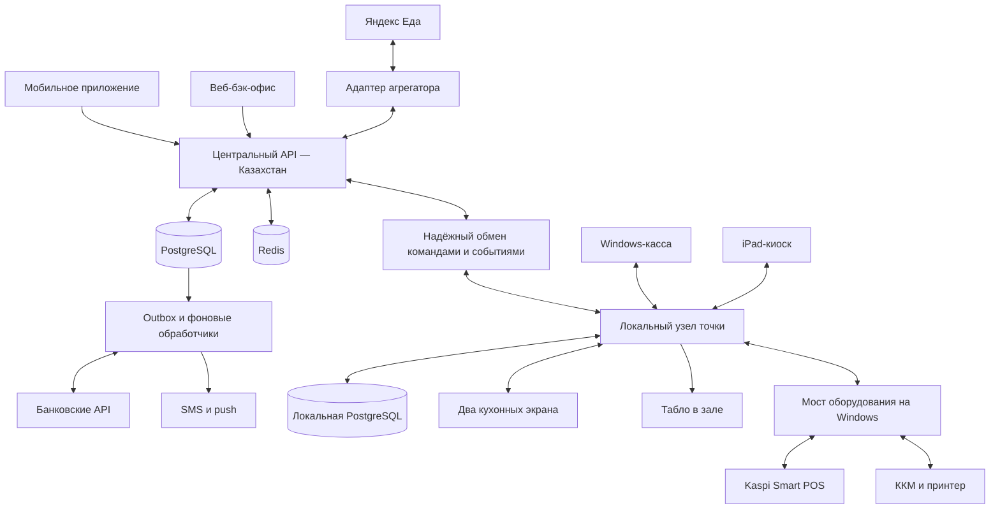

# PickChick — техническое задание

Версия 1.0 · 06.09.2026 · статус: проект для согласования бизнес-правил и интеграций.

**Уточнение владельца 16 сентября 2026:** сеть действует около трёх месяцев,
касса и Яндекс Еда уже работают через iiko. Цель - полная замена необходимых
операций iiko собственным ядром PickChick с добавлением мобильного приложения.
В mobile обязательны Kaspi.kz, Apple Pay и ручной ввод банковской карты через
эквайера. [Обследование, границы переноса и приёмка](operations/iiko-replacement-discovery.md).
Веб-доступ iiko предложен владельцем, но фактическое обследование ещё не выполнено.

**Решение владельца 14 сентября 2026:** два Windows 10 Pro моноблока;
кассовый также размещает локальный сервер, кухонный переключает приготовление,
сборку и выдачу. [ADR-0009](architecture/adr/0009-two-windows-workstations.md)
уточняет размещение первой точки без изменения денежных инвариантов и приёмки.

## 1. Цель и границы

Создать собственную операционную экосистему сети PickChick в Казахстане. Сейчас одна точка; архитектура должна позволять открывать новые точки настройкой справочников, оборудования и договоров, без отдельной копии кода.

На 8 сентября 2026 владелец подтвердил единственную действующую точку:
**ТЦ Abay Plaza, Алматы, 4-й микрорайон, 10Б**. Другие рестораны добавляем
после фактического открытия и подтверждения владельца. [Справочник и текущая привязка](operations/restaurant-locations.md).

В систему входят:

1. Приложение iOS/Android на React Native + Expo: меню, заказ в зале или с собой, оплата, лояльность, простые брендированные 2D-игры.
2. Отдельное приложение киоска на iPad: заказ без регистрации, опциональное начисление по телефону, оплата.
3. Приложение кассира на существующем Windows-моноблоке: продажи, платежи, смены, возвраты, работа без внешнего интернета.
4. Два кухонных экрана с распределением задач и единым контролем готовности заказа.
5. Табло в зале: «Готовится» и «Готово».
6. Веб-бэк-офис: управление точками, меню, складом, заказами, финансами, сотрудниками, устройствами, лояльностью и коммуникациями.
7. Центральный backend, PostgreSQL, Redis, фоновые обработчики, локальные узлы точек, мониторинг и резервное копирование.
8. Интеграции с Kaspi, эквайрингом Apple Pay/банковских карт, зарегистрированной ККМ/фискальным сервисом, Яндекс Едой и согласованным бухгалтерским обменом.

**Собственной доставки в мобильном приложении нет.** Доставка поступает из агрегатора. API вызова курьера Яндекс Доставки не заменяет API ресторанных заказов Яндекс Еды; условия действующего договора Яндекс Еды сверяются при обследовании.

Собственная разработка означает владение исходным кодом продуктов и интеграционных адаптеров. Банковский процессинг, отправка SMS, APNs/FCM и зарегистрированная ККМ остаются внешними услугами. Создание собственного банка, ОФД или сертифицированной ККМ в объём не входит.

## 2. Приоритеты релизов

| Уровень | Состав |
|---|---|
| P0 — операционный фундамент | Касса и локальный узел; кухня и табло; меню и стоп-лист; мобильное приложение и киоск; подтверждённая Kaspi-оплата по нужным каналам, Apple Pay и ввод банковской карты в mobile; чеки и возвраты; смены; базовая лояльность; прямая интеграция Яндекс Еды; аудит, мониторинг, backup, минимальный склад |
| P1 — также в четырёхмесячном релизе | Одна проверенная 2D-игра, базовые миссии и события; базовые сегменты и маркетинговые push; промо-календарь; операционные отчёты; согласованная выгрузка для бухгалтерии |
| P2 — последующие итерации | Несколько игр, сложные уровни/серии/рефералы, прогнозирование, расширенная CRM, внешние отзывы и полная складская автоматизация |

Склад P0 включает техкарты, поступления, списания, инвентаризацию, единицы измерения и достоверные остатки. «Номенклатура есть» не означает «склад работает». Полное отключение складского учёта iiko допускается только после приёмки заменяющих процессов, даже если они займут часть P1.

Весь объём из макетов сохраняется в roadmap. **Четыре календарных месяца — требование заказчика, включая тестирование и внедрение.** P0 и P1 выше входят в целевой релиз. P2 — предложенные дополнительные итерации, которые нужно явно отделить при фиксации договора. Если доступы или объём не позволяют уложиться, требуется решение о ресурсах/составе, а не молчаливый перенос. Сохранение iiko допускается как временный переходный режим; оно не считается завершённой заменой заказанных функций.

## 3. Архитектура

### 3.1. Центральный модульный backend

Начать с **модульного монолита на TypeScript и NestJS**: один репозиторий, общая модель данных, чёткие границы доменов. HTTP API и фоновые worker-процессы можно развёртывать отдельно из одной кодовой базы. Для одной и нескольких точек микросервисы добавят сетевые отказы и сложность транзакций раньше, чем дадут полезный эффект.

Выбор NestJS — инженерная рекомендация: общий язык с React Native и web, структурированные модули, возможность использовать Express/Fastify. Возможности платформы описаны в [официальной документации NestJS](https://docs.nestjs.com/). Версии Node LTS, NestJS, Expo, PostgreSQL и драйверов фиксируются после совместимого сборочного прототипа; «latest» в production не используется.

Схема ККМ условная: локальный или облачный адаптер выбирается после проверки конкретного зарегистрированного решения. Для каждого чека назначается ровно один исполнитель фискализации. Облачная и локальная стороны не должны независимо пробивать один расчёт.

### 3.2. Модули ядра

| Модуль | Ответственность |
|---|---|
| Identity | SMS OTP, пользовательские сессии, сотрудники, роли, устройства, согласия |
| Organization | Сеть, юрлица, точки, расписания, операционные дни, станции, кассы |
| Catalog | Блюда, варианты, комбо, группы модификаторов, цены, RU/KZ, публикации меню |
| Availability | Стоп-лист, доступность точки и каналов, резервирование ингредиентов, загрузка кухни |
| Checkout | Серверный расчёт корзины, скидки, резервы бонусов и кухни, срок действия предложения |
| Orders | Жизненный цикл заказа, снимок состава, отмены, история событий |
| Payments | Попытки оплаты, подтверждения банка, возвраты, сверка |
| Fiscal | ККМ, фискальные документы, состояния запросов, X/Z-отчёты и ошибки |
| Kitchen | Производственные задания по позициям, зависимости станций, сборка, выдача |
| Inventory | Техкарты, партии, поступления, производство, списания, инвентаризация |
| Loyalty | Журнал Чиков, доступный баланс, резервы, уровни, купоны, корректировки |
| Engagement | События, игровые сессии, миссии, лимиты наград, защита от накрутки |
| CRM | Профили, обращения, оценки заказов, сегменты, согласия на маркетинг |
| Notifications | Транзакционные уведомления, кампании, шаблоны RU/KZ, статусы доставки |
| Reporting | Выручка, оплаты, комиссия, возвраты, кухня, приложение, выгрузки |
| Integrations | Kaspi, ККМ, Яндекс, бухгалтерия, SMS и push через отдельные адаптеры |
| Platform | Outbox/inbox, синхронизация, аудит, настройки, диагностика |

Модуль не пишет напрямую в таблицы соседнего модуля. Обращение проходит через команду/сервис домена. Связанные изменения внутри одной БД выполняются транзакционно; внешние услуги координируются сохранёнными шагами и компенсирующими операциями.

### 3.3. Клиентские технологии

| Продукт | Предложение | Особенность |
|---|---|---|
| Mobile | React Native + Expo, TypeScript, Expo Router | Общий код iOS/Android, нативные модули по необходимости |
| iPad kiosk | Отдельное приложение Expo из того же monorepo | Собственные bundle ID, сборка, режим киоска, MDM |
| POS Windows | React UI + Electron, минимальный защищённый IPC | Нативные драйверы через ограниченный локальный сервис |
| KDS | React web, приложение полностью раздаётся из локального узла | Браузер в kiosk-mode на проверенном оборудовании |
| Табло | Отдельное React web-приложение | Управляемый медиаплеер, read-only токен точки |
| Back office | React + TypeScript | Адаптивный desktop/tablet web, авторизация сотрудников |
| Edge | Node.js/TypeScript service + PostgreSQL на отдельном Linux mini-PC | Автозапуск, локальная сеть, исходящее защищённое соединение в центр |
| Hardware bridge | Windows service; .NET при необходимости драйверов | Печать, ККМ и terminal API; выбор по SDK оборудования |

Expo — инструментарий для React Native, а не две независимые реализации на Swift и Kotlin. С первого спринта нужны development builds и тесты на реальных телефонах/iPad. Expo Go не является достаточным стендом для интеграций, требующих собственных нативных модулей. См. [Expo development builds](https://docs.expo.dev/develop/development-builds/introduction/).

8 сентября заказчик подтвердил Windows-моноблоки BX S7 (сенсорный, кухня)
и BX S6 Dual (кассир), маркировка i5 / 8/128. Точная конфигурация, обе кухонные
станции и физическая установка ещё проверяются: [реестр оборудования](operations/restaurant-equipment.md).

Electron выбран для Windows как стартовый вариант, с проверкой памяти и драйверов на текущем моноблоке. Для renderer: `nodeIntegration=false`, `contextIsolation=true`, sandbox, allowlist IPC, запрет произвольной навигации и выполнения команд. Кассовое приложение не должно иметь универсальный доступ к shell. Основание защитных настроек: [Electron Security](https://www.electronjs.org/docs/latest/tutorial/security).

На iPad заранее проверить local-network permission, HTTPS в локальной сети, доверие сертификатам, автоматический запуск и распространение через подходящий Apple/MDM-механизм. Guided Access допустим для стенда; постоянный киоск требует управляемой конфигурации устройства и процедуры восстановления.

### 3.4. Где нужен Redis

Redis используется для кеша опубликованного меню, краткоживущих OTP/лимитов, кеша сессий, сигналов обновления интерфейсов и BullMQ. Денежные операции, подтверждения оплаты, бонусный журнал, задания синхронизации и финансовые итоги хранятся в PostgreSQL.

Очередь не является единственной копией бизнес-события. PostgreSQL outbox хранит задание до подтверждения; после потери Redis очередь восстанавливается из БД. Повторный обработчик безопасен. Это соответствует принципу [идемпотентных задач BullMQ](https://docs.bullmq.io/patterns/idempotent-jobs).

Разделить Redis кеша с разрешённым вытеснением и Redis очереди с `noeviction` и настроенной persistence. При нехватке памяти очередь не должна молча терять работу. Pub/Sub использовать как сигнал «перечитай состояние», не как гарантированную доставку заказа: [Redis описывает его семантику доставки](https://redis.io/docs/latest/develop/pubsub/). При недоступности Redis финансовый путь может опираться на PostgreSQL; OTP и маркетинг временно ограничиваются, worker с DB-outbox продолжает критические проверки. Такой режим нужно реализовать и протестировать явно.

## 4. Требования к продуктам

### 4.1. Мобильное приложение — MOB

Решение владельца от 08.09.2026: гостям доступны меню, события и сбор корзины;
игры и оформление заказа требуют входа. Проверять также прямые ссылки и повторный
доступ после выхода. После входа возвращать к выбранному действию, сохраняя корзину.
В локальном TEST-клиенте используется выбранный режим аккаунта (demo или server);
локальный demo-вход не подтверждает номер и не заменяет серверную авторизацию реальных заказов.

Решение владельца от 23.09.2026: добавить код входа через официальный WhatsApp
Business Platform. Основной предлагаемый канал - WhatsApp с Copy Code, SMS -
резерв. Один номер сохраняет один аккаунт и общие лимиты между каналами.
Переход на SMS не должен оставлять два действующих кода. Выбор канала явно
показывается пользователю; получение webhook не подтверждает вход.
Бизнес-аккаунта пока нет, реальная отправка закрыта до регистрации, шаблона,
согласий и проверки доставки. [Подключение и границы этапа](operations/whatsapp-login.md).

**Уточнение UI/UX от 23 сентября 2026.** Владелец поручил согласовать анимации,
переходы, размеры и типографику во всём mobile; у Пик Комбо видео должно плавно
переходить в фон страницы. Исходная композиция, фирменные шрифты и отсутствие
кнопки паузы фонового видео сохраняются. Системное сокращение движения
отключает пространственные эффекты; анимация не задерживает действие.
[Реализация и проверяемые границы](operations/mobile-motion-polish.md).

**MOB-01. Вход.** Просмотр меню без входа; перед оформлением заказа, запуском любой игры и использованием лояльности — подтверждение казахстанского мобильного номера. Нормализация E.164, поддержка ввода `8...`/`+7...`, проверка актуальных диапазонов Казахстана библиотекой и SMS-провайдером: одного префикса `+7` недостаточно для различения стран. Дубли одного номера не создают разные аккаунты.

OTP: предложенный старт — 6 цифр, TTL 3 минуты, 5 попыток, повторная отправка через 60 секунд, лимиты на номер/IP/устройство и дневной бюджет SMS. Значения согласуются и настраиваются. Код не логировать; хранить HMAC кода с серверным секретом и одноразовым challenge, сравнивать безопасно. Ответы не раскрывают наличие аккаунта. Refresh token хранить в Keychain/Keystore, вращать при обновлении, отзывать при выходе/подозрении на компрометацию.

**Сохранение входа — решение владельца от 7 сентября 2026.** После первого
подтверждения номера пользователь остаётся в аккаунте на своём телефоне.
Закрытие приложения, перезапуск телефона, обычное обновление приложения,
смена календарного месяца и длительное отсутствие активности не вызывают
плановый выход или новую SMS. Короткий access token обновляется автоматически
через отдельную отзывную сессию устройства без планового срока завершения.
Ошибки сети/сервера не удаляют сохранённый доступ; окончательный отзыв
обрабатывается отдельно. Повторный OTP нужен при новом устройстве, явном
выходе, утрате сохранённого ключа или защитном отзыве. Удаление аккаунта
отзывает все его сессии. Требование относится к личному mobile, не меняет
очистку гостевого киоска или правила доступа сотрудников.
[Смета SMS и детали приёмки](integrations/phone-verification.md#сохранение-входа).

На iOS использовать поле одноразового кода и подходящий SMS-формат; на Android — SMS Retriever/User Consent при поддержке провайдером и устройством. Всегда оставлять ручной ввод: автозаполнение зависит от ОС, формата SMS и окружения. Основание: [Apple AutoFill](https://developer.apple.com/documentation/security/enabling-autofill-for-domain-bound-sms-codes), [Google SMS Retriever](https://developers.google.com/identity/sms-retriever/overview).

**MOB-02. Точка и способ получения.** Явный выбор точки, «В зале»/«С собой», время работы, доступность заказа. При смене точки корзина пересчитывается, недоступные товары выделяются. Доставки и адреса курьера в checkout нет. Отложенный заказ — отдельная P2-функция; первая версия оформляет на ближайшее время с оценочным ETA.

**MOB-03. Меню.** Категории, фото, описание, вес, КБЖУ и аллергены из данных заказчика, варианты объёма, обязательные соусы/напитки, лимиты выбора, допы, комбо, стоп-лист. Цена и состав проверяются сервером при расчёте и подтверждении. При изменениях требуется подтверждение нового предложения, скрытая замена запрещена.

Уточнение владельца от 23 сентября 2026: профиль остаётся в нижнем меню,
верхняя кнопка заменяется колокольчиком. Экран уведомлений разделяется на
«Заказы» и «Для вас». Счётчик показывает только реальные непрочитанные сообщения;
до подключения ленты используется пустое состояние без счётчика.
[Реализация и границы](operations/mobile-menu-notifications.md).

**MOB-04. Checkout и оплата.** Корзина, промокод, понятная сумма скидок и Чиков, ожидаемое начисление, способ получения, разрешённый платёжный метод. Объект заказа и попытка оплаты сохраняются до обращения к банку. После возвращения из Kaspi приложение запрашивает состояние backend; переход по deep link не доказывает оплату.

Состояния интерфейса: «Ожидаем оплату», «Проверяем платёж», «Оплачено — передаём на кухню», «Точка приняла», «Готовится», «Готово», «Выдано», «Отменён», «Возврат выполняется». Закрытие приложения не теряет заказ. При неизвестном результате нельзя предлагать слепо оплатить повторно.

**MOB-05. Получение и история.** Живой статус, номер, адрес точки, ETA как оценка, состав, чек, история и повтор заказа с текущими ценами. Выдачу подтверждает сотрудник. Клиентское «Я забрал» может закрыть экран/оставить обратную связь, но не управляет деньгами и начислением.

**MOB-06. Профиль.** RU/KZ, настройки push, телефон, опциональный никнейм, поддержка, удаление аккаунта. По решению заказчика от 7 сентября 2026 при первом входе запрашивать дату рождения через системный пикер: колёса день/месяц/год на iOS, системный выбор даты на Android. Никнейм без префикса `@`. Дата и пол необязательны; сохранить «Заполню позже», редактирование и очистку даты в профиле. Хранить дату без времени (`YYYY-MM-DD` / PostgreSQL `date`), исключить несуществующие и будущие даты. Правила подарков согласовать отдельно. Юридические тексты, факты о блюдах и переводы предоставляет PickChick, команда проверяет полноту и корректность отображения.

### 4.2. Киоск iPad — KIO

**KIO-01.** Стартовый экран → язык → в зале/с собой → меню → модификаторы → корзина → опциональный телефон/QR → оплата → номер/чек. Регистрация для покупки не требуется.

**KIO-02.** Ввод телефона разрешает только запрос начисления. Он не подтверждает личность и не позволяет показывать чужой баланс, историю, подарки или списывать Чики. Для расходования нужен одноразовый QR из авторизованного приложения либо OTP. Начисление новому непроверенному номеру хранится как pending-claim до подтверждения владения; срок такого требования задаётся политикой.

**KIO-03.** Для каждого киоска закрепить terminal ID. Если терминал общий с кассой, edge сериализует сессии и показывает занятость. Предпочтительно отдельный терминал на киоск. Сеанс QR/оплаты связывается с точным заказом и суммой.

**KIO-04.** При бездействии — предупреждение и очистка корзины/контактов; предложенный таймер 90 + 15 секунд. Активную банковскую операцию нельзя отменять очисткой UI: финансовый процесс живёт на edge/backend, результат восстанавливается. После завершения сессии персональные данные скрываются.

**KIO-05.** В автономном режиме меню и заказ доступны через LAN. Если банк или ККМ недоступны, показать только реально доступный способ. «Оплатить на кассе» можно включить как согласованный fallback: создаётся неоплаченный заказ с TTL, без задания на приготовление до оплаты. Принтер печатает после подтверждения, а не по нажатию кнопки.

**KIO-06. Закрытое распространение и устройство.** По решению заказчика от
7 сентября 2026 киоск выпускается отдельным iPad-only приложением
`kz.pickchick.kiosk` в существующей Apple Team. Первый выпуск — только внутренний
TestFlight без публичной ссылки и внешних тестеров. Постоянное размещение на
точках — частное распространение организации и supervised iPad с Single App
Mode через MDM/Apple Configurator. Гость не получает выход, браузер или
административные действия. Полноэкранный UI и отсутствие кнопки выхода сами по
себе не блокируют iPad. Ограничение выхода, возврат после перезагрузки и
управляемое обновление принимаются на физическом устройстве отдельно от тестов
приложения; существующий iPad нельзя стирать без согласованного переноса данных.
[Конфигурация и процедура приёмки](operations/ipad-kiosk-lockdown.md).

### 4.3. Касса Windows — POS

**POS-01.** Личный вход сотрудника, открытие смены, стартовая наличность, выбор блюда и допов, назначение телефона/QR, наличные со сдачей, терминал, поиск по номеру, повторная печать, журнал событий.

**POS-02.** Единая лента всех каналов: касса, mobile, kiosk, Яндекс. Фильтры по оплате/приготовлению, заметные ошибки «банк ответил, чек проверяется», «нет подтверждения кухни». Онлайн-заказ с подтверждённой оплатой не требует повторного ручного ввода.

**POS-03.** Смены сотрудников, кассовые смены ККМ и операционный день — разные сущности. Внесение/изъятие наличности, X-отчёт, Z-отчёт, пересчёт наличных, закрытие с расхождением и причиной. Закрытие смены не закрывает автоматически незавершённые заказы.

**Номер заказа (уточнение владельца 25 сентября 2026).** Короткий номер без префикса и ведущих нулей начинается с 1 при открытии новой операционной смены точки после закрытия предыдущей. Полночь и смена сотрудника не сбрасывают счётчик. Закрытие не перенумеровывает незавершённые заказы. Общую смену всех каналов следует связать с владельцем edge; текущая облачная очередь пока управляется отдельно через управляющего ([состояние реализации](operations/shift-order-numbers.md)).

**POS-04.** Полный/частичный возврат и отмена с правами управляющего и причиной. Возврат денег, возвратный чек, корректировка Чиков и складское решение имеют отдельные статусы. Приготовленное блюдо не возвращается на склад автоматически.

**POS-05.** Продолжение продаж при потере WAN, перезапуск приложения с восстановлением состояния, локальная очередь синхронизации, индикаторы WAN/LAN/банк/ККМ/принтер. Подробности — в документе [об автономной точке](03-offline-and-reliability.md).

**Временный сервисный режим (POS-02, POS-05).** По решению владельца 15 сентября 2026 касса
может передавать заказ на кухню без оплаты и чека после явной настройки оператором.
Это отдельный неизменяемый режим заказа, не имитация подтверждения оплаты:
сумма не считается выручкой, чек и Чики не начисляются. Сохраняются будущие
банк/ККМ адаптеры. Кухня и бэк-офис показывают реальную готовность отдельно от
оплаты. Личный пароль, смена, состав и durable восстановление обязательны.
Подробности и границы - [ADR-0010](architecture/adr/0010-pos-unpaid-service.md).

### 4.4. Два кухонных экрана — KDS

Предложение для первой точки: экран A — приготовление/фритюр; экран B — сборка, напитки, упаковка и выдача. Фактическое распределение подтвердить наблюдением одной пиковой смены. Логические станции не привязывать жёстко к количеству мониторов.

**KDS-01.** Заказ раскладывается на задания по позициям и компонентам комбо. Соус, размер, исключённый ингредиент, упаковка и комментарий должны доходить до нужной станции. Сборка видит весь заказ и готовность компонентов.

**KDS-02.** Статусы задания: queued → in_progress → done; исключения blocked/cancelled. Заказ готов только после всех обязательных заданий и финального подтверждения сборщика. Готовность картофеля не завершает всё комбо.

Уточнение владельца23 сентября2026: основной интерфейс подтверждает весь чек
одним действием станции приготовления, затем одним действием сборки. Задания
по компонентам сохраняются внутри системы, но подтверждения каждого соуса
и блюда не требуются. Комментарии клиента/заказа видны обеим станциям; источник
и способ получения показаны раздельно. Сначала согласуется
[демо этого сценария](operations/kitchen-ticket-flow.md), затем реализуется
атомарная серверная команда с прежними гарантиями версий и идемпотентности.

**KDS-03.** Большой номер, канал, режим получения, время ожидания, поздние заказы, звуковой сигнал с ограничением повторов, полный список вне зависимости от вместимости экрана. Действие «отложить» не меняет время поступления и фактическую длительность.

**KDS-04.** Отмена после начала приготовления требует подтверждения остановки на станции и решения о списании. Перенос задания между станциями аудируется. Повторная доставка команды не создаёт второй тикет. При падении одного экрана второй может временно принять его роли после назначения управляющим.

### 4.5. Табло — DSP

Номер и две группы «Готовится»/«Готово», RU/KZ, брендовые сообщения. Источник данных — edge, обновления событийные с повторным чтением состояния. Поддержка большого списка и автоматической прокрутки. Телефон, состав, сумма и личные данные не выводятся. Никнейм — опционально с согласием и фильтром; безопасное значение по умолчанию — только номер.

Табло убирает заказ после подтверждённой выдачи. Таймер может только скрыть старую карточку по политике, не создавать событие выдачи или начисление. Потеря связи отображается честно; нельзя продолжать анимацию случайных статусов.

### 4.6. Веб-бэк-офис — BO

8 сентября 2026 по поручению владельца выполнен локальный этап BO-02: все 15 разделов
по исходному HTML и операционный backend. [Матрица реализации и оставшегося объёма](operations/backoffice-operations.md)
фиксирует конкретные связи и ограничения. Этот этап не снимает приведённые ниже требования.
[ADR0008](architecture/adr/0008-backoffice-operations.md) описывает владение и транзакции.

| Раздел | Требования |
|---|---|
| Дашборд | Продажи, средний чек, нагрузка кухни, отмены, неопознанные платежи, свежесть данных по каждой точке |
| Заказы | Все каналы, состав, версии событий, оплата, чек, возврат, журнал действий, выгрузка |
| Номенклатура | Блюда, ингредиенты, техкарты, комбо, модификаторы, КБЖУ, аллергены, RU/KZ, цены по точке/каналу |
| Остатки | Поступления, партии, преобразование единиц, производство полуфабрикатов, списания, инвентаризация, стоп-лист |
| Отчёты | Выручка отдельно от банковского поступления; оплаты, возвраты, скидки, себестоимость, кухня, каналы, периоды |
| Касса и бухгалтерия | Смены, наличность, чеки, реестр сверки банка/ККМ, исключения, согласованная выгрузка в 1С |
| Промо и баннеры | План публикации, канал/точка/язык, предварительный просмотр, условия и бюджет акции |
| Игры и челленджи | Шаблоны игр, расписания, попытки, награды, лимиты, отключение без новой версии приложения |
| Гости и push | Сегменты, карточка с ограничением доступа, согласия, шаблоны, лимиты частоты, результат кампании |
| Обращения | Жалоба/вопрос, заказ, ответственный, срок реакции, статус и история |
| Отзывы | Собственная оценка после заказа; внешние площадки только при разрешённом API/договоре |
| Станции и маршруты | Привязка компонентов к станциям, зависимости, нормы, назначение экранов |
| Устройства | Регистрация, сертификат, версия, heartbeat, очередь синхронизации, отзыв доступа, обновления |
| Смены и сотрудники | Роли и привязка к точке, кассовые операции, показатели смены; не автоматическое наказание по рейтингу |
| Аудит | Кто/когда/что изменил, прежнее и новое значение, причина, связь с заказом |

«Бухгалтерия» первой версии — операционный учёт и обмен. Полный регламентированный бухучёт, зарплата, налоговая отчётность и замена 1С требуют отдельного объёма. Налоговые ставки/признаки и реквизиты не зашивать из демоданных: их подтверждает бухгалтер для каждого юрлица и типа операции.

**Определения показателей.** Отдельно показывать количество принятых и выданных заказов, продажи до скидок, скидки/Чики, денежные оплаты, возвраты, комиссии и фактические банковские поступления. Средний чек считать по согласованной базе завершённых заказов, указывая обработку возвратов. Себестоимость считается по принятому методу оценки запасов; без расходов на аренду/персонал/налоги показатель нельзя называть чистой прибылью. Кухонные времена считать по реальным timestamp этапов, а не возрасту карточки на экране.

В аналитике приложения: успешная OTP-регистрация; просмотры меню; quote/начало checkout; открытая платёжная попытка; подтверждённая оплата; выдача; повторная покупка; активация игры и полученная награда. Определить DAU/MAU по авторизованному customer ID, retention по когортам D7/D30 и повторную покупку за 30 дней; анонимные просмотры не смешивать с зарегистрированными гостями. Для кампаний разделять отправку провайдеру, известную доставку, открытие и заказ в заданном attribution-window: push сам по себе не доказывает причину покупки. События дедуплицировать и не включать в payload телефон.

## 5. Лояльность и игры

Чики разделить на **расходуемый кошелёк**, **прогресс дороги наград** и **критерий уровня**. Возвраты уменьшают экономически полученные преимущества по утверждённой политике; это не один изменяемый счётчик.

8 сентября 2026 владелец выбрал тематику шести алматинских вершин и подарок
комбо за вторую вершину. Подготовлены [предложение программы и новый дизайн](design/almaty-peaks-loyalty.md).
Предлагаемые пороги 300/1000/2000/3500/5500/8000 относятся ко всем подтверждённым
заработанным Чикам, независимо от расходуемого остатка. Эти числа, 5%, состав
подарков, лимиты и сроки пока являются предложением; активная программа в БД
этой правкой не создаётся. Старые уровни из макета заменены на шесть вершин.

Базовое предложение: начислять после подтверждённой оплаты и выдачи сотрудником; считать процент только от суммы, оплаченной деньгами за допустимые позиции; не начислять на потраченные Чики; резервировать списание до оплаты; закрывать резерв при подтверждении или освобождать после окончательного отказа. Баланс рассчитывается по журналу операций. В автономном режиме начисления ожидают синхронизации, списание общего баланса выключено.

Значения из макетов — 7%, уровни 5/7/10%, 180 дней, 300 Чиков за профиль/игру, реферальные 1000/500 — **не утверждённая экономика**. До разработки утвердить лимит списания, округление, срок жизни, исключения, условия возврата и стоимость вознаграждений. Для MVP предпочтительно истечение отдельных партий начислений; продление всего кошелька после покупки из макета — альтернативная политика, требующая явного выбора.

Игры: одна простая 2D-механика в первой итерации; брендовые персонажи, короткая сессия, управление одним пальцем, пауза при потере фокуса, стабильность на согласованном минимальном устройстве. Клиентский результат не является достаточным основанием для бонуса. Сервер выдаёт session ID, nonce, seed, версию правил и попытку; проверяет длительность, события/возможность результата, повторное предъявление и лимиты. Для небольшой игры предпочтителен детерминированный replay; в любом случае гарантированную защиту от читов не обещать, ущерб ограничивать бюджетом и лимитами.

8 сентября 2026 владелец выбрал дополнительную конкретную механику: брендированный
тетрис **PICK BLOCKS** внутри «Событий». [Текущая реализация](operations/pick-blocks.md)
— самостоятельная локальная игра с сохранением партии и рекорда, без наград.
Серверное подтверждение игровых результатов и экономика Чиков остаются отдельными
критериями P1; локальная игра не подменяет их.

Дополнительное решение владельца от 08.09.2026: в «Событиях» сначала идут
заголовок/описание и стрик Алматы, затем игры, миссии и «Скоро». PICK BLOCKS
переносится в «Игры», получает исходный логотип и плавную анимацию. Вместо
заглушки PICK MAN с паутиной добавляется собственный лабиринт PickChick:
Чик собирает бургеры, фингерсы и колу. Это явно выбранное расширение числа
локальных игр сверх первоначального P1; сроки серверных наград не меняются.
[Механика и границы PICK MAN](operations/pick-man.md).

Уточнение владельца от 23 сентября 2026: полностью убрать стрик заказов
и заменить его в событиях карточкой «Купи 7 комбо - получи 8-е в подарок».
Такую же карточку разместить в обновлённом профиле, сохранив остальные функции.
Использовать фирменные цвета и не показывать выдуманный личный прогресс;
цифровой учёт и правила погашения вводятся отдельным этапом.
[Дизайн и границы акции](operations/profile-combo-card.md).

Последующее уточнение 23 сентября 2026: по просьбе владельца сделать акцию
компактным купоном в событиях и профиле, улучшить карточки меню, личный блок
профиля и общие элементы от регистрации до заказов, применяя UI/UX Pro Max
и Impeccable в рамках существующего брендбука. Временно оставить в приложении
только PICK MAN и PICK BLOCKS; PICK RUN убрать также из галереи, старые ссылки
вести в события. Это уточнение доступности и оформления, без изменения
экономики Чиков и серверных игровых наград.
[Изменение и проверки](operations/mobile-design-refinement.md).

23 сентября 2026 владелец поручил повысить качество всех существующих игр.
В этой итерации RUN переведён на физику прыжка и 45-секундные раунды,
обновлены общие игровые экраны, обратная связь и сенсорное управление.
MAN сохраняет свайпы и получает дополнительные стрелки для точного поворота;
BLOCKS остаётся полностью жестовым. [Реализация и приёмка](operations/arcade-polish.md).
Серверные награды и физическая проверка производительности остаются отдельными.
Последующее уточнение владельца в тот же день: убрать стрелки MAN и увеличить
поле. Управление на телефоне остаётся свайпами; нижняя панель освобождена.
[Изменение](operations/pick-man-large-board.md).

Игры без покупок попыток и денежных призов; колесо удачи из бэк-офиса не включать автоматически. Новые механики требуют отдельной проверки условий акции и правил магазинов. Конфигурацией можно менять доступные уровни и награды; произвольный удалённый код не использовать для обхода публикации приложения.

## 6. Интеграции и внешние зависимости

### 6.0. Временный мобильный эквайринг - решение 28 сентября

Владелец выбрал TipTopPay для пилота с реальными малыми списаниями и Webkassa
для чеков на действующей кассе. Домен pickchick.kz (PS.kz), текущий VPS в Алматы,
позднее перенос по DNS. Текущий TipTopPay терминал TEST, кабинет другой компании:
LIVE, привязка продавца и Webkassa API ещё не подтверждены. Приём Pay подготовлен
и проверен локально; новая оплата и фискализация не включены.
[Границы этапа и продолжение](operations/payment-domain-pilot.md).

### 6.1. Kaspi

Решение владельца от 08.09.2026: обычный mobile checkout повторяет композицию
предоставленного макета и использует исходный логотип Kaspi. Страницы
симулятора исключены из обычной сборки; отдельный QA-клиент включается только
через `EXPO_PUBLIC_ORDER_SIMULATOR=1` при сборке/запуске. Настоящая оплата
остаётся отключённой до подключения доверенного банковского адаптера.
[Дизайн и границы изменения](operations/mobile-payment-design.md).

Собственный адаптер разделить на `KaspiSmartPosAdapter` для точки и `KaspiRemotePaymentAdapter` для удалённого checkout. У них могут быть разные договоры, протоколы и доступность операций.

Kaspi официально описывает интеграцию Smart POS с кассовым ПО. В опубликованной инструкции указаны общая приватная локальная сеть, HTTPS, регистрация кассы и токен; для LAN рекомендован Ethernet. Это подтверждает техническое направление для точки, но не доступность оплаты из мобильного приложения. См. [Kaspi Smart POS](https://guide.kaspi.kz/partner/ru/pos/conditions/q2722) и [инструкцию](https://guide.kaspi.kz/partner/ru/pos/documents/Smart-POS-Dokymentatsia-po-integratsii).

Наличие счёта Kaspi не доказывает право на удалённый API. До фиксации срока mobile-checkout получить письменное подтверждение нужного сценария: оплата на том же телефоне, QR для киоска, проверка состояния, таймаут, возврат, частичный возврат, лимиты, sandbox/сертификация, реквизиты точки. Статический QR или скриншот оплаты не подходит для автоматического сопоставления.

Мы реализуем orchestration, ledger и адаптер. Подтверждение денег приходит от доверенного bank/terminal API. Если API не даёт webhook, используется разрешённый polling. Если операция завершилась неизвестно, повторное списание блокируется до проверки. Карточные реквизиты не храним; сохранённые карты возможны только через отдельный согласованный tokenized acquiring.

По уточнению 16 сентября Apple Pay на iPhone и ручной ввод Visa/Mastercard и
других поддерживаемых эквайером карт обязательны в mobile наряду с Kaspi.kz.
Защищённую форму/SDK, 3-D Secure, токенизацию при сохранении с согласия клиента,
отмены/возвраты и обработку неизвестного результата принимаем отдельно.
Конкретный эквайер ещё не выбран; Halyk из макета не считается заключённым
договором. Пересчитываем объём интеграции и расширяем проверки без молчаливого
переноса согласованного срока.

### 6.2. Фискализация

Выбрать зарегистрированное решение с нужными API и режимом работы точки. Webkassa указан в макете и публично предлагает API; это кандидат, а не установленный контракт. См. [официальный сайт Webkassa](https://webkassa.kz/).

7 сентября 2026 по предложению заказчика дополнительно рассмотрена связка
Webkassa + WOFD: [проверенные возможности, предварительный бюджет и порядок
интеграции](integrations/fiscal-wofd-webkassa.md). WOFD выполняет роль ОФД;
фискальный API подключается к ККМ. Выбор остаётся предварительным до проверки
действующей кассы iiko, sandbox и работы точки без WAN.

8 сентября заказчик подтвердил действующий ОФД **WOFD** и передал два номера
касс. Название/версия самой ККМ, назначение каждого номера, API-доступ и режим
без WAN ещё не сверены. WOFD повторно выбирать не требуется; интеграция с ККМ
остаётся этапом реализации и приёмки.

ККМ выпускает фискальный документ и взаимодействует с ОФД; PickChick хранит запрос, результат, номер/признак и ссылку. Наш PDF/печать пречека фискализацию не заменяет. Для каждого расчёта и возврата должна быть определена юридическая и техническая схема; отдельно проверить бесплатные блюда, смешанную оплату, бонусную скидку и заказы агрегатора.

Автономный режим зарегистрированной ККМ при потере связи с ОФД отличается от недоступности облачного API ККМ для кассы. Официальное разъяснение описывает автономный фискальный признак, но не гарантирует работу любого облачного сервиса без WAN. См. [разъяснение КГД](https://astana.kgd.gov.kz/ru/news/otnositelno-primeneniya-kkm-pri-vremennom-otsutstvii-podklyucheniya-k-seti-telekommunikaciy-2). Конкретные допустимые сроки, протокол, регистрацию и поведение выбранной модели подтвердить с поставщиком и бухгалтером на дату запуска.

### 6.3. Яндекс

Уточнение 16 сентября: Яндекс Еда уже интегрирована с действующей iiko.
Первое действие - обследование существующей связки и согласование замены POS,
а не повторное подключение ресторана. Сохранить внешние ID, договорную схему
чеков/возвратов и владельца активных заказов до согласованного переключения.
Актуальные KZ-контакты и ресторанное API: [запрос заказчику](operations/customer-integration-request-2026-09-16.md#3-яндекс-еда-заказы-из-яндекса-в-pickchick).

Яндекс Еда обслуживает ресторанные заказы: меню, стоп-лист, подтверждение, приготовление, передача курьеру и отмены. API вызова курьера решает другую задачу. Используем действующего менеджера и [казахстанскую поддержку Яндекс Еды](https://yandex.com/support/eda-vendor-kz/ru/), а также [ресторанный API](https://yandex.ru/dev/eda-vendor/doc/ru/ref/); набор методов и допуск новой POS согласовываются для конкретного договора.

Нужны согласование замены интеграции в Казахстане, актуальная спецификация, доступы, точные сроки ACK/отказов, идентификаторы ресторанов/меню, правила изменений заказа, подпись или другой механизм проверки запросов и ответственность за чеки. В нашей модели `channel=yandex_eats`, `fulfillment=aggregator_delivery`; номер агрегатора сохраняется. Баллы клиента PickChick не начислять автоматически по замаскированному номеру агрегатора.

### 6.4. SMS, push, бухгалтерия

SMS-поставщик с доставкой на операторов Казахстана, отчётами о доставке, согласованным sender ID и тестовым контуром. Сначала оценить маршруты и стоимость на реальных SIM; резервный провайдер не должен отправлять второй валидный код одновременно с первым.

Push — через APNs/FCM, с минимальным payload и без телефонов/состава заказа. Push не гарантирует доставку и не является транспортом финансового состояния: приложение перечитывает API. Для собственной аналитики хранить события в Казахстане; внешние crash/analytics SDK оценивать по передаваемым данным.

1С: согласовать конфигурацию и версию, формат, идентификаторы документов, повторную загрузку, закрытые периоды, сверку итогов и ответственного бухгалтера. Надпись «Экспорт XML» в макете не является техническим контрактом обмена.

## 7. Данные, безопасность и эксплуатация

### 7.1. Размещение в Казахстане

Центральные БД с персональными данными размещать физически в Казахстане. Статья 12 закона РК устанавливает территориальное требование к хранению; статья 16 отдельно регулирует трансграничную передачу. Наличие сервера в Казахстане само по себе не закрывает вопросы сторонних SDK, поддержки и резервных копий. См. [закон «О персональных данных и их защите»](https://www.adilet.zan.kz/rus/docs/Z1300000094).

Проектное решение: БД, WAL/backup, логи с идентификаторами, объектное хранилище, аналитика и мониторинг — в казахстанском контуре. Публичные изображения меню можно обслуживать отдельно, если они не содержат персональных данных. Карта потоков данных, согласия и договоры обработки входят в предзапусковую проверку с местным специалистом. В GitHub и AI-чаты — исходники и синтетические данные, без production-дампов, телефонов, SMS-кодов и секретов.

### 7.2. Роли и защита

Клиент видит свои заказы; кассир — свою точку; повар — состав и задания своей станции; сборщик — сборку и выдачу; начальник смены — смену/стоп-лист/разрешённые отмены; управляющий — свои точки; бухгалтер — финансовые данные/выгрузки; маркетолог — агрегированные сегменты и кампании; администратор — конфигурацию. Поддержке выдаётся ограниченный доступ на время обращения.

Проверки прав выполняются backend и edge на каждой операции. `branch_id` из тела запроса не является доказательством доступа. Для управляющих — MFA, короткие сессии повышенных прав, персональные учётные записи. Смена телефона, возвраты, ручные бонусы, экспорт данных, изменение реквизитов и прав аудируются с причиной.

Устройства регистрируются через одноразовый код и получают сертификат/ключ с привязкой к точке и роли. Отзыв доступа и сроки автономных полномочий обязательны. Публичное табло имеет только чтение обезличенных статусов. Секреты в secret manager, ротация, TLS, private network для БД/Redis. VPN-доступ к администрированию; локальный узел не публикует банковский API в интернет.

### 7.3. Нагрузочные допущения

Подтверждено заказчиком 6 сентября 2026: **100 000–1 000 000 зарегистрированных
пользователей** и **около 1 000 одновременно готовящихся заказов на нескольких
точках**. Это разные измерения: число профилей не равно числу online-клиентов,
а активные кухонные заказы не означают 1 000 новых оформлений в секунду.

Для испытаний принимаем 1 млн синтетических профилей, 1 000 активных заказов
на 20 точках с перекосом нагрузки, 10 оформлений/с 60 минут и 30/с пять минут,
500 публичных чтений/с и 10 000 realtime-подключений. Число точек и интенсивности —
инженерные допущения с запасом; уточняются после измерений бизнеса.
Кухня имеет отдельное ограничение ёмкости и времени выдачи.

[ADR 0007](architecture/adr/0007-capacity-and-fixed-controls.md) фиксирует расчёт,
архитектуру, индексы, этапы реализации и критерии доказательства ёмкости.
Текущий общий VPS и ограниченный TEST namespace не прошли эти испытания и
не обозначаются как production для миллиона пользователей.

### 7.4. Стартовая конфигурация серверов

| Ресурс | Начальная оценка | Условия |
|---|---|---|
| API | 2 VM по 4 vCPU, 8 GB RAM | Балансировщик, разные физические хосты, stateless процессы |
| Worker | 1 VM 4 vCPU, 8 GB | Критические очереди отдельно от массовых push/отчётов |
| PostgreSQL | primary 4–8 vCPU, 16–32 GB RAM, 150–250 GB SSD/NVMe; standby сопоставимый | PITR, наблюдаемый replication lag, проверенное переключение |
| Redis | Раздельные небольшие инстансы cache/queue, суммарно 2–4 GB RAM на старте | Durable outbox в PG, лимиты памяти, восстановление очередей |
| Storage | Приватное S3-compatible хранилище + отдельное backup-хранилище | Размещение в Казахстане, шифрование, retention/lifecycle |
| Monitoring | Отдельная VM либо казахстанский managed-сервис | Алерты доступны при отказе основного API |
| Staging | 1–2 VM + отдельная БД | Только тестовые данные; интеграционный стенд оборудования |
| Edge точки | 4 ядра, 16 GB RAM, SSD 256–512 GB, Ethernet, Linux LTS | UPS, автозапуск, запасной образ/устройство |

Это конфигурация для расчёта стоимости и испытаний, не гарантия производительности. Требовать у хостера адреса ЦОД/backup, SLA, IOPS, anti-DDoS, обслуживание БД, изоляцию хостов и условия восстановления. Не выбирать поставщика только по слову «Казахстан» на сайте.

На первой точке возможен один edge как известная точка отказа с запасным устройством и проверенным восстановлением. Если нужен автоматический failover и нулевая потеря при физической гибели edge во время WAN-аварии, потребуется дополнительный локальный синхронный узел и fencing; это отдельный объём.

Docker и декларативное развёртывание достаточны для старта. Kubernetes, Kafka, ClickHouse и отдельный кластер на каждую функцию не обязательны. Переходить к ним по измеренным ограничениям и наличию эксплуатации.

### 7.5. SLO и приёмка качества

| Показатель | Проектная цель и граница |
|---|---|
| Центральный API | 99,9% доступности за месяц по собственным endpoint; банковский/SMS outcome измерять отдельно |
| Локальный приём заказа | p95 ≤ 500 мс после валидации, без времени внешней оплаты/ККМ |
| Появление на KDS | p95 ≤ 2 секунд после локального commit принятого заказа |
| Обновление табло | p95 ≤ 2 секунд после подтверждения сборки |
| Публичное меню/API | p95 ≤ 400 мс на сервере под согласованной нагрузкой, сеть клиента отдельно |
| Интерфейсы | Плавный скролл на согласованных реальных устройствах; отзыв на касание ≤ 100 мс для локального UI |
| WAN-авария | Проверка непрерывной локальной работы на протяжении 8 часов при работоспособных LAN/питании/ККМ |
| Сходимость | После 8-часовой тестовой аварии очередь ≤ 10 000 событий синхронизируется за ≤ 15 минут при измеренном канале |
| Cloud recovery | RPO ≤ 5 минут, RTO ≤ 60 минут при утрате основной БД из backup; реальный результат подтверждается восстановлением |
| Edge recovery | Перезапуск сервиса ≤ 2 минут; замена устройства ориентир ≤ 30 минут после готовности запасного комплекта |

RPO cloud не обещает нулевую потерю при аварии. Сохранённые события edge и сверка банка помогают восстановлению, но не заменяют резервную копию. При гибели единственного edge без WAN возможна потеря ещё не скопированных локальных операций — это явно учитывается в выборе оборудования и уровня отказоустойчивости.

«Без каких-либо багов» заменить измеряемой готовностью: нет открытых блокирующих/критических дефектов; пройдены сценарии денег, дубликатов, автономной работы, возвратов и восстановления; проведён пилот; есть ответственный за инцидент и понятный откат.

## 8. Порядок запуска

Сначала доказать сквозную цепочку на стенде: **один заказ → подтверждённая оплата → законный чек → два кухонных этапа → табло → выдача → одно начисление → возврат → сверка**. Затем повторить её с отключением интернета, перезапуском и повторной доставкой событий. После этого расширять меню, интерфейсы и геймификацию.

План работ, условия переключения iiko и полная матрица приёмки: [roadmap](04-roadmap.md), [автономность](03-offline-and-reliability.md), [данные/API](02-data-and-api.md).
