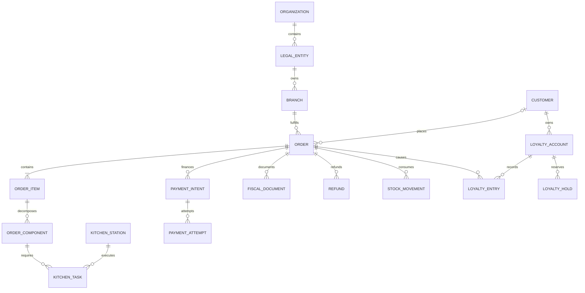

# PickChick — модель данных, состояния и API

Версия 1.0 · проект логической модели. Это спецификация для реализации и проверки, не готовая миграция production-БД.

## 1. Основные правила

1. PostgreSQL — источник долговечных данных в центре и на edge. Redis и UI не определяют баланс, факт оплаты или готовность заказа.
2. Использовать UUID для сущностей, которые могут возникнуть на точке без центра. Человекочитаемый номер заказа — отдельное поле, а не primary key.
3. `organization_id`, `legal_entity_id`, `branch_id` задаются с первого дня. Пользователь/кошелёк общий для сети; заказ принадлежит конкретной точке и продавцу. Для нескольких юрлиц отдельно согласовать финансирование общей лояльности.
4. Суммы — `bigint` в минимальных единицах валюты, `currency='KZT'`. При масштабе 100 сумма 3 490 ₸ хранится как 349000. Преобразование к целым тенге/десятичной строке для конкретного провайдера выполняет адаптер с явным округлением. `float` для денег запрещён.
5. Количество товара — integer для порций/штучных позиций либо `numeric(14,3)` для измеряемых единиц. Рецептуры — decimal и базовые г/мл/шт; коэффициенты конверсии версионируются.
6. Все времена хранить в UTC (`timestamptz`), у точки — IANA timezone `Asia/Almaty` и правило операционного дня. Событие имеет `occurred_at` и `received_at`; клиентские часы не задают финансовый порядок.
7. Итог, названия, цены, состав комбо, налоги, скидки, техкарта и маршруты фиксируются снимком в момент заказа. Изменение меню не меняет старый чек/списание.
8. Ошибки исправляются компенсирующими записями. Проведённый платёж, чек, складское движение и запись Чиков не удаляются и не редактируются задним числом.
9. Объектные права проверяются по субъекту и точке. Составные FK защищают от случайной связи заказа одной точки со сменой/кассой другой.
10. Состояния модулей разделены; межмодульные итоги проверяются транзакционно и периодической сверкой.

## 2. Словарь таблиц

| Домен / таблицы | Ключевые поля и назначение |
|---|---|
| `organizations`, `legal_entities`, `branches` | Сеть, продавцы с БИН/реквизитами, адреса, timezone, расписание, enabled channels |
| `branch_service_windows`, `business_days` | Рабочие интервалы, исключения/праздники, открытие операционного дня |
| `staff_users`, `roles`, `permissions`, `staff_branch_roles` | Персональный доступ сотрудников и срок назначения |
| `devices`, `device_credentials`, `device_assignments` | Тип, точка, станция/терминал, сертификат, expiry, версия, last_seen |
| `customers`, `customer_phones` | Customer ID; телефон зашифрован; lookup HMAC нормализованного номера, verified_at |
| `consents`, `customer_preferences` | Версия текста, purpose, канал, дата согласия/отзыва, язык |
| `auth_sessions`, `otp_challenges` | Сессии/хеш refresh token; metadata challenge и anti-abuse. Секрет OTP допустим в Redis с TTL |
| `categories`, `products`, `product_variants`, `product_translations` | Меню, варианты порции, описание RU/KZ, вес, аллергены, media ID |
| `modifier_groups`, `modifier_options`, `product_modifier_groups` | min/max, обязательность, кратность, надбавка, несовместимые варианты |
| `combo_versions`, `combo_slots`, `combo_slot_options` | Состав комбо: количество фингерсов, соусы, напитки, допустимые замены |
| `price_lists`, `price_entries` | Цена по точке/каналу/периоду; версии и уникальность активного предложения |
| `menu_releases`, `branch_menu_activations` | Неизменяемый опубликованный пакет, hash, версия схемы, ACK применения edge |
| `availability_overrides` | Ручной/автоматический стоп, причина, приоритет, автор, срок; отдельно от цены |
| `checkout_quotes`, `quote_lines` | Серверный расчёт, версия правил, expires_at, список ограничений, money/points totals |
| `orders`, `order_items`, `order_item_modifiers`, `order_components` | Точка, канал, тип получения, снимок цены/состава, роли компонентов, customer nullable |
| `order_events` | Aggregate version, переход, actor, причина, immutable payload |
| `branch_order_reservations`, `stock_reservations` | Admission lease, допустимость кухни, состав/количества, точное состояние освобождения |
| `payment_intents`, `payment_attempts`, `payment_operations` | Один платёжный intent на checkout; несколько попыток; сумма, владелец, terminal/provider ID, unknown |
| `provider_events`, `provider_operations` | Дедупликация callback/poll результата, внешний request ID, подтверждённый эффект |
| `refunds`, `refund_lines` | Инициатор, причина, суммы по позициям, статусы банка/ККМ, остаток к возврату |
| `fiscal_registers`, `fiscal_shifts`, `fiscal_documents`, `fiscal_document_lines` | Зарегистрированная касса, смена, sale/refund, immutable request, provider ID, fiscal mark, URL |
| `cash_shifts`, `cash_movements`, `cash_counts` | Смена кассира, внесение/изъятие/оплата/возврат, фактический пересчёт |
| `kitchen_stations`, `routing_rule_versions` | Логические станции, зависимости, правила выбора оборудования |
| `kitchen_tasks`, `kitchen_task_dependencies`, `kitchen_task_events` | Order item/component, qty, assigned station, статус, ready quantities, version |
| `handoffs` | Кто выдал, когда, какой код/номер проверил; customer или courier |
| `ingredients`, `units`, `unit_conversions` | Номенклатура склада и единицы измерения |
| `recipe_versions`, `recipe_lines` | Техкарта, выход, потери, ингредиенты, вложенные полуфабрикаты без циклов |
| `warehouses`, `stock_batches`, `inventory_documents`, `stock_movements` | Партии, сроки, документы поступления/списания/перемещения/производства; журнал количества/стоимости |
| `stock_balances`, `inventory_counts`, `inventory_count_lines` | Текущая проекция и факт инвентаризации; корректировка создаёт движение |
| `loyalty_accounts`, `loyalty_entries`, `loyalty_lots` | Кошелёк, неизменяемые начисления/списания/сторно, партии начислений со сроком |
| `loyalty_holds`, `loyalty_allocations`, `loyalty_claims` | Резервы, какие партии потрачены, запрос начисления по неподтверждённому телефону |
| `loyalty_rule_versions`, `tier_progress`, `reward_progress` | Версия экономики; уровень и дорога наград отдельно от кошелька |
| `promotions`, `promotion_versions`, `coupons`, `coupon_redemptions` | Приоритеты, совместимость, лимиты, факт погашения и возврата |
| `game_definitions`, `game_versions`, `game_sessions`, `game_reward_grants` | Версия механики, seed/nonce, попытка, валидация, единичная выдача награды |
| `missions`, `customer_mission_progress`, `referral_links` | Условия участия, подтверждённые события, защита от повторного выполнения |
| `push_devices`, `notification_templates`, `notification_jobs`, `campaigns` | Токены, язык, согласие, статус провайдера, лимиты и аудит отправки |
| `support_tickets`, `order_ratings` | Обращение, доступный заказ, оценка и ответственность менеджера |
| `integration_accounts`, `external_entity_mappings` | Ссылки на секреты, соответствия ID Яндекс/iiko/1С и внутренних сущностей |
| `outbox_events`, `inbox_messages`, `sync_cursors`, `command_results` | Долговечный обмен, последовательности, replay, результаты команд |
| `idempotency_keys`, `audit_log`, `reconciliation_runs`, `reconciliation_issues` | Повторы запросов, журнал изменений, сверка и разбор расхождений |

Это доменная декомпозиция. Перед реализацией уточнить физические таблицы и индексы; не создавать весь P2 заранее. Зарезервировать расширяемость через идентификаторы и версии, а не сотни неиспользуемых полей.

## 3. Основные связи



Схема показывает смысл связей; например, складское движение ссылается также на строку техкарты и документ, а не только на заказ. Возврат имеет связь с конкретными payment operations и исходным фискальным документом.

## 4. Ограничения и индексы

| Инвариант | Механизм |
|---|---|
| Один нормализованный подтверждённый телефон на аккаунт в сети | Unique lookup HMAC в `customer_phones`, отдельная процедура смены номера/объединения |
| Один внешний заказ | Unique `(integration_account_id, external_order_id)` |
| Один эффект внешней операции | Unique `(provider_account_id, provider_operation_id)`; не путать разные типы provider ID |
| Один результат клиентской команды | Unique `(principal_id, operation, idempotency_key)` + hash body |
| Один тикет компонента | Unique `(order_component_id, station_id, task_kind, routing_version)` |
| Одно начисление за выдачу | Unique `(loyalty_account_id, source_type, source_id, rule_version, entry_kind)` |
| Одна награда за игровую сессию | Unique `(game_session_id, reward_kind)` |
| Один эффект входящего события | Unique `(producer_id, event_id)` в inbox |
| Порядок событий объекта | Unique `(aggregate_type, aggregate_id, aggregate_version)`; коммерция и исполнение — разные агрегаты |
| Один фискальный запрос операции | Unique `(fiscal_register_id, business_operation_id, document_kind)` |
| Номер выдачи не конфликтует | Unique `(branch_id, business_day_id, display_number)`; назначает единственный edge |
| Сущности принадлежат одной точке | Composite FK с `branch_id` для order/shift/register/station |
| Суммы и количества допустимы | NOT NULL, FK, CHECK для одной строки; межстрочные суммы — транзакция/trigger и сверка |

Для ленты: `(branch_id, created_at DESC, id)`; для активной кухни — partial index по незавершённым task; для callback — provider reference; для outbox — индекс `next_attempt_at` по неподтверждённым сообщениям; для отчётов — точка/операционный день/тип операции. Индексировать FK на горячих связях; исключить full-scan ленты и offset-pagination на большой истории.

PostgreSQL поддерживает FK, UNIQUE, CHECK и другие ограничения, но CHECK не обеспечивает условия между произвольными строками. Поэтому сумму возвратов и доступный бонусный баланс нельзя «защитить одним CHECK». См. [PostgreSQL Constraints](https://www.postgresql.org/docs/18/ddl-constraints.html).

## 5. Разделённые состояния

| Объект | Основной путь | Исключения |
|---|---|---|
| Заказ | draft → awaiting_payment → paid_pending_acceptance → accepted → in_production → ready → handed_over | expired, rejected, cancel_requested, cancelled, attention_required |
| Платёж | created → pending → succeeded | failed, cancelled, expired, unknown; возвраты отдельными операциями |
| Фискальный документ | queued → submitting → issued | unknown, retryable_error, permanent_error, needs_review |
| Бонусный резерв | held → committed | released; состояние unknown платежа удерживает резерв до разбора |
| Кухонное задание | queued → in_progress → done | blocked, cancel_requested, cancelled |
| Возврат | requested → approved → processing → completed | rejected, partially_completed, unknown, needs_review |
| Доставка в точку | queued → sent → durably_received → applied | rejected, retry_wait, needs_review |

`paid_pending_acceptance` означает деньги подтверждены, но edge ещё не разрешил приготовление. Нельзя показывать «готовится». `handed_over` допускается после выполнения обязательных production tasks, успешного расчёта либо согласованного внешнего settlement и допустимого фискального состояния. Яндекс-оплата отражается как external settlement; второе списание нашим банком не создаётся.

Возврат не превращает исходную успешную оплату в «не было оплаты»: исходный success сохраняется, рядом учитывается refunded amount. Поздний callback не должен откатывать success в pending. История спорного перехода сохраняется и поступает на сверку.

## 6. Серверный расчёт корзины

1. Проверить точку, канал, часы работы, устройство/клиента, опубликованную версию меню.
2. Проверить позиции и все модификаторы, min/max и допустимые сочетания. Развернуть комбо в производственные компоненты.
3. Рассчитать суммы строк и скидки по установленному порядку. Предложение: товарная цена → совместимые промо → скидка Чиками с лимитом → сумма денег.
4. Распределить скидку по строкам детерминированно. Остаток округления распределять методом наибольших остатков с устойчивым tie-break по ID строки.
5. Сохранить quote со снимком и TTL, например 5 минут. Доступность последней порции должна дополнительно подтвердиться на edge до оплаты.
6. После подтверждения клиентом — создать order и intent, зарезервировать Чики, запросить admission/stock reservation точки. Только успешная резервация даёт старт платёжному запросу.

Пример проектной экономики: корзина 5000 ₸; промо 500 ₸; списание 1000 Чиков при курсе 1:1; к оплате 3500 ₸. При ставке 7% — 245 Чиков после выдачи. Это пример, а не утверждённый размер скидки/курса. Бонусная скидка уменьшает облагаемую/фискальную стоимость только согласно согласованному правилу ККМ и бухгалтерии.

При частичном возврате возвращается распределённая денежная сумма конкретных строк и относящаяся к ним бонусная скидка, а не текущая цена блюда. Пример: две одинаковые позиции по 2000 ₸, скидка 1000 Чиков поровну; банк принял 3000 ₸. Возврат одной позиции — 1500 ₸ деньгами и 500 Чиков по политике восстановления; начисление пересчитывается от оставшейся продажи с учётом накопленного округления.

## 7. Транзакционные границы

### 7.1. Checkout

В одной cloud-транзакции: идемпотентная команда, order/снимок, payment intent, бонусный резерв с блокировкой кошелька, outbox-команда на edge. Внешний вызов банка не выполняется внутри открытой DB-транзакции.

Edge проверяет заявку, резервирует локальную доступность, сохраняет reservation/inbox/result/outbox одним commit. Центр получает подтверждение, затем инициирует банк. Между этими шагами используется сохраняемая state machine. Если шаг не выполнен, worker продолжает с последнего подтверждённого состояния.

### 7.2. Подтверждение банка

Сначала проверить подлинность события допустимым способом конкретного API. В транзакции: inbox provider event → блокировка payment intent/order → фиксация provider operation → переход оплаты → commit бонусного резерва → задания фискализации и исполнения в outbox. ACK внешнему провайдеру — только после долговечного сохранения, согласно его контракту.

Если пришли два подтверждённых списания по разным попыткам, это не «дубликат callback»: в журнале должны остаться обе реальные операции. Заказ исполняется один раз, лишняя сумма попадает в очередь возврата/разбора. Нельзя скрыть второе списание уникальным индексом «один платёж на заказ».

### 7.3. Кухня и склад

Edge в одной транзакции применяет разрешение исполнения, создаёт kitchen tasks и фиксирует изменения резервов. Списание ингредиентов происходит один раз по выбранному моменту — предложение: при переходе соответствующей производственной задачи в `in_progress`. При отмене до старта снимается резерв; после старта оформляется расход/потери. Рецептура и упаковка берутся из снимка.

Мгновенно точный остаток невозможен без точного факта поступлений и расхода. Масло, потери, выход полуфабрикатов и испорченное сырьё требуют явных операций. Доступный объём = подтверждённый остаток − активные резервы − страховой запас. Для отрицательного факта инвентаризации не падать с ошибкой; фиксировать расхождение и блокировать новые продажи затронутых позиций.

### 7.4. Выдача и Чики

Сотрудник создаёт `handoff`. Edge сохраняет выдачу и outbox. Центральная транзакция проверяет оплату/внешний settlement и выполненные условия, создаёт уникальное начисление в ledger, обновляет проекцию кошелька, tier/reward progress и notification job. Повторная выдача сообщения не даёт повторного начисления.

### 7.5. Возврат

Блокировать исходную оплату при резервировании refundable amount: суммарно completed + pending refunds не превышают полученные деньги. Для каждой строки ограничивать возвращаемое количество. После подтверждения банка выпускать нужный возвратный чек и корректировки по утверждённой схеме. Сбой ККМ не повторяет уже успешный refund банка.

Возврат может прийти раньше события выдачи. Тогда итоговое начисление вычисляется от актуальной чистой допустимой суммы, а запоздавшая выдача не восстанавливает отменённый бонус. Если начисленные Чики уже потрачены, не блокировать законный возврат денег: отдельный adjustment/debt по правилам программы, доступный к расходованию баланс не ниже нуля. Решение фиксируется до запуска.

## 8. Лояльность: конкурентный доступ

Кошелёк один на клиента/программу, доступный баланс — подтверждённые партии минус списания, истечения, debt и активные резервы. Проверка и создание hold выполняются при блокировке строки аккаунта, либо SERIALIZABLE с retry. Например, баланс 1000 и два checkout по 800: только один может удержать 800; второй получает остаток 200 и новый quote.

Обычный TTL Redis для этого непригоден: резерв не должен исчезнуть, пока банк может завершить оплату. Планировщик освобождает его лишь после окончательного failed/cancelled/expired результата или контролируемого решения при неизвестном исходе. Для долгого unknown создать задачу сверки и показать её управляющему.

Начисление по номеру в кассе/киоске без проверки — ограниченный pending claim: заказ и допустимая награда, зашифрованный телефон, срок, версия согласия. Регистрационная награда не выдаётся на каждый такой ввод. Исправление ошибочного номера сотрудником требует прав, причины и защиты от присвоения уже полученных бонусов.

## 9. API-контракты

REST `/v1`, OpenAPI в репозитории, runtime-валидация запросов/ответов; SDK клиентов генерируются. Для статусов — WebSocket/SSE и восстановление с последним sequence/cursor; polling с backoff как fallback. Внутренние и публичные схемы различаются: телефон, финансовые причины и служебные payload не попадают на табло.

| Группа | Предлагаемые endpoint |
|---|---|
| Auth | `POST /v1/auth/otp/request`, `/verify`, `/refresh`, `/logout` |
| Меню | `GET /v1/branches`, `GET /v1/branches/{id}/menu`, `/availability` |
| Checkout | `POST /v1/checkout/quotes`, `POST /v1/orders`, `POST /v1/orders/{id}/payment-attempts` |
| Клиент | `GET /v1/me/orders`, `GET /v1/orders/{id}`, `POST /v1/orders/{id}/cancel-requests` |
| Лояльность | `GET /v1/me/loyalty`, `POST /v1/me/loyalty/qr-tokens` |
| Игры | `POST /v1/game-sessions`, `POST /v1/game-sessions/{id}/finish` |
| POS | `POST /edge/v1/orders`, `/payments`, `/cash-shifts`, `/cash-movements` |
| Кухня | `GET /edge/v1/kitchen/tasks`, `POST /edge/v1/kitchen/tasks/{id}/transitions`, `/handoffs` |
| Табло | `GET /edge/v1/display/snapshot`, `/display/events` |
| Управление | `POST /v1/admin/menu-releases`, `/refunds`, `/inventory-documents`, `/campaigns` |
| Интеграции | Раздельные `/integrations/{provider}/...` по фактической спецификации поставщика |
| Синхронизация | `/internal/v1/edge/sync/push`, `/pull`, `/ack`, `/snapshot` через device identity |

Пути — наш проектный контракт, не выдуманные endpoint Kaspi/Яндекса. Конкретные provider routes появятся после получения спецификации.

Пример запроса заказа после quote:

```json
{
  "quote_id": "quote-uuid",
  "quote_version": 3,
  "fulfillment": "takeaway",
  "payment_method": "kaspi_remote",
  "client_request_id": "request-uuid"
}
```

В headers: `Authorization`, `Idempotency-Key`, `X-Client-Version`, trace ID. `branch_id`, строки и итог берутся из проверенного quote. ID в примере — обозначения UUID, не тестовые рабочие значения.

Ответ может быть `202 Accepted` с `order_id`, `payment_state`, `acceptance_state`, `next_action` и URL чтения состояния. 202 означает долговечное принятие команды, а не факт оплаты или приём кухни. `next_action` содержит только допустимый redirect/QR от проверенного адаптера, не произвольный URL клиента.

Ошибки: `code`, локализуемый `message_key`, `field_errors`, `retryable`, `trace_id`, при необходимости `current_version`/`new_quote_id`. Типовые коды: `QUOTE_EXPIRED`, `MENU_CHANGED`, `BRANCH_UNAVAILABLE`, `ITEM_STOPPED`, `LOYALTY_REQUIRES_VERIFICATION`, `PAYMENT_PENDING_REVIEW`, `VERSION_CONFLICT`, `DEVICE_REVOKED`.

Идемпотентность: тот же ключ и body возвращают тот же результат, иной body с прежним ключом — 409. Для обычных API предложить retention результата 7 суток; длительные банковские операции и edge-команды защищены также постоянными business IDs/ledger, поэтому истечение записи не разрешает новый финансовый эффект. Edge replay должен дедуплицироваться дольше максимального автономного хранения.

Изменения кухонного task и конфигурации передают `expected_version`; устаревшая команда получает конфликт и актуальное состояние. Запретить универсальный endpoint «поставить любой статус».

## 10. Конверт событий

```json
{
  "event_id": "event-uuid",
  "producer_id": "edge-branch-01",
  "producer_sequence": 1842,
  "aggregate_type": "order",
  "aggregate_id": "order-uuid",
  "aggregate_version": 7,
  "event_type": "order.handed_over",
  "schema_version": 1,
  "branch_id": "branch-uuid",
  "occurred_at": "2026-09-06T10:15:00Z",
  "correlation_id": "checkout-uuid",
  "causation_id": "command-uuid",
  "payload": {"handoff_id": "handoff-uuid"}
}
```

Producer sequence нужен для потока синхронизации; aggregate version — для порядка одного объекта. Событие может доставляться несколько раз. Подтверждение даётся после commit inbox и эффекта; outbox отправителя не удаляется по факту записи в сокет. При пропуске sequence запрашиваются недостающие записи; невозможность replay закрывается подписанным snapshot с watermark и продолжением событий после него.

## 11. Схемы, миграции и хранение

Выбрать один migration pipeline (например SQL-миграции с выбранной ORM/драйвером); схема принадлежит backend, а не каждому AI-инструменту отдельно. Запрет `schema push` в production. Расширять schema сначала совместимо: добавить поля → развернуть совместимый код → заполнить данные → перевести чтение → удалить устаревшее отдельным релизом.

Официальные финансовые сроки хранения подтверждает бухгалтер; не назначать универсальное удаление «через 30 дней». Для инженерного старта: редактируемая policy по каждому классу данных, минимум необходимой PII на edge, анонимизация аналитики, независимое хранение финансовых оснований. Удаление аккаунта отзывает доступ и marketing consent; необходимые расчётные документы сохраняются по законному основанию с минимизацией связи с профилем.

При восстановлении backup повторно применять журнал уже исполненных удалений/отзывов, чтобы не восстановить пользовательскую доступность и рассылки. Отдельно проверять целостность backup, миграции с реальным объёмом, индексы, explain plan и сходимость проекций ledger.

## 12. Ежедневная сверка

Сверять по operation ID и строкам, а затем по суммам; совпадение общего итога не доказывает отсутствие двух противоположных ошибок. Внутренняя чистая оплата = сумма подтверждённых payment operations − подтверждённые refunds. Отдельно выделить pending/unknown, наличные и external settlement Яндекса. В реестре банка сравнивать операции того же merchant account; поступления на счёт могут относиться к другому дню и быть уменьшены на комиссию.

Для ККМ сравнивать каждый расчёт с назначенным sale/refund документом, учитывая утверждённое представление бонусной скидки и внешних расчётов. Для кошелька: opening + earn + adjustments − spend − expiry = closing; holds уменьшают доступность, но не являются проведённым расходом. Для склада: opening + receipts + production output + incoming transfers − consumption − waste − outgoing transfers ± count adjustments = closing.

Расхождение создаёт `reconciliation_issue` с источником, суммой/количеством, связями на исходные операции, ответственным, сроком и доказательством закрытия. Нельзя исправлять его прямой правкой balance или автоматическим повторным списанием. Закрытая сверка хранит дату среза и версии исходных данных; запоздавшие offline-события создают уточнённую версию отчёта, а не незаметно меняют подписанный итог.
