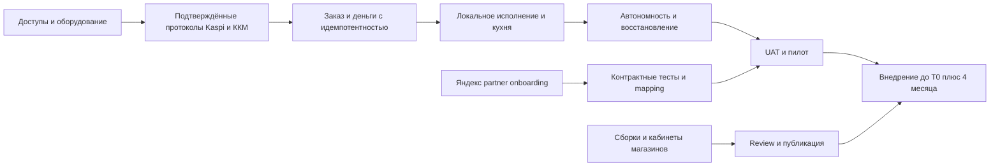

# PickChick — roadmap на четыре месяца и план приёмки

Версия 1.0 · **срок заказчика: четыре календарных месяца вместе с тестированием и внедрением**.

**Уточнение на 9 сентября 2026:** [оставшаяся работа до полного запуска](08-launch-roadmap.md)
сопоставляет текущий код, невнедрённые ветки, обязанности владельца/разработчика
и критерии готовности. По последующим решениям владельца объём включает три игры
PICK RUN, PICK MAN и PICK BLOCKS, а также рабочую логику всех 15 разделов
бэк-офиса. Упоминание одной игры в исходном плане ниже не отменяет это уточнение.
Численные правила экономики Чиков требуют утверждения. Срок и определение T0
сохраняются; этот документ не начинает новый четырёхмесячный отсчёт.

Состояние реализации на 7 сентября 2026: [аудит по коду и доказательствам](audits/2026-09-07-roadmap.md).
Полные Gate A–F ещё не закрыты; Foundation, mobile/TestFlight и облачный TEST-путь
имеют отдельные подтверждённые результаты. [Данные/решения для продолжения](operations/launch-inputs.md).
Ниже сохраняется целевой план, а не отчёт о выполненных неделях.

## 1. Как считать срок

`T0` — согласованная дата начала проекта, а не дата получения последнего API-ключа. Если банк выдаёт доступы с задержкой, это потребляет общий срок и должно немедленно отражаться как риск. Дата завершения — T0 + 4 календарных месяца.

Основной план — 16 недель. Оставшиеся примерно 1–2 недели внутри четырёх календарных месяцев зависят от даты старта и используются как резерв. Они не должны заранее заполняться новыми функциями. К концу недели 12 замораживается основной функционал, недели 13–16 предназначены для нагрузочных/аварийных испытаний, приёмки, пилота и внедрения. Проверки отдельных функций начинаются с первой недели.

Цель релиза: все шесть интерфейсов, центральное ядро, автономная точка, Kaspi в mobile и на точке, фискализация, Яндекс, базовый склад, лояльность, одна игра, базовые push/сегменты и управленческие отчёты. Никакая внешняя интеграция не считается выполненной только потому, что работает её mock.

## 2. Условия выполнимости

- Один ответственный заказчика принимает решения по меню, бизнес-правилам и работе точки; вопросы P0 разрешаются в течение 1–2 рабочих дней.
- Параллельно должны двигаться backend/интеграции, mobile/kiosk, касса/edge/KDS, web и QA/инфраструктура. У каждого направления назначен владелец; несколько ролей могут совмещаться только с учётом загрузки. AI-инструменты ускоряют работу, но не заменяют ответственного за деньги и аппаратные испытания.
- Реальное оборудование и тестовые доступы предоставляются с начала проекта. Kaspi mobile, ККМ offline и Яндекс должны получить результат проверки не позднее конца второй недели; срок ответа поставщика нельзя гарантировать силами команды.
- Состав P0/P1 фиксируется после discovery. Новые пожелания заменяют сопоставимую по трудоёмкости функцию либо требуют пересмотра ресурсов/договора. Они не добавляются бесплатно к последней неделе тестирования.
- Владелец запуска заранее определяет окна внедрения, обучение смены, on-call и право остановить продажи при финансовом дефекте.

Если эти условия не выполнены, четырёхмесячный срок остаётся требованием, но его достижимость под угрозой. На контрольной точке оформляется решение о ресурсах, варианте интеграции или согласованном составе; документ не даёт автоматического права урезать релиз или продлить срок.

## 3. План по неделям

| Неделя | Что делаем | Результат и проверка |
|---|---|---|
| 1 | Обследование точки/iiko/сети; реестр требований из макетов; заявки на API; сценарии кассира и двух станций; GitHub, CI, модель данных | Карта оборудования, backlog с владельцами, диаграмма процессов, первые сборки на iPhone/Android/iPad/Windows |
| 2 | Kaspi Smart POS и удалённая оплата spike; ККМ sale/refund/offline spike; Яндекс partner discovery; edge LAN/HTTPS; утверждение бонусной экономики | Gate A: протокол возможностей и ограничений; работающий аппаратный стенд; согласованный релиз и API v1 draft |
| 3 | PostgreSQL/миграции, точки/права/устройства, каталог/версии/комбо, базовый edge, outbox/inbox | Одно меню в mobile/kiosk/POS, опубликованная версия подтверждается edge; роли ограничены точкой |
| 4 | Серверный quote, order/payment states, первый POS checkout, KDS A/B, табло, hardware bridge | Gate B: один тестовый заказ проходит полный путь без имитации бизнес-статусов; crash/retry не дублирует заказ |
| 5 | Наличные, terminal payment, чек/печать, смены; retry неизвестных операций; mobile OTP и профиль | На стенде оплата/чек/возврат; SMS на реальных операторах; повтор запроса безопасен |
| 6 | Kaspi mobile checkout, обработка callback/poll/возврата; admission reservation; базовая лояльность и телефонные claims | Сквозной mobile-заказ, приложение закрывается в оплате и восстанавливает статус; два резерва одного кошелька не перерасходуют баланс |
| 7 | Киоск полностью, idle reset, закрепление терминала; автономность POS/KDS; Яндекс входящие заказы и mapping | Заказы всех каналов различимы; сценарии guest privacy и LAN проверены; контрактный тест Яндекса |
| 8 | Сверка банка/ККМ, частичные возвраты; отмены кухни; Яндекс стоп-лист/статусы; первая полная WAN-авария | Gate C: интеграционное ядро работает; 8-часовой автономный тест без потери подтверждённых операций в оговорённом сценарии |
| 9 | Бэк-офис: номенклатура, остатки/техкарты, закупки/списания/инвентаризация, отчёты; игра v1 и reward validator | Реальные складские документы; игра выдаёт серверно проверяемую награду один раз |
| 10 | Гости/согласия/сегменты/push, промо-календарь, обращения/оценки; QA игры; бухгалтерская выгрузка | Тестовая кампания на разрешённые тестовые устройства, проверка opt-out; бухгалтер принимает образец выгрузки |
| 11 | RU/KZ, меню/контент, accessibility, реальное оборудование; release builds; подготовка App Store/Google Play | Полные сценарии на согласованных устройствах; store metadata/privacy/deletion готовы, первая подача на review при готовности |
| 12 | Закрытие функциональных пробелов; миграционные репетиции; документация/обучение; feature freeze | Gate D: P0/P1 реализованы, contract tests зелёные, кандидат релиза, перечень известных дефектов и план устранения |
| 13 | Нагрузка/длительная работа, security/RBAC, восстановление backup, отказ Redis/БД/edge, аппаратные аварии | Отчёт испытаний; подтверждённые SLO/RPO/RTO либо устранённые причины непрохождения |
| 14 | Теневая сверка с iiko, UAT с сотрудниками, исправления, повторные store submission при необходимости | Gate E: сотрудники выполняют сценарии без разработчика; нет открытых блокирующих/критических дефектов |
| 15 | Контролируемый пилот, постепенное переключение каналов, Яндекс cutover, начальные остатки и сверка | Полные реальные смены; каждая продажа имеет владельца, банк/ККМ/кухня/бонусы согласованы |
| 16 | Завершение внедрения, устранение пилотных дефектов, повторная приёмка, передача эксплуатации | Gate F: акт приёмки, стабильная работа точки, доступы/репозиторий/документы переданы, on-call работает |

Пилот целесообразно вести 7–10 последовательных рабочих дней ресторана, начиная с конца недели 14 или начала 15; точный календарь согласовать с режимом точки. Не ужимать пилот до одной демонстрации ради формальной даты.

Подача в магазины начинается до финального внедрения: review контролируется Apple/Google и может потребовать изменений. Публичная доступность приложений входит в итоговый gate; TestFlight/internal testing подтверждает тестирование, но не публичный запуск.

## 4. Критический путь

Дизайн компонентов, контент, бэк-офис и игра разрабатываются параллельно после фиксации контрактов. Не разрешать игре или графикам отчётов вытеснять работу с неопределёнными платежами и локальной кухней.

## 5. Первые десять рабочих дней

| Когда | Действие | Владелец / готовый результат |
|---|---|---|
| День 1 | Провести kick-off, утвердить цель T0+4 месяца, список принимающих лиц, список P0/P1 | Product + PickChick: протокол scope и сроков |
| Дни 1–2 | Снять inventory железа/сети/iiko/ККМ; наблюдать пиковую смену | Tech lead + операционный руководитель: схема точки, фото/модели с разрешения |
| Дни 1–2 | Подготовить обращения в Kaspi, Яндекс, ККМ о требуемых API/режимах | Ответственный интеграций + владелец договоров: заявки и трекер ответов |
| Дни 2–3 | Получить меню, техкарты, единицы, налоговые группы, brandbook, RU/KZ | PickChick: реестр файлов и недостающих данных |
| Дни 2–3 | Утвердить правила Чиков, возвратов, выдачи, неоплаченных заказов | Product + бухгалтер + operations: таблица правил с version 1 |
| Дни 2–4 | Создать организацию/приватный monorepo, роли, branch rules, CI, staging | Tech lead/DevOps: проверка доступа и тестовый PR; по отдельной команде на настройку |
| Дни 3–5 | Согласовать ER-модель, состояния, OpenAPI и владение cloud/edge | Backend + клиенты + QA: ADR и examples для успешных/ошибочных сценариев |
| Дни 4–6 | Поднять edge/LAN/HTTPS на стенде, запустить POS, iPad, KDS, табло | Edge owner: один локальный тестовый заказ при отключённом WAN |
| Дни 5–8 | Проверить банк: create/status/cancel/refund/unknown, очередь терминала | Integrations + QA: записанные доказательства, без заявления о production-доступе до выдачи |
| Дни 5–8 | Проверить фискальный sale/refund и отдельно потерю связи с ККМ/ОФД | Integrations + бухгалтер: пригодность решения для автономной точки |
| Дни 7–9 | Проверить Яндекс-контракт, внешние ID, сроки подтверждения и cutover iiko | Integrations + partner manager: согласованный план |
| День 10 | Gate A: оценить feasibility, закрепить риски, выбрать конкретные SDK и оборудование | Ответственные: решение и обновлённый план без скрытых предположений |

Это план действий, а не сообщение об уже отправленных заявках, созданных аккаунтах или купленном оборудовании.

## 6. Матрица приёмочных сценариев

| ID | Проверка | Критерий результата |
|---|---|---|
| AC-01 | Новый/существующий номер, неверный/просроченный OTP, лимит SMS | Нет дубля клиента и обхода лимитов; ручной ввод работает при отсутствии autofill |
| AC-02 | У блюда исчез модификатор/изменилась цена после добавления | Новый quote с понятным объяснением; старую цену не списываем без валидного снимка |
| AC-03 | Последняя порция одновременно с POS и mobile | Резервация edge допускает один заказ; второму отказ до открытия оплаты |
| AC-04 | 10 повторов checkout с одним ключом | Один order, один intent, один результат; другой body даёт конфликт |
| AC-05 | Банк принял деньги, приложение закрыли/ответ потерян | Состояние восстанавливается; новая оплата не открывается автоматически |
| AC-06 | Callback повторяется и приходит в обратном порядке | Сохраняется правильный финальный статус; один kitchen effect/бонус |
| AC-07 | Два фактических списания по разным попыткам | Оба отражены, заказ приготовлен один раз, лишняя сумма видна в возврате/сверке |
| AC-08 | Успешный банк, неизвестный ответ ККМ | Не повторяем оплату; проверяем исходный чек; статус честно разделён |
| AC-09 | Принтер без бумаги после выпуска чека | Повторная печать того же документа; нет второго фискального sale |
| AC-10 | Полный и два конкурирующих частичных возврата | Нельзя вернуть больше оплаченного/количества; банк, чек, Чики согласованы |
| AC-11 | Возврат после расходования начисленных Чиков | Деньги возвращаются по правилам; учтён бонусный adjustment/debt, нет обхода баланса |
| AC-12 | Комбо с задачами A/B и напитком | На каждой станции правильный состав, ready только после обязательных задач и сборки |
| AC-13 | Повторное нажатие «Готово»/отмена во время готовки | Версии защищают переходы; отмена подтверждается; склад не восстанавливает приготовленное |
| AC-14 | Клиент нажал «Я забрал» до выдачи | Не создаёт серверный handoff и не начисляет Чики |
| AC-15 | Касса/kiosk/кухня работают 8 часов без WAN | Все разрешённые локальные операции сохранились; ограниченные функции честно отключены |
| AC-16 | Процесс edge падает между DB commit и отправкой ACK | После запуска один заказ и один эффект; неподтверждённый outbox повторяется |
| AC-17 | WAN вернулся, 10 000 событий с повторами/пропусками | Сходимость по заданному времени; суммы/количество/кухонные статусы совпали |
| AC-18 | Mobile оплатил перед потерей WAN, edge ACK потерян | Нет ложного «готовится», повторной готовки и слепого refund по таймеру |
| AC-19 | Два заказа списывают одни 1000 Чиков | Сумма резервов не выше доступного баланса; один конфликт корректно обработан |
| AC-20 | На киоске введён чужой телефон | Не раскрыты баланс/история, нельзя получить его подарок или потратить бонусы |
| AC-21 | Idle reset во время/после оплаты | Чужие данные скрыты; платёжный процесс не потерян и не продублирован |
| AC-22 | Два клиента претендуют на один Smart POS | Один активный session, сумма и результат не переходят соседнему заказу |
| AC-23 | Яндекс duplicate/new/cancel/change/status retry | Один внешний заказ; понятный канал; корректные ответы по реальному контракту |
| AC-24 | Яндекс cutover из iiko с активными заказами | Каждый заказ имеет одного владельца, нет двух чеков/двух готовок |
| AC-25 | Сотрудник точки A обращается к данным B; табло к PII | Отказ на backend/edge независимо от UI и подставленного branch_id |
| AC-26 | Повторное завершение игры, завышенный score, много устройств | Одна награда на session, серверные лимиты и антифрод соблюдены |
| AC-27 | Отзыв marketing consent/удаление аккаунта | Новые кампании исключают пользователя, сессии отозваны, обязательные документы обработаны по policy |
| AC-28 | Восстановление cloud backup и замена edge | Зафиксированы фактические RPO/RTO; известные платежи не отправлены повторно |
| AC-29 | Поступление → производство → продажа → потери → инвентаризация | Остатки и себестоимость трассируются до документов; корректировка не меняет старые продажи |
| AC-30 | Закрытие смены с незавершённым заказом и расхождением наличных | Нет скрытого закрытия заказа; кассовый отчёт и причина расхождения сохранены |
| AC-31 | RU/KZ и минимальные устройства, длинные названия, маленький экран | Полный checkout доступен; нет обрезанных критических сумм/кнопок/модификаторов |
| AC-32 | Публикация меню при offline edge и несовместимом клиенте | Неактивная версия не используется в checkout, ошибки не ломают текущую смену |
| AC-33 | Пик нагрузки + одновременно массовая push-кампания | Очереди маркетинга не задерживают деньги/KDS, целевые p95 соблюдены |
| AC-34 | Добавление второй тестовой точки с отдельными терминалом/ККМ/ролями | Конфигурация без fork кода; изоляция данных и общий кошелёк работают |
| AC-35 | Итоговая ежедневная сверка | Все суммы заказа/платежей/возвратов/чеков/Чиков объяснимы; нет неразобранных финансовых расхождений |
| AC-36 | Один OTP, затем 30 запусков, restart телефона, обычное обновление mobile, смена месяца и более года без активности (управляемые часы) | Тот же customer, сохранённый вход, дополнительных SMS 0; нет планового выхода по времени |
| AC-37 | Access истёк, параллельный refresh, ответ потерян, restart приложения/API/Redis, временные 5xx/offline | Доступ восстанавливается без OTP после восстановления сервиса; сессия не удалена из-за транспортного сбоя; чужой refresh/replay не даёт доступ |
| AC-38 | Выход на устройстве, потеря ключа/новое устройство, защитный отзыв, удаление аккаунта | Отозванная сессия не работает, повторный вход требует OTP; удаление аккаунта отзывает все устройства, настройки киоска/сотрудников не ослаблены |

## 7. Стратегия тестирования

Unit/property tests — денежное округление и распределение скидок, бонусные лимиты, state transitions, рецептуры и запреты циклов. Integration tests — реальные PostgreSQL-транзакции, locks, unique constraints, outbox/inbox и восстановление. Contract tests — собственный API и каждый предоставленный provider contract; mock проверяет нашу обработку, sandbox подтверждает интеграцию.

E2E — весь путь по каждому каналу; mobile на физических iOS/Android, kiosk на настоящем iPad, POS с терминалом/ККМ/принтером. Нагрузочные — API, KDS fanout, очереди, отчёты и синхронизация. Fault injection — обрыв до/после commit, задержка callback, duplicate/out-of-order, перезапуск, заполнение диска на стенде, потеря Redis и restore БД. Все разрушительные испытания выполняются на выделенном стенде; production-пилот имеет контролируемые окна.

Каждое испытание сохраняет версию кода/схемы/контракта, набор данных, ожидания, фактический результат и ссылки на логи без PII. Демо-скриншот не заменяет проверку финансовых записей.

## 8. Критерии окончания четырёхмесячного проекта

- Все обязательные интерфейсы доступны на рабочем оборудовании; mobile опубликован для пользователей.
- Kaspi работает в обоих согласованных контекстах, фискальные документы проверены, Яндекс переключён по контракту.
- Заказы всех каналов доходят до нужных кухонных станций, выдача отображается на табло, лояльность работает один раз.
- Автономные сценарии пройдены; персонал понимает различие WAN/банк/ККМ и ограничения списания Чиков.
- Базовый склад и отчёты сверены; нет скрытой зависимости от iiko для принятой функции. Для оставленного архива/бухгалтерского обмена зафиксированы границы.
- Нет открытых blocker/critical defects и неразобранных финансовых расхождений. Другие известные дефекты перечислены с владельцем и сроком.
- Пилотные смены, обучение, резервное восстановление и процедура отката завершены с доказательствами.
- Исходники, миграции, документация, release artifacts, тесты, доступы организации и эксплуатационные инструкции переданы владельцу проекта.

## 9. После запуска: оставшаяся часть года

| Период | Развитие | Условие |
|---|---|---|
| Месяцы 5–6 | Вторая точка, автоматизация установки устройств, улучшение склада и бухгалтерского обмена | Первая точка стабильна, новая точка проходит checklist и тест изоляции |
| Месяцы 6–9 | Дополнительные 2D-игры, уровни/серии/рефералы, расширенная CRM и промо | Экономика наград и удержание измерены; бюджет/антифрод подтверждены |
| Месяцы 9–12 | Несколько точек, межточечные перемещения, продвинутая аналитика, HA edge при необходимости | Нагрузочные данные и стоимость простоя оправдывают усложнение |

Ежемесячное обновление игр из прежнего обсуждения — операционный процесс: подготовка контента → проверка наград → тест → публикация → анализ. Один новый шаблон игры в месяц требует отдельного планирования после исходного релиза; замена баннера или награды не равна разработке новой механики.

## 10. План затрат без выдуманных тарифов

Отдельно учитывать разработку, разовую инфраструктуру точки и ежемесячные услуги. Запросить коммерческие предложения на: KZ cloud/backup/monitoring, mini-PC/UPS/сеть/MDM, SMS, ККМ/ОФД, терминалы/эквайринг, магазины приложений, AI-подписки/API, GitHub plan и эксплуатационную поддержку. Банковские комиссии и суммы из макетов не использовать как реальные тарифы.

Месячная модель: фиксированная инфраструктура + SMS × цена маршрута + оборот по каждому способу оплаты × договорная комиссия + тариф ККМ/ОФД × число касс + MDM × устройства + AI/CI usage + поддержка. Комиссии Яндекса и стоимость продуктов/наград учитывать отдельно от технической инфраструктуры. Сумма 46 млн ₸ из прежнего обсуждения не является проверенной себестоимостью; её нужно сопоставить с закреплённым P0/P1 и обязанностями поддержки.

## Уточнение ёмкости от 6 сентября 2026

Срок четыре месяца сохраняется. Во время реализации accounts/order domain
добавить миллион синтетических профилей и проверку планов запросов; во время
edge/event delivery — 1 000 активных заказов на нескольких точках, изоляцию станций
и reconnect. До рабочего релиза выполнить нагрузочный, soak и failover Gate из
[ADR 0007](architecture/adr/0007-capacity-and-fixed-controls.md). Расширение сети
не должно впервые обнаружить общую блокировку, неограниченный polling или
исчерпанный пул БД. Текущие TEST-квоты не снимать для имитации production.
