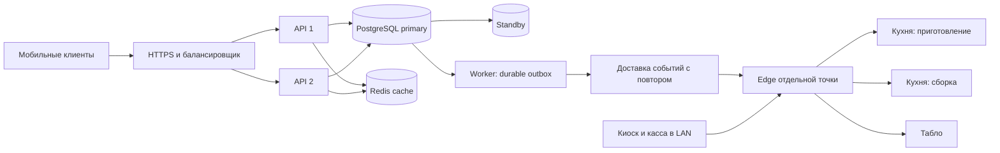

# ADR 0007 — масштаб сети и устойчивые элементы управления

Статус: принято как целевая архитектура; защитные механизмы foundation реализованы.
Дата: 6 сентября 2026. Решение заказчика: 100 000–1 000 000 зарегистрированных
клиентов, около 1 000 одновременно готовящихся заказов суммарно на нескольких точках.

## Нагрузка и границы обещания

Регистрация в базе не равна одновременному подключению. Активный заказ на кухне
не равен одному новому HTTP-запросу в секунду. При условных 10 минутах приготовления
1 000 активных заказов соответствуют примерно 100 новым заказам в минуту
(1 000 / 600 ≈ 1,67 в секунду) в устойчивом режиме. При пяти минутах — 3,33/с.
Это оценка средней скорости, она не предсказывает всплеск после push-кампании.

| Величина                       | Критерий будущего стенда                                                         | Откуда взята                                                                    |
| ------------------------------ | -------------------------------------------------------------------------------- | ------------------------------------------------------------------------------- |
| Профили клиентов               | 1 000 000 синтетических записей + индексы                                        | Подтверждённая граница роста                                                    |
| Активные кухонные заказы       | 1 000 на 20 синтетических точках, с неравномерным распределением 400/600         | Суммарная нагрузка подтверждена; число точек и перекос — испытательный сценарий |
| Новые оформления               | 10/с в течение 60 минут, пик 30/с на 5 минут                                     | Инженерный запас к оценке выше, не прогноз продаж                               |
| Публичные чтения меню/статусов | 500 HTTP/с 60 минут, пик 1 000/с на 5 минут                                      | Допущение до данных о DAU и кампаниях                                           |
| Realtime                       | 10 000 подключений, из них 1 000 подписок на активные заказы; массовый reconnect | Допущение для испытания, не число зарегистрированных                            |
| История                        | 10 млн синтетических заказов для проверки планов и пагинации                     | Запас для проверки роста таблиц, не обещанный годовой оборот                    |

Во время теста создавать и завершать заказы так, чтобы число активных оставалось
около 1 000; не накапливать их бесконечно. Отдельно проверять всплеск на одной
точке: её реальная кухня должна отклонять новые слоты или увеличивать обещанное
время, даже если центральный API свободен. Вместимость конкретной кухни измеряется
с персоналом; 400 заказов в техническом тесте не означает допустимость их продажи.

SLO: публичные чтения p95 ≤ 400 мс; локальный приём p95 ≤ 500 мс без банковского
ожидания; принятое событие → соответствующий KDS p95 ≤ 2 с; технические ошибки
< 0,1% в согласованном диапазоне; ноль потерь и повторных финансовых эффектов.
Преднамеренный 503 при тесте перегрузки считать отдельно и не скрывать в статистике.
Доставку банка/ККМ и SMS измерять отдельно от серверной задержки.

**Эти критерии пока не доказаны.** Действующий TEST namespace ограничен квотами,
одной синтетической точкой и общей блокировкой для защиты тестового сценария.
Его нельзя нагрузить миллионом клиентов и объявить production готовым.

## Архитектура для этой цели

Модульный backend сохраняется: не нужны отдельные микросервисы на каждый экран.
Статeless API масштабируется репликами; PostgreSQL хранит все долговечные эффекты.
В Kubernetes переходить только при необходимости и наличии эксплуатации.

Для рабочей среды нужны отдельные ресурсы в Казахстане:
две API VM по 4 vCPU / 8 GB, worker 4 vCPU / 8 GB, PostgreSQL primary
4–8 vCPU / 16–32 GB NVMe + сопоставимый standby на другом физическом хосте,
раздельные Redis cache и transport/queue, внешние backup и мониторинг.
Это начальный размер **для измерений**, не заказ оборудования и не гарантия.
Управление очередями не должно конкурировать с массовыми отчётами и push.
Текущий VPS 4 vCPU / 4 GB, совместно используемый с другим сервисом, для этого
HA-контура не подходит. Его достаточно сохранить для staging и демонстраций.

Каждая точка обслуживает свои кассу/кухню/табло через LAN и локальную БД. Отключение
WAN не должно переключать владельца заказа туда-сюда: протокол cloud/edge и
fencing остаются обязательными по ADR и документу автономности. Облачный заказ
попадает только на свою точку; при неподтверждённой доступности edge новое
мобильное оформление ограничивается, а уже подтверждённая оплата сверяется.
Рабочая интеграция этого пути ещё должна быть закончена — текущий TEST идёт через cloud.

## Данные и конкурентные операции

- Индекс уникального нормализованного телефона в профилях; токены сессий хранить
  хэшами, отдельно индексировать срок действия/отзыв. Истёкшие сессии и OTP удалять
  порциями. Миллион профилей не загружать целиком в память и не кэшировать без TTL.
- Все кухонные чтения ограничены `branch_id`, `station` и активными состояниями.
  Индекс `(branch_id, state, created_at, id)` либо частичный индекс активных заказов
  проверяется на реальных планах. История — cursor pagination по `(created_at,id)`;
  отчёты и полный экспорт не выполняются на пути создания заказа.
- Цена, позиции, оплата и outbox фиксируются одной короткой транзакцией.
  Повтор команды ограничивается уникальным ключом `(scope, actor_id, command_id)`;
  повтор с другим телом даёт конфликт. Версия заказа защищает переходы состояний.
- В рабочем domain отсутствует единая блокировка всей сети. Блокируются конкретный
  заказ/кошелёк/остаток или счётчик номера точки; порядок блокировок детерминирован.
  Общий `test_flow_lock` остаётся исключительно ограничителем TEST namespace.
- Outbox worker забирает ограниченные пачки с `FOR UPDATE SKIP LOCKED`; аренда,
  попытки, задержка, dead letter и повторная доставка наблюдаемы. Inbox дедуплицирует
  событие до применения. Сетевые вызовы провайдера не держат SQL-транзакцию открытой.
- Redis кеширует версии меню и ускоряет доставку; удаление Redis не удаляет заказ.
  При reconnect клиент получает snapshot + курсор, затем события; пропуск номера
  события требует дочитывания. Пользователь подписан на свои заказы, станция — на
  свою точку. Глобальная рассылка всех заказов всем клиентам запрещена.
- Partitioning истории вводится по измеренным объёмам/retention и планам, не по
  одному числу профилей. Ежемесячно контролировать размер индексов, bloat, VACUUM,
  медленные запросы, WAL и время восстановления backup.

## Что изменено сейчас

- `DB_POOL_MAX`: целое 1–64, по умолчанию 5 **на процесс**. `HTTP_MAX_IN_FLIGHT`:
  1–1024, по умолчанию 32. Изменение лимита не создаёт дополнительную мощность БД.
- Глобальный Nest interceptor допускает ограниченное число выполняющихся handlers.
  Перегрузка возвращает 503, `Retry-After: 1`, retryable error и trace ID. Внутренней
  бесконечной очереди здесь нет. Слот освобождается по завершении handler, а не по
  закрытию клиентского сокета; это проверено на заблокированном PostgreSQL-чтении.
  Защита действует после маршрутизации; ограничение входящего трафика/OTP/аккаунтов
  и защита от атак должны дополнительно находиться на ingress и уровне домена.
- Readiness имеет отдельный бюджет четыре запроса, одновременные проверки делят
  одну операцию; следующий probe проверяет заново. Liveness не ждёт БД.
- Приватный `GET /health/metrics` отдаёт Prometheus gauges/counters активных запросов,
  отказов, завершений, пула PG и heap. В метках нет телефонов, order ID и секретов.
  Gateway не публикует этот маршрут. Ожидаемые отказы admission считаются метрикой,
  а не создают по одной строке error-log на каждый отклонённый запрос.
- Mobile TEST опрашивает активный заказ раз в 3–3,6 с; завершённую историю —
  60–72 с, с обновлением при возврате приложения. Ошибки увеличивают интервал,
  истёкшая авторизация останавливает автоматический опрос. Клиентские операции
  продолжают использовать прежний idempotency key при неизвестном результате.
  Текущий polling не удовлетворяет будущему SLO 2 с: для него нужен event delivery.
- Навбар вынесен из прокручиваемой области, кнопки корзины/оформления имеют
  собственное место в flex layout с safe area. В киоске действия отделены от
  прокрутки каждого шага. Служебная ссылка на дизайн перенесена в профиль.

Пример бюджета будущего подключения: две API-реплики × 12 + два worker × 8 = 40
соединений приложения. Добавить административный резерв, миграции, monitoring и
максимум реплик во время rolling deployment. Реальный `max_connections` выбирается
после оценки памяти и плана failover. PgBouncer transaction pooling возможен после
проверки сессий/подготовленных запросов/блокировок; текущий staging URL-контракт
его пока не включает. Не повышать default 5 до 64 на каждой реплике автоматически.

## Приёмка и последовательность

1. Сейчас: геометрия mobile/kiosk, нативные проверки, защита перегрузки,
   локальный read baseline, приватные метрики. Сохранить доказательства и версии.
2. После accounts/order domain: синтетический million-row seed, branch isolation,
   планы запросов, отдельные бюджеты OTP, кошельков и очередей; без production PII.
3. После edge/event delivery: 1 000 активных заказов / 20 точек, 10 000 соединений,
   duplicate/out-of-order/reconnect, 8 часов WAN-offline, ограниченная синхронизация.
4. На отдельном нагрузочном стенде: сценарии таблицы, затем двукратная перегрузка,
   отказ API-реплики/Redis/primary PG, rolling deployment с запасом ёмкости,
   24-часовой soak и восстановление backup. Проверить суммы/количество заказов
   до и после, а не только HTTP-коды. Реальные SMS и банковские списания выключены.
5. Gate перед рабочим релизом: отчёт с составом стенда, SHA, версиями, графиками,
   p95/p99, долей ошибок, outbox lag, планами SQL, подтверждёнными RPO/RTO и откатом.
   При непрохождении ограничить ёмкость/объём запуска и исправить причину.

Срок проекта четыре месяца сохраняется. Эти измерения входят в тестирование и
внедрение, а не откладываются до фактического миллиона пользователей. Подготовка
миллионных fixtures не подменяет ещё отсутствующую реализацию accounts и финансов.

## Источники технических ограничений

- [React Native: ограниченная высота ScrollView](https://reactnative.dev/docs/scrollview).
- [React Navigation: bottom tabs и keyboard](https://reactnavigation.org/docs/bottom-tab-navigator/).
- [React Native: KeyboardAvoidingView](https://reactnative.dev/docs/keyboardavoidingview).
- [node-postgres: бюджет пула на несколько сервисов](https://node-postgres.com/guides/pool-sizing).
- [node-postgres: Pool API](https://node-postgres.com/apis/pool).
- [PgBouncer: ограничения transaction pooling](https://www.pgbouncer.org/features.html).
