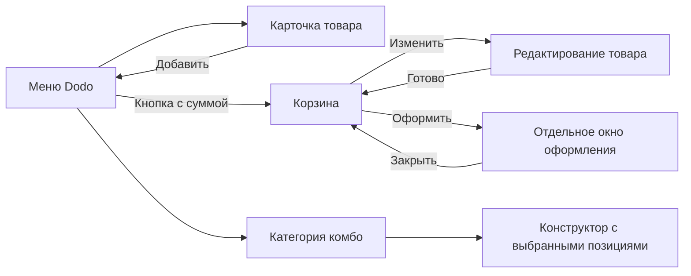

# Dodo и Drinkit: наблюдения и адаптация для PickChick

Дата: 28 сентября 2026. Источник - приложения на iPhone владельца через видеоповтор Mac, плюс ранее предоставленные владельцем скриншоты. Это исследование видимого интерфейса, а не внутренних API или исходного кода. Личные адреса, история покупок, реквизиты и снимки аккаунта в репозиторий не включены.

## Что действительно проверено

| Приложение | Пройдено непосредственно                                                                                                                                                                       | Пока не подтверждено                                                                                                                 |
| ---------- | ---------------------------------------------------------------------------------------------------------------------------------------------------------------------------------------------- | ------------------------------------------------------------------------------------------------------------------------------------ |
| Dodo       | Главная, переход к категории комбо, конструктор из трёх пицц; карточка Coca-Cola, добавление, корзина, редактирование и «Готово»; открытие оформления и возврат; удаление добавленного напитка | Вложенная замена в конструкторе, полный список акций, ошибки промокодов, оплата, история, поддержка, статус настоящего нового заказа |
| Drinkit    | Сезонная видеообложка, категории, прогресс подарка, персональные рекомендации и повтор заказа; открытие карточки напитка и её завершённое раскрытие                                            | Сохранение модификаторов, корзина, оформление, живое изменение статуса, профиль, ошибки и пустые состояния                           |

В Dodo был добавлен один напиток для проверки и затем удалён. После удаления приложение вернулось к меню без кнопки корзины. Заказ не отправлялся, деньги не списывались. В Drinkit товар не добавлялся. Нажатия и прокрутка через видеоповтор периодически возвращали `noWindowsAvailable`; скриншоты оставались доступны. Непройденные действия не считаются исследованными.

## Карта наблюдавшегося пути

## Наблюдения и решения

| Наблюдение                                                                                                         | Польза для клиента                                                        | Решение PickChick                                                                                    |
| ------------------------------------------------------------------------------------------------------------------ | ------------------------------------------------------------------------- | ---------------------------------------------------------------------------------------------------- |
| Добавление в Dodo закрывает товар и возвращает в меню; сумма появляется компактной кнопкой                         | Можно продолжить собирать заказ без лишнего закрытия корзины              | Уже реализовано; повторно проверено на Burger Duo                                                    |
| Большое фото товара, название, варианты и одно основное действие                                                   | Легко понять, что выбираешь и сколько стоит результат                     | Сохраняем наши фото, шрифты и синие страницы; основная цена теперь оранжевая                         |
| В редактировании Dodo основное действие называется «Готово»                                                        | Отличает изменение строки от добавления новой                             | У нас уже есть «Готово» в замене; дальнейшая проверка должна охватить все модификаторы и количество  |
| Корзина Dodo показывает товар, выбранный объём, изменение, минус/плюс и сумму                                      | Состав заказа проверяется без чтения рекламного описания                  | Уже используем только выбранные модификаторы, белые фотографии и минус                               |
| Дополнения и акции идут после выбранных товаров                                                                    | Продажа дополнений не мешает первичной проверке корзины                   | Сохраняем эту иерархию; персонализацию дополнений оценивать отдельно                                 |
| Итоговое действие закреплено снизу; оформление открывается отдельной поверхностью                                  | Сумма и следующий шаг доступны при прокрутке                              | Уже реализовано; проверен переход и возврат без потери корзины                                       |
| После минуса на последнем экземпляре Dodo кратко предлагает «Вернуть»                                              | Можно исправить случайное удаление                                        | Предложение следующего этапа, ещё не реализовано                                                     |
| В оформлении Dodo видны группы получения, времени и оплаты                                                         | Клиент завершает выбор последовательно                                    | Для нас оставляем ресторан, «С собой / В зале», время, оплату и итог. Доставку не добавляем          |
| В конструкторе Dodo у каждого слота собственные фото, размер и «Заменить»                                          | Понятно, какую именно часть комбо меняешь                                 | Сохраняем раздельные напитки и соусы с наценкой, не объединяем два напитка в неясный общий выбор     |
| Drinkit соединяет сезонное видео с категориями и программой подарков                                               | Витрина и польза программы видны в одном маршруте                         | У нас уже есть видео и 7+1. Сохраняем компактность и только настоящий серверный прогресс             |
| Drinkit показывает рекомендации «как всегда» и повтор заказа                                                       | Повторная покупка требует меньше поиска                                   | Кандидат следующего этапа: только на основе реальной истории; нужна проверка доступности и новых цен |
| Карточка Drinkit использует полноэкранный фон, пищевую ценность, «подробнее», нижнюю полосу настроек, объём и цену | Основной выбор остаётся у большого пальца; детали раскрываются по желанию | Не переносим все элементы механически на комбо. Проверить такую компоновку отдельно для напитков     |

## Цвет и читаемость

Владелец выбрал оранжевый Dodo как ориентир нового фирменного цвета. Для цифрового интерфейса PickChick принят **#FF6900**. Это выбранный по визуальному ориентиру токен, не результат извлечения оригинального файла дизайн-системы Dodo.

- `brandOrange` и mobile `accent`: #FF6900. Применяется к основным заливкам действий, цене товара, выбору получения и индикаторам.
- Текст на оранжевом: #251609, контраст 6,07:1. Белый мелкий текст на такой заливке не используем.
- Для небольших оранжевых текстовых ссылок на приподнятых синих карточках выделен `accentText`: #FF8A3D. Это читаемый светлый вариант, а не ещё один цвет основной кнопки.
- Синий #0047BB, тёмная тема #04143A, Jost/Manrope и собственные изображения сохранены. Вторичные кремовые настройки товара остаются вторичными.
- Цветовые токены остальных рабочих интерфейсов пока прежние. Изменение общего brandOrange доступно потребителям токена, но выпуск кассы, кухни, web и печатных материалов этим этапом не подтверждён.

## Движение и размеры

Переходы наблюдались как пространственное раскрытие снизу с сохранением контекста. По отдельным кадрам видеоповтора нельзя достоверно назвать FPS, easing, миллисекунды или разрешение исходных медиа конкурента.

Для нашей реализации выбрана собственная спецификация: открытие панели 360 мс с замедлением к концу, закрытие 240 мс, возврат после незавершённого жеста 200 мс. Это настройки PickChick, не измеренные значения Dodo. На iOS карточка товара использует штатную навигационную анимацию; корзина/оформление/статус используют Reanimated. Перемещение выполняется через transform, затемнение через opacity. Reduce Motion убирает пространственное движение.

Исправлено прерывание появления панели жестом: панель продолжает движение с текущей позиции, а не прыгает к нулевой координате. Положение ограничено высотой экрана; отменённый жест возвращает панель, повторное закрытие блокируется. Прокрутка содержимого не закрывает окно - жест остаётся на верхней ручке.

Ранее согласованная высокая корзина и оформление сохранены: верхний отступ max(20, safe-area + 8), максимальная ширина 720. Статус остаётся отдельной высокой панелью. Не копируем разрешение одного iPhone: используем размер окна, safe area, масштаб текста, реальные пропорции фото и touch targets 48.

## Проверки этого этапа

- TypeScript, адресный ESLint/Prettier, Impeccable detect.
- 203 Node и 30 Python mobile-проверок.
- Design catalog: 130 экранов, 21 требование, 9 контрастных пар, согласованность JSON/CSS и исходных изображений.
- iOS Dev manifest и bundle: HTTP200.
- CUA: товар на 393px, цвет CTA rgb(255,105,0), размер 345 × 56; добавление возвращает в меню с корзиной 6990 ₸. Оформление на 320px, выбор «В зале», возврат в корзину на 768px с тем же составом и итогом.
- Отдельно остаются физическая оценка FPS, свайпы во время анимации, VoiceOver/TalkBack, крупный системный текст и полный сценарий Drinkit. Эти проверки не подменяются браузером или прохождением unit-тестов.
- VPS, TestFlight и онлайн-пульт не выпускались; оплата и фискализация не изменялись.

GitHub CI исходного коммита dac88f6: Foundation CI 36388327517 и Project roadmap 36388359170 завершились failure, jobs вернули пустые steps; причина не установлена. Локальные проверки прошли, зелёного CI/релиза нет. PR: https://github.com/xaaknazar/pickchick/pull/124.

## Следующая последовательность

1. Завершить прямой просмотр замены/добавок Drinkit, корзины, профиля и поддержки обоих приложений при стабильном управлении.
2. Пять улучшений согласованы и реализованы ниже; следующий шаг - физическая приёмка.
3. Принять текущую палитру и переходы на реальном iPhone, затем проверить Android и accessibility.
4. Полный новый заказ проверять в нашем разрешённом неоплаченном контуре с кухней. В сторонних приложениях реальные покупки для исследования не нужны.

## Реализация пяти UX-улучшений - 28 сентября

Добавлены повтор выданного/отменённого заказа с проверкой текущего меню, восстановление удалённой строки с точными модификаторами, контекстные допы, нумерация напитков/соусов комбо и следующий шаг 7+1. Сохранены синие карточки, светлые фото и оранжевый CTA. Подготовлены 8 прозрачных изображений напитков 0,5 л и один фингерс на основе собственных референсов; файлы Dodo не получены (403).

1. **Повтор заказа:** у выданных/отменённых заказов истории и деталей. Отдельная
   панель показывает актуальные цены/состав перед добавлением. Изменившиеся цены
   и недоступные блюда раскрыты явно; неподтверждённые старые модификаторы не
   подменяются дефолтами. Другая точка/отсутствие актуального подключения блокируют
   действие. Существующая корзина сохраняется; все добавления атомарны в пределах
   11 конфигураций/20 одинаковых позиций. Двойное подтверждение блокируется.
2. **Вернуть:** после удаления последней единицы - строка над корзиной, в том числе
   пустой. Тот же состав/количество можно восстановить, пока корзина открыта.
   Без короткого таймера. При изменении цены/наличия, лимитах или смене точки старые
   данные не возвращаются молча. Очистка корзины остаётся отдельным подтверждением.
3. **Ваше комбо:** каждый напиток и соус обозначен «1 из 2», включённая позиция или
   доплата видны до открытия выбора. В выборе показывается актуальная сумма комбо
   до «Готово»; редактирование строки сохраняет выбор в корзине.
4. **К вашему заказу:** горизонтальные карточки с фото и быстрым добавлением.
   К бургеру - фингерс, к фингерсам - бургер. Уже выбранные отдельные блюда/допы
   повторно не предлагаются; при включённом напитке нет дополнительного напитка.
   Нет навязывания включённого фирменного соуса. Дольки/тост/коулслоу - дополнительные
   порции. Только доступные позиции текущего каталога с допустимыми настройками.
5. **7+1:** сохраняется компактный блок с галочками. Текст показывает оставшееся
   число комбо, окно условий - следующий шаг. Пример, неизвестный баланс и
   серверный пробный круг различаются; не обещаем выдачу подарка из practice.

Проверены 212 Node + 30 Python mobile-тестов, mobile typecheck, ESLint/Prettier, Impeccable detect без замечаний и iOS Dev manifest/bundle HTTP200. CUA320/393/768: второй напиток, добавление без открытия корзины, удаление последней позиции/возврат точного состава, допы без повторного предложения, условия 7+1, повтор с сохранением корзины (4190 → 8380 ₸). Физические iPhone/Android, крупный системный шрифт и VoiceOver остаются для приёмки. 7+1 сохраняет серверный practice-режим без права на бесплатный подарок; оплата/чеки не изменены. VPS/TestFlight/онлайн-пульт этим этапом не обновлены.

UI/UX Pro Max: native accessibility/undo; Impeccable: сохранение контекста,
одна задача на панели, явные изменения цены, обратимые действия, 48px targets.
Новые CTA имеют доступные имена, состояние и обратную связь. Существующее движение
панелей и Reduce Motion сохранены. Это собственная реализация PickChick, не код
и не измеренные параметры анимации Dodo. Dev проверен локально, production не выпущен.
