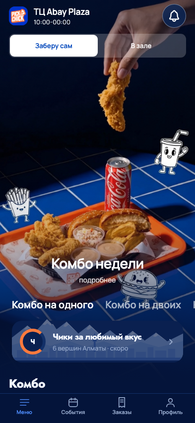
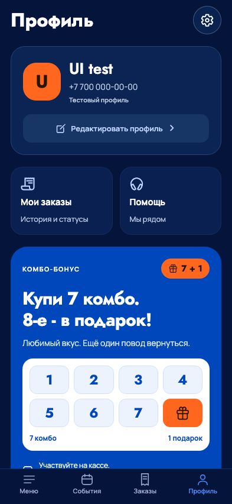
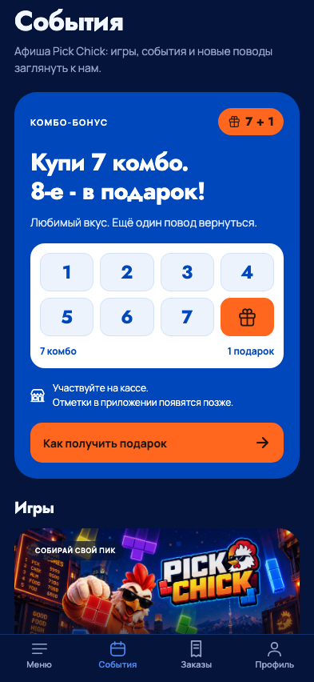

# PickChick: первый разбор с UI/UX Pro Max и Impeccable

23 сентября 2026. Исходная версия приложения: `861a44b5fe1de6090e0b61150329e710eb8f9da6`.
Объём этого этапа - подключение инструментов и оценка улучшений. Изменения
экранов ниже являются предложениями, они ещё не реализованы.

## Вывод для владельца

У приложения уже есть узнаваемая основа: еда в центре внимания, синий фон,
оранжевые акценты, свои шрифты, Алматы и фирменные игры. Следующий шаг -
упростить путь к действию и сделать повторяющиеся детали согласованными.
Менять бренд на готовый шаблон из базы скилла не нужно.

UI/UX Pro Max полезен как проверяемый справочник. Impeccable помогает
разделить оформление и реальную задачу пользователя. Меню, корзина и профиль
в первую очередь нужны для действий; промо и игры могут быть выразительнее.
Одинаково крупные промо-блоки во всех разделах ухудшают эту иерархию.

## Как выполнен разбор

- Прочитаны оба SKILL.md, правила взаимодействия/доступности Pro Max,
  нативный audit Impeccable и его iOS/Android references.
- Запущены Pro Max design-system и адресные поиски. Отдельно отфильтрованы
  неподходящие палитра, шрифты и структура лендинга.
- Запущен Impeccable context для ProfileScreen.tsx; engine 0.1.5 работает.
  Для React Native его native audit предписывает проверять исходники;
  web-детектор не запускался и не выдаётся за нативный анализатор.
- Проверены тема, общий UI, Motion, Brand, CatalogScreens, ProfileScreen,
  GameScreens, ComboRewardCard, уведомления и нижние вкладки.
- Получены девять свежих web-превью: меню, профиль, события на 320×568,
  393×852 и 768×1024. Переполнения страницы по горизонтали и JS-ошибок нет.
  У кнопок на этих трёх маршрутах не обнаружены DOM-рамки меньше 48.
  Это не проверка всех контролов корзины и не измерение native hit area.
- Данные синтетические, обращения к бизнес-API перехвачены локальной
  проверкой. Заказы, бонусы и сообщения не создавались.
- Отдельно рассчитан контраст непрозрачных цветовых пар из исходников.

Это один авторский разбор исходников и композиции по native audit, не
формальный запуск команды `critique` с двумя независимыми оценщиками.
Web-превью не заменяет нативную проверку и не доказывает 60/120 FPS.

## Что подтверждено и что ещё нужно проверить

| Направление Impeccable | Наблюдение                                                                                          | Граница результата                                                                          |
| ---------------------- | --------------------------------------------------------------------------------------------------- | ------------------------------------------------------------------------------------------- |
| Accessibility          | Есть роли/подписи, общий reduced motion; найдены маленькие элементы корзины и низкий контраст «ХИТ» | VoiceOver/TalkBack и фокус после закрытия окон не проверены на устройствах                  |
| Performance            | Мемоизация карточек, кеш фото, стабильная шапка и native-driver feedback уже есть                   | Скорость запуска, память и FPS release-сборки не измерены                                   |
| Appearance & Theming   | Общая тема и шрифты есть; часть оттенков и радиусов задана в экранах                                | Фиксированная тёмная тема - текущее решение, отсутствие светлой темы не объявлено дефектом  |
| Platform Conformance   | Expo Router, safe-area insets, четыре вкладки и системный выбор даты                                | Системные жесты и Back требуют iOS/Android проверки                                         |
| Adaptivity             | Три размера web без горизонтального переполнения, есть реакции на fontScale                         | Крупный системный текст, клавиатура, landscape и multi-window этим проходом не подтверждены |

Общий балл /20 не выставлен: непроверенные нативные свойства дали бы ложную
точность. P0-блокеры в рассмотренном объёме не обнаружены.

## Подтверждённые проблемы и предложения

### P1: сенсорные кнопки корзины меньше принятой цели

**Где:** `apps/mobile/src/screens/CatalogScreens.tsx`, кнопки количества
на строках 710 и 727, `cartHeaderButton` на строке 1069.
Они переопределяют общий IconButton на 44×44, без расширения hitSlop.
Общий компонент UI.tsx сам задаёт 48×48, но допускает это переопределение.

**Влияние:** на Android и по принятому стандарту PickChick область меньше
целевых 48; маленькие элементы сложнее нажимать в движении.
**Предложение:** минимум 48 для общей области касания, с проверкой корзины
на 320 и крупного текста. Не увеличивать изображение иконки без необходимости.
**Проверка при исправлении:** добавить/убрать позицию, удалить последнюю,
предел количества, перенос суммы без перекрытий. Инструменты: Pro Max Touch
Target Size + Impeccable `adapt`.

Не считать `productPlus` 32×32 отдельным дефектом: он декоративный View
внутри большой нажатой карточки. Этот пример показывает, почему простой
поиск чисел в стилях не заменяет проверку настоящей области действия.

### P1: белая надпись «ХИТ» плохо контрастирует с оранжевым

**Где:** `CatalogScreens.tsx:1045`, стиль hitText - белый текст 10 на
`colors.accent = #FF7A3D`.
**Доказательство:** относительная яркость sRGB даёт контраст **2,59:1**;
для обычного текста нужен 4,5:1 по принятому стандарту проекта.
**Предложение:** `colors.orangeInk = #251609` на том же фоне даёт **6,77:1**.
Одновременно проверить размер подписи и её роль, не менять оранжевый бренд.
**Проверка:** бейдж на реальном фото, обычный/крупный текст, отсутствие
дублирования декоративной подписи экранным диктором. Инструменты: Pro Max
Color Contrast + Impeccable `typeset`/`polish`.

Для сравнения: белый на #0047BB - 8,02:1; #93A6C9 на #04143A - 7,32:1;
белый на #2E6FE8 - 4,61:1. Это расчёты конкретных пар, не аудит всех
смешанных/полупрозрачных фонов и состояний.

### P2: акция «7 + 1» занимает слишком много места в двух разделах

**Где:** `ComboRewardCard.tsx:141`, вставка в `ProfileScreen.tsx:196`
и перед играми в GameScreens. На 393×852 в событиях карточка занимает
примерно 484 пункта; первая игра видна только частично. В профиле Чики
расположены ниже большого промо, вне первого экрана.
**Предложение:** два варианта одного компонента: компактный для профиля,
более выразительный для событий. Сохранить акцию перед играми, как просил
владелец, но уменьшить площадь иллюстрации отметок. Условия оставить в окне.
**Проверка:** после открытия видно, как перейти к основной функции;
условия и кнопка остаются доступны при большом шрифте. Не показывать
ложный персональный прогресс. Инструменты: Impeccable `distill`/`layout`.

### P2: первый экран меню почти целиком занят промо

**Где:** `CatalogScreens.tsx:256`, heroHeight зависит от `height * 0.93`.
В текущем web-снимке 393×852 виден заголовок «Комбо», но не сама карточка
блюда. Это соответствует выразительному исходному макету; поломки нет.
**Предложение для следующего макета:** сравнить текущий вариант с более
компактным hero или понятным переходом «Выбрать комбо», чтобы пользователь
быстрее находил еду. Сохранить видео, плавный стык и фирменную композицию.
**Критерий:** путь от открытия меню до выбора блюда короче, видео не
задерживает действие. Это гипотеза для проверки, не измеренная конверсия.
Инструменты: Pro Max content-priority + Impeccable `layout`.

### P2: часть общих визуальных правил остаётся в отдельных экранах

**Где:** ProfileScreen, ComboRewardCard и нижние вкладки содержат собственные
оттенки вторичного текста; Motion.tsx задаёт 80/150/180/240, а общий tokens.json
хранит feedback 120 и sheet 220. Разные значения сами по себе допустимы:
нажатие и появление видео решают разные задачи.
**Предложение:** именованные роли цветов, текста, контейнеров и движения
с явными назначениями; не заменять всё одним радиусом/таймингом.
**Критерий:** общий компонент имеет документированные варианты, изменение
правила даёт предсказуемый результат во всех его местах.
Инструменты: Impeccable `extract` + Pro Max semantic tokens.

Итого: 2 P1 и 3 P2, из них изменение высоты промо - предложение по UX,
а не функциональная ошибка. Исправления в этом этапе не выполнялись.

## Что сохранить

- Четыре понятные нижние вкладки; профиль больше не дублируется в шапке.
- Общие feedback-анимации и reduced motion, фото и обложки владельца.
- Реальные disabled/пустые состояния: отсутствующая функция не изображает
  работающую оплату, push, награду или отметку покупки.
- Общий компонент «7 + 1» с условиями вместо двух расходящихся реализаций.
- Полноразмерное поле PICK MAN, свайпы и яркие блоки без логотипов.

## Последовательность следующих изменений

| Очередь | Блок                      | Что сделать                                                                            | Как принять                                                                   |
| ------- | ------------------------- | -------------------------------------------------------------------------------------- | ----------------------------------------------------------------------------- |
| 1       | Общие элементы, корзина   | Касания 48, контраст «ХИТ», роли текста и оттенков                                     | Малый телефон, крупный текст, счётчик количества, скриншоты до/после          |
| 2       | Профиль и события         | Компактный/полный вариант акции, сильнее выделить путь к Чикам и играм                 | Основные действия находятся сразу; правила акции не потеряны                  |
| 3       | Меню и блюдо              | Проверить более короткий путь от hero к блюдам, выбранные модификаторы и итоговую цену | Собрать сложное комбо без догадок и лишних возвратов                          |
| 4       | Корзина, заказ, вход      | Полная система ошибок, ожидания, восстановления; клавиатура и Back                     | Ошибка не теряет ввод/корзину и не предлагает повторный неизвестный платёж    |
| 5       | Чики, миссии, уведомления | Разделить информационное оформление и настоящие операции                               | Только серверные баланс/прогресс/сообщения; пока честные пустые состояния     |
| 6       | Игры                      | Согласовать вход, паузу, результат и обратную связь; измерить плавность                | Удобные жесты, нет задержек управления, reduced motion и фоновые паузы        |
| 7       | Касса, кухня, бэк-офис    | Отдельные проверки под рабочую задачу и экран, без копирования mobile                  | Приём заказа, один чек - одно подтверждение, стоп-лист и статусы с расстояния |

Последняя очередь - расширение методики на экосистему, не утверждение, что
касса и кухня уже прошли этот аудит. Для каждого этапа нужны отдельный PR
и приёмка соответствующего сценария. Финальный шаг после исправлений -
Impeccable `polish`, затем нативная проверка на iPhone/Android.

## Визуальные доказательства

Снимки - web-превью React Native, синтетический аккаунт. Меню снято в этом
проходе; профиль/события совпадают с сохранёнными снимками того же исходного
состояния. Крупный системный шрифт этим набором изображений не доказан.

## Статус подключения

Оба навыка установлены и их исполняемые части проверены. Правила включены
в AGENTS.md, версии закреплены. Установка сама по себе внешний вид приложения
не меняет; следующий этап - адресные исправления из первой очереди.
Новый TestFlight, обновление моноблоков или смена продуктовой дизайн-системы
в рамках этого этапа не выполнялись.
