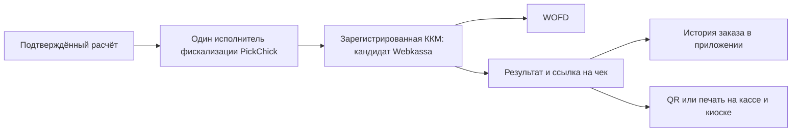

# WOFD и проверка действующей ККМ PickChick

Проверено 7 сентября 2026. По предложению заказчика рассмотрена выдача
электронного чека через WOFD. Это исследование и план подключения, а не
включённая интеграция. Реальные чеки, договоры и регистрация касс не создавались.

Дополнено 8 сентября: заказчик подтвердил **WOFD как текущий ОФД** и передал
два номера SWK…. Полные номера сохранены приватно, в документах используются
обезличенные обозначения. Назначение каждой кассы и текущая конфигурация iiko
пока не подтверждены; получение номеров не является получением API-доступа.

## Что подтверждено

8 сентября проверен формат номеров: [официальный WOFD](https://wofd.kz/)
в инструкции создания кассы Webkassa обозначает заводской номер как SWK….
Это основание проверить Webkassa в текущей установке, но префикс не доказывает
версию, действующую регистрацию или принадлежность номера конкретной кассе iiko.
[FAQ Webkassa](https://promo.webkassa.kz/questions) отдельно различает заводской
номер, регистрационный номер ККМ и ID ОФД. Их не подменяем одним SWK-полем.

WOFD принимает данные от ККМ и передаёт их налоговым органам. На его сайте есть
проверка чека и подключение кассы; отдельно указана работа с Webkassa/BKASSA.
[Официальный WOFD](https://wofd.kz/).

Webkassa предоставляет API фискализации и кассовых отчётов. Официальный порядок:
регистрация в тестовом кабинете, тестовая касса с API-KEY, документация и
Postman-коллекция, проверка интеграции вместе с поставщиком, затем production.
Тестовая среда заявлена бесплатной. Актуальную схему API получают в кабинете.
[Интеграция Webkassa](https://promo.webkassa.kz/integrations).

Ссылка заказчика относится к consumer-странице WOFD. При этой проверке она
не отобразила содержимое; модель ККМ и способ доставки чека конкретного
ресторана не подтверждены. Домен ссылки сам по себе их не устанавливает.
Параметры реального чужого чека не копируются в Git, фикстуры или наш заказ.

## Предлагаемый сценарий

После подтверждения расчёта выполняется один фискальный запрос через выбранную
ККМ. Она выпускает документ и передаёт данные в ОФД. PickChick сохраняет
идентификатор, фискальные реквизиты, результат и ссылку, полученную по
подтверждённому контракту поставщика. Формат consumer-URL вручную не угадываем.

В приложении появится действие «Фискальный чек» в оплаченном заказе; на киоске
и кассе — QR/печать того же документа. Пока результат неизвестен, интерфейс
показывает ожидание или ошибку, а не выдуманный чек. Отправка ссылки по SMS —
отдельная доставка через Mobizon с отдельным бюджетом; она не выпускает чек.
Telegram/WhatsApp не подключаются самим выбором ОФД.

Банк подтверждает деньги отдельно. Один заказ не должен одновременно
фискализироваться в нашем адаптере, iiko и автоматической связке терминала.
До переключения каждого канала назначить единственного исполнителя;
для Яндекса отдельно подтвердить договорного владельца фискализации.

## Порядок реализации

1. WOFD уже подтверждён. Установить название/версию действующей ККМ, статус и
   назначение каждого из двух номеров, регистрацию, настройки iiko и терминала.
   Два номера не доказывают, что обе кассы действующие или относятся к двум
   разным рабочим местам. Проверить использование существующих касс без замены.
2. Получить sandbox подтверждённой ККМ (Webkassa — после сверки действующего
   решения), актуальные методы и условия API. Уточнить получение
   исходного чека после таймаута, идентификатор операции, пределы повторов,
   статусы, частичный возврат, налоговые признаки, НКТ/GTIN и смешанные оплаты.
3. Реализовать серверный fiscal adapter и durable outbox. Идентичность операции
   задаёт `(fiscal_register_id, business_operation_id, document_kind)`;
   сумма хранится в целых минимальных единицах, позиции — в снимке расчёта.
4. После потери ответа сверять исходную операцию. Пока её результат неизвестен,
   запрещены слепой повтор sale и повторное списание денег. Печать повторяет
   документ, а не создаёт новый. Возврат связывается с исходными строками/оплатой.
5. Проверить sandbox: sale, timeout после приёма, повтор события оплаты,
   восстановление после restart, частичный/full refund, X/Z, отказ принтера,
   восстановление ссылки и сверку сумм. Один повтор не создаёт второй чек.
6. Испытать потерю WAN на реальном Windows/POS/edge. Автономность ККМ при
   недоступном ОФД не доказывает доступность облачного API с отключённой точки.
   Нужен подтверждённый локальный путь или другое подходящее ККМ-решение.
7. После технической приёмки поставщиком и согласования реквизитов/налогов
   провести пилот одной точки и сверку банка, ККМ и заказов. Затем расширять сеть.

В историческом [руководстве Webkassa 2.0, 2021](https://my.webkassa.kz/Docs/RukovodstvoPoEkspluataciiWebkassa-2.0.pdf)
различаются связь с ОФД и интернет-доступ к самой Webkassa (стр. 4–5, 68).
Это подтверждает необходимость отдельного испытания WAN; условия старой модели
не принимаются как действующий контракт Webkassa 3.0/WOFD.

## Стоимость для предварительного бюджета

На дату проверки WOFD публикует 1 100 ₸ за месяц либо 10 800 ₸ за год, без НДС.
[Тарифы WOFD](https://wofd.kz/).
Webkassa для касс на WOFD показывает 3 000 ₸ за месяц без НДС, 3 480 ₸ с НДС;
годовой вариант — 29 500 ₸ без НДС. [Тарифы Webkassa](https://webkassa.kz/).

Если эти тарифы применимы к нашей API-конфигурации, ориентир для одной кассы:
4 100 ₸/месяц без НДС при месячной оплате; при годовой — 40 300 ₸ за год без НДС.
Это арифметический ориентир, не коммерческое предложение: включение API,
число касс, ограничения, локальный компонент, обслуживание, печать и доставка
SMS должны быть подтверждены отдельно. Стоимость разработки сюда не включена.

## Открытые зависимости и статус

ОФД WOFD и два номера уже предоставлены; повторно запрашивать их не нужно.
Остаются название/версия действующей ККМ и привязка номеров к iiko/каналам,
sandbox/API-доступ и документация подтверждённого поставщика, правила регистрации
по точкам, согласованные бухгалтером реквизиты и настройки, ответ по работе
без WAN. [Полученные модели Windows-оборудования и план приёмки](../operations/restaurant-equipment.md).
Секреты передаются в приватные server-файлы, а не в исходники приложения.

Публичные материалы подтверждают направление, но точные поля receipt URL,
idempotency/status API и автономный режим выбранной конфигурации пока не приняты.
Backend, БД, VPS, TestFlight и действующая iiko этим исследованием не изменены.
Тесты runtime не запускались: изменены только документы; проверяются источники,
арифметика, Markdown и отсутствие персональных параметров чека в diff.
