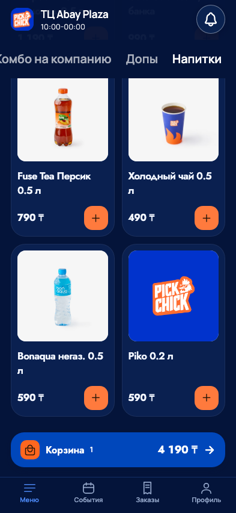
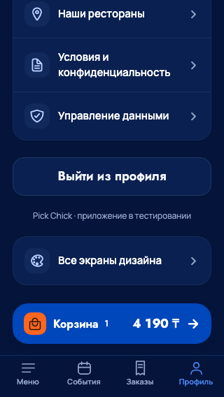

# Корзина: вариант 1 - 25 сентября 2026

По выбору владельца временно применён «Чистый синий»: компактная синяя кнопка,
оранжевая иконка пакета, белая надпись и сумма, количество рядом без плашки.
Персонаж убран. Размер от 58px; при крупном шрифте/длинной сумме сохранён перенос.
Прозрачные поля и измеренные отступы прокрутки сохранены на четырёх вкладках.
Короткая реакция количества 160+240ms прерывается при уходе в фон/с экрана
и отключается Reduce Motion; цена и область нажатия неподвижны.

Проверено: типизация/lint/export, 162 JS+30 Python mobile, четыре вкладки на
320×568/393×852/768×1024/852×393, переход/очистка корзины, движение и Reduce Motion.
Просмотрены реальные браузерные снимки меню393 и профиля320. Физические FPS,
VoiceOver/Dynamic Type и выпуск TestFlight этим не подтверждены.

## Предыдущий этап

# Корзина над вкладками - 24 сентября 2026

По поручению владельца убрана общая подложка корзины в событиях, заказах и
профиле, как ранее в меню. Теперь единая кнопка плавает над всеми четырьмя
вкладками. Прозрачные поля пропускают касания к странице. Фактическая высота
кнопки резервируется в прокрутке: последние элементы остаются доступными,
в том числе при переносе суммы и увеличенном системном шрифте.

В кнопке сохранены фирменные Jost/Manrope и синий цвет; добавлены оранжевый
счётчик, стрелка и существующий персонаж из предоставленного оформления
PICK MAN. Это повторное использование брендового изображения, новый персонаж
или обещание награды не добавлены. Вся кнопка - одно действие с суммой и
количеством в доступном имени. На ширине меньше 360, увеличенном fontScale
или длинной сумме текст располагается в две строки.

## UX и движение

Применены адресные рекомендации UI/UX Pro Max (Reduced Motion, Excessive Motion,
React Native UI-thread) и Impeccable animate/iOS/craft-floor. Сохранена текущая
идентичность приложения. Персонаж делает один короткий кивок при появлении
корзины на вкладке или увеличении количества: 180 мс вверх/наклон и 300 мс назад.
Сама область нажатия и цена неподвижны; бесконечного цикла нет. Анимация
использует native driver на iOS/Android, прекращается при потере фокуса,
уходе приложения в фон, размонтировании и включении Reduce Motion.

## Проверки и границы

- TypeScript, targeted ESLint/Prettier, git diff check прошли.
- 162 JS и 30 Python mobile-проверок прошли.
- Browser: четыре вкладки на 320×568, 393×852, 768×1024 и 852×393;
  прозрачность, положение над вкладками, количество/сумма, переход в корзину,
  очистка и отсутствие кнопки при пустой корзине. Использованы локальные
  синтетические GET-ответы, серверных заказов/платежей не создавалось.
- Отдельно проверены движение персонажа и переключение Reduce Motion во время
  работы. Снимки ниже - браузерные, после завершения стартовой заставки.
- Web export и живой iOS Dev manifest/bundle HTTP 200 прошли. Детектор Impeccable
  не выдал замечаний к компоненту.
- Симулятор iPhone не сохранил запущенное состояние; актуальный iOS bundle
  экспортирован, но нативные скриншоты и Dynamic Type не приняты. Физические
  FPS, VoiceOver и крупный системный шрифт требуют приёмки на устройстве.
  Это не новый TestFlight или IPA; изменения подаются в установленный Dev.

