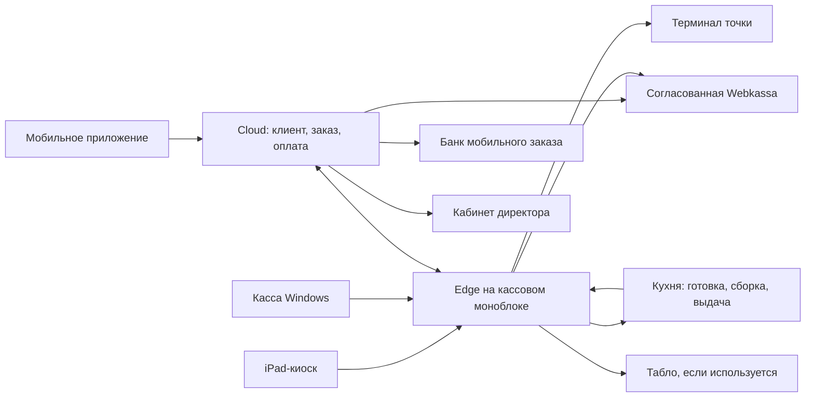

# Полный запуск точки: проверка готовности 4 октября 2026

Основание: запрос владельца о совместной работе mobile, iPad-киоска, Windows
кассы и кухни. Проверен общий исходник `d1bd631018ea169f42783655d6ead56cc052b451`,
код ключевых путей, актуальные протоколы установки, ТЗ01-07 и матрица AC.
Два независимых read-only разбора покрыли оборудование и денежные интеграции.
Изменений рабочих продаж, банковских вызовов, SMS/OTP, чеков и устройств не было.

## Вывод

Полное переключение действующей точки пока не готово. Работает существенная
часть мобильного пилота: вход, заказ, счёт Kaspi, передача в edge и статусы кухни.
Но POS ещё отправляет неоплаченный service-заказ, киоск использует TEST-платёж,
а фискальный документ в мобильном пилоте намеренно отложен. Это конкретные
незаконченные интеграции, а не причина повторять все тесты интерфейса.

## Что подтверждено сейчас

Read-only проверка VPS показала:

- API `e236824` отвечает ready=true, database/schema/Redis up; gateway/БД/portal
  healthy. Public release `d1bd631`, банковский worker `b18beb08`.
- Kitchen portal сообщает edgeConnected=true. Доступность меню fresh=true,
  актуальные стопы модификаторов получены. orderingOpen=false соответствует
  нерабочему времени; задан график10:00-00:00 Asia/Almaty.
- Telegram включён, выбор канала automatic, channels=[telegram]. Это не новый
  тест доставки и не проверка текущего баланса Gateway. WhatsApp не включён.
- Опубликованный мобильный каталог `/v1/customer-checkout/catalog` возвращает404:
  флаг новой витрины выключен. Config checkout без клиента возвращает401 штатно.
- Общий `/v1/capabilities` всё ещё описывает TEST/pilot и payments=false; это
  не статус отдельного authenticated customer checkout. Для приёмки надо проверять
  фактические разрешения каждого канала, не выводить из этого флага отсутствие Kaspi.
- Backup timer active, последняя плановая копия завершилась success/exit0.
  Копии на VPS существуют; диск занят20%. Отдельное хранилище и PITR не подтверждены.
- Последняя подтверждённая мобильная поставка по протоколу - TestFlight0.2.0(8),
  группа из двух тестировщиков. App Store/Google Play публикация не подтверждена.

Public `/health/ready` закрыт шлюзом (404), loopback readiness исправен. Это не
инцидент. Windows, физический iPad, терминал, принтер и LAN-кухня в этом аудите
не обследовались: свежий heartbeat не заменяет их аппаратную приёмку.
Открытые PR просмотрены через GitHub connector; старые PR не являются доказательством
установки. CLI gh на этом Mac без активной авторизации; git refs получены успешно.

## Матрица оставшейся работы

| Область      | Что есть                                                              | Что обязательно завершить                                                                                  | Доказательство готовности                                                                                                  |
| ------------ | --------------------------------------------------------------------- | ---------------------------------------------------------------------------------------------------------- | -------------------------------------------------------------------------------------------------------------------------- |
| Mobile       | Telegram, сессия, корзина, Kaspi pilot, статусы; TestFlight8          | Коммерческая фискальная политика, приёмка платежей/отмены/возврата на текущей сборке; публикация клиентам  | Новый клиент проходит вход и заказ, возврат из фона не создаёт второй счёт, чек и история совпадают                        |
| POS          | Локальный сервер, PIN/роли, смены, меню, кухня                        | Наличные и физический Kaspi POS через денежное ядро, чек, печать, закрытие и сверка смены                  | Заказ кассира имеет подтверждённую оплату, настоящий чек, одну выдачу и корректную кассовую сумму                          |
| Киоск        | iPad UI, корзина и TEST flow                                          | Коммерческий quote/order/payment вместо simulated-payment, схема оплаты и восстановление гостевой сессии   | Реальный iPad оплачивает точную корзину, получает чек, заказ доходит на ту же кухню; следующий гость не видит чужие данные |
| Кухня/выдача | Edge и внешний HTTPS portal; статусы mobile                           | Установка локального клиента на кухонный моноблок, маршруты готовки/сборки/выдачи, при необходимости табло | Все три канала поступают однократно; одна станция не выдаёт раньше готовности всех компонентов; LAN работает без WAN       |
| Меню         | Закреплённый коммерческий mobile-снимок и рабочий стоп-лист; редактор | Общие SKU/модификаторы/цены, версия для mobile/kiosk/POS, доставка и ACK кассы                             | Один состав и сумма во всех каналах; старая версия не создаёт неправильный платёж; стоп блюда/соуса блокирует продажу      |
| Webkassa     | План и внутренние fiscal states                                       | Правильная ККМ/продавец/точка, API-доступ, sale/refund/status/reprint, сверка                              | Настоящий фискальный документ; timeout повторно получает исходный чек, не создаёт второй                                   |
| Возвраты     | Durable refund intent и денежные инварианты                           | Реальный банковский возврат, полный/частичный чек возврата, права/причины/сверка                           | Нельзя вернуть больше оплаченного; повтор команды не возвращает деньги дважды                                              |
| Смены/отчёты | Cloud033 и кабинет установлены                                        | Edge016/новый worker на кассе, исторические отчёты и полнота покрытия                                      | Открытие/закрытие/внесения/изъятия и заказы одной реальной смены сходятся с кабинетом                                      |
| Эксплуатация | Автостарт/повторы, encrypted backup/restore инструменты               | Холодный старт, независимые копии, аварийные оповещения, принятые RPO/RTO, UPS/сеть                        | Сотрудник восстанавливает работу без разработчика; потеря VPS/edge имеет проверенный порядок восстановления                |
| Запуск смены | Код и отдельные контрольные проверки                                  | UAT персонала, переключение владельцев заказов с iiko, ежедневная сверка и пилот                           | 7-10 рабочих смен по плану, нет потерянных оплат/дублей/необъяснимых сумм                                                  |

Действующий стоп-лист не резервирует последнюю порцию и не рассчитывает остатки
по техкартам. При переносе складской автоматизации за первый запуск требуется
согласованный ручной порядок доступности и обработки уже оплаченной позиции,
которую ресторан не может приготовить. Одновременная продажа последней порции
должна быть отдельным приёмочным сценарием.

## Схема, к которой доводим систему

Это целевая связь; линии киоск/терминал/ККМ ещё не означают работающую интеграцию.
У каждой оплаты один order ID, amount/version, idempotency key; у заказа явные
organization/branch/channel, смена и номер. Edge владеет приготовлением/выдачей,
банк подтверждает деньги, ККМ подтверждает чек. Cloud и edge сохраняют события
в PostgreSQL/outbox/inbox и обмениваются ACK; UI не объявляет успех сам.

Для первого ресторана достаточно кассового edge и одного кухонного моноблока
с переключением стадий по решению владельца. Не требуется покупать второй KDS
или отдельный сервер только из-за исходного плана двух станций.

## Порядок завершения

1. **Закрепить конфигурацию точки.** Текущие IP/резервации DHCP, устройства,
   роли сотрудников, принтер, терминал, UPS; единые branch/device IDs. Уточнить
   готовность физического iPad и окна обслуживания. Это обследование, без
   остановки текущих продаж и без повторного запроса уже известных реквизитов.
2. **Параллельно получить Webkassa и терминальный доступ.** Проверить техническую
   привязку ККМ к продавцу приложения PICK CHICK ALA AP и Abay Plaza: ранее
   предоставленные паспорта относятся к Peak Group. Оба бизнеса принадлежат
   владельцу, но это не доказывает нужную конфигурацию фискального API.
   У Kaspi mobile не менять работающий счёт на терминальную схему кассы.
3. **Закончить общие деньги/меню/возвраты.** Снять deferred_pilot только после
   рабочего чека; принять неизвестный результат, повтор и сверку. Ввести одну
   согласованную версию меню; разные цены каналов не обязательны для первого
   запуска, если общий прайс утверждён. Нельзя обещать изменение цены через
   кабинет до реального применения этой публикации всеми каналами.
4. **Установить POS/edge, LAN kitchen, подключить commercial kiosk.** Обновить
   edge016/worker с backup и сохранением смен. Закрепить iPad в приложении,
   проверить очистку данных гостя и восстановление незавершённой оплаты.
5. **Пройти единую приёмку на железе.** По заказу из mobile/POS/kiosk, одинаковые
   позиции/замены, оплата/чек/готовка/сборка/выдача/отчёт. Стоп блюда и напитка,
   истечение счёта, поздняя оплата, повторное нажатие, полный/частичный возврат,
   закончилась бумага, потерянный ответ банка/ККМ/edge.
6. **Проверить сбои и эксплуатацию.** Перезагрузка Windows, WAN-loss8часов,
   синхронизация накопленных событий, замена edge и восстановление cloud из
   независимой копии. Цели RPO<=5мин/RTO<=60мин в ТЗ ещё не доказаны ежедневным
   dump на том же VPS. Облачные оплаты при недоступности банка не имитируются.
7. **Обучение, пилот, магазины.** Ответственный за смену, инструкция при неизвестной
   оплате, сверка банка/ККМ/заказов ежедневно; 7-10 рабочих дней по действующему
   плану. Готовые клиентские сборки публикуются через магазины. Review Apple/Google
   и доступы поставщиков нельзя обещать к точной дате без подтверждения.

## Что ещё входит в полное ТЗ, но не закрывает базовую продажу

WhatsApp-резерв, маркетинговые push/сегменты, ручные бонусные корректировки,
контент/видео CMS, расширенная статистика и игровые награды требуют отдельных
этапов. Их нельзя отмечать готовыми по наличию пункта меню.
Apple Pay/карты, Яндекс, склад по техкартам и лояльность входят в согласованный
план; перенос за первый запуск возможен только отдельным решением владельца.
Если продолжаем принимать Яндекс через iiko, это частичное сосуществование,
а не полная замена iiko. Нужен один владелец каждого заказа и чека.

Текущий Kaspi-мост не официальный API; успешный счёт не доказывает его постоянную
доступность или поддержку банком. До полного запуска нужен принятый владельцем
операционный порядок отказа/повторного входа и подтверждённый способ возвратов.
Не обходить проверки банка и не обещать непрерывный интернет. Цель надёжности -
сохранить заказ/деньги и автоматически восстановиться, а не скрыть факт сбоя.

## Что нужно от владельца, что делает разработка

От владельца: текущий IPv4 кассы/кухни и доступность iPad; модель/способ подключения
Kaspi POS; API-доступ Webkassa и подтверждение нужной кассы/продавца; ответственный
сотрудник для приёмки и окно пилота. Пароли/ключи через приватные файлы.
Разработка: адаптеры/денежные сценарии, общий каталог, commercial kiosk, локальная
кухня, edge016, отчёты, мониторинг/копии, сборки и проверяемый выпуск.

Срок и процент готовности не рассчитаны: отсутствуют подтверждённые сроки внешних
доступов и аппаратная приёмка. Первый следующий этап - конфигурация устройств и
Webkassa/POS spike параллельно с общим меню; очередной редизайн не критический путь.

## Основания

- [Статус](../project-status.md), [план/AC-01-41](../04-roadmap.md),
  [автономность, RPO/RTO, переключение](../03-offline-and-reliability.md).
- [POS](../../apps/pos/src/app.ts): unpaid_service; [киоск](../../apps/kiosk/src/controller.ts)
  и [API клиента](../../apps/kiosk/src/api.ts): simulated-payment/TEST.
- [Пилот checkout](../../packages/commerce-core/src/customer-checkout.ts),
  [fiscal policy](../../packages/commerce-core/src/repository.ts),
  [Kaspi adapter](../../packages/commerce-core/src/kaspi-remote.ts).
- [Webkassa доступы](../integrations/webkassa-live-access-2026-09-28.md),
  [Kaspi приёмка](kaspi-live-activation.md), [стоп-лист](mobile-stop-list.md).
- [Директор](director-console.md), [кухонная связь](kitchen-live-link.md),
  [оборудование](restaurant-equipment.md), [режим iPad](ipad-kiosk-lockdown.md).
- [Восстановление связи](connection-recovery.md), [TestFlight8](mobile-testflight.md),
  [автоматические каналы](automatic-auth-channels.md), [копии](staging-vps.md).
