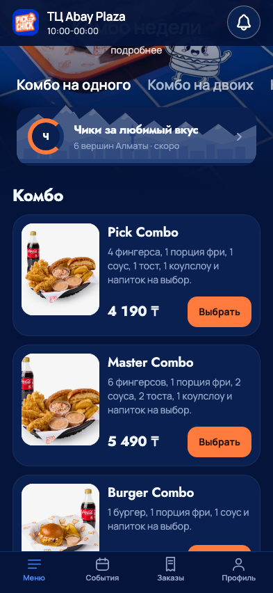
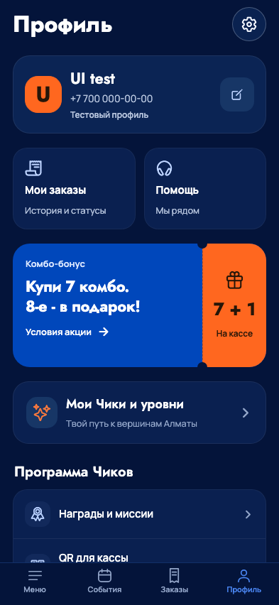
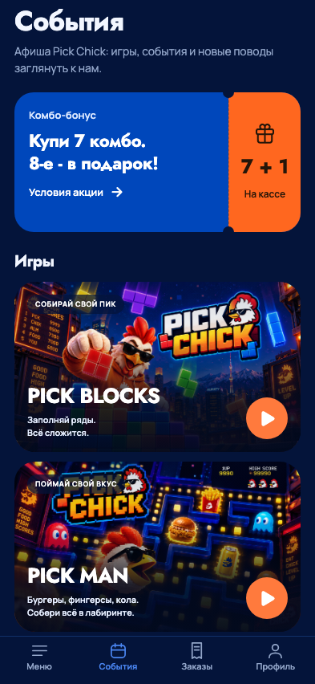
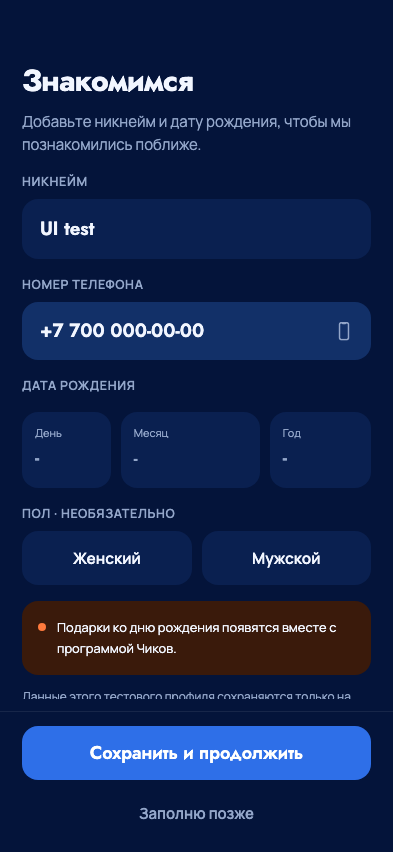

# Мобильный интерфейс: карточки, купон и общие элементы

23 сентября 2026. Уточнение владельца после подключения UI/UX Pro Max и Impeccable.
Визуальная основа сохраняется: исходный mobile-v2, фотографии меню, обложки игр,
синие/оранжевые цвета PickChick, Jost и Manrope. Это развитие согласованного дизайна.

## Изменения

- **Меню:** более собранные карточки с фото, отдельной ценой и заметным оранжевым
  действием; вся карточка нажимается. Компактные карточки дополнений получили
  более читаемые названия и крупный знак добавления. Описание/варианты/цены не
  заменены рекламными заглушками. «ХИТ» существует в демонстрационном каталоге;
  реальному меню признак популярности без данных не присваивается.
- **Комбо-бонус:** вместо большой сетки условных отметок - единый купон с
  отрывным оранжевым краем. Высота 174 px на ширине 393; на узком экране текст
  переносится, купон растёт по содержимому без обрезки. Условия по нажатию, доступный переход в меню.
  Нет выдуманного личного прогресса или выдачи подарка клиентским кодом.
- **Профиль:** компактная строка с аватаром, именем, номером и кнопкой
  редактирования 48×48. Гостевой вход, восстановление и обозначение тестового
  аккаунта сохранены. Длинное имя переносится; крупный шрифт допускает перенос ряда.
- **Вход и регистрация:** центрированная форма до 480 px, спокойнее заголовки,
  очистка даты в нормальной раскладке вместо абсолютного наложения. Пол переключается
  в колонку при увеличенном системном шрифте. Клавиатуры, обязательность полей
  и сохранение профиля не меняются.
- **Заказы:** компактное пустое состояние; карточка истории открывается целиком,
  статус отдельно от суммы, дата и способ получения читаются независимо.
  Неизвестный/непроверенный результат по-прежнему не выдаётся за отсутствие заказа.
  Номер в макете приготовления адаптируется к ширине и масштабу текста.
- **Общий UI:** выровнены ограниченные по ширине шапки/нижние действия, меньше
  пустые состояния, улучшен контраст текста основных оранжевых кнопок, значения
  итогов могут переноситься. Крупнее модификаторы и пояснения checkout; окна
  удаления/очистки прокручиваются на низком экране. Корзина поверх меню сохранила
  прозрачный фон, а меню - поведение видео и сокращение движения.
- **Игры:** в приложении только PICK MAN и PICK BLOCKS. PICK RUN и его анонс
  убраны, M27/M28 возвращают в события также с `preview=1`. Исторический движок
  и его unit-проверки сохранены для возможного возвращения. Список галереи -
  33 экрана; две игровые страницы дополнительно доступны через события.

## Применение навыков

Impeccable: контекст проекта, `layout`/`distill`, правила native-audit и craft floor;
два независимых разбора композиции и механики помогли выявить слишком высокий
промоблок, дублирование отступов и риск перекрытия текста. Веб-сканер CSS не
использовался как средство проверки React Native.

UI/UX Pro Max: применены правила контраста, размеров касания, иерархии и
React Native accessibility labels/roles. Поиск по конкретной композиции
product card не дал подтверждённого результата даже после уточнения; решение
карточки основано на исходном дизайне и общих правилах навыков, а не на
несуществующем шаблоне из базы. Новые зависимости не добавлялись.

## Подтверждение и ограничения

- TypeScript, ESLint, форматирование, web-экспорты обычного и изолированного
  QA-режима. 162 JS unit-теста и 30 Python проверок mobile прошли.
- 33 экрана × 320×568 / 393×852 / 768×1024: ограничение ширины, нижние действия,
  отсутствие JS-ошибок. Сохранены плавный стык Пик Комбо, геометрия шапки,
  отмена нажатия и переключение reduced motion.
- 24 блюда, 13 переключений категорий, варианты/модификаторы и суммы на
  320/390/430; checkout на 320/393/430, без операций оплаты.
- История после потери сети: тот же сохранённый заказ, повтор чтения и переход
  в детали; обновлённая карточка не создаёт новый заказ.
- Профиль гостя и участника, длинное имя, редактирование, восстановление и выход;
  регистрация на 320/390/430, ошибочный OTP, сохранение/очистка даты,
  отмена календаря и необязательный пол. SMS не отправлялись.
- Купон/окно условий, меню, профиль и возврат со всех ссылок RUN на
  320/393/768/852; две игры на четырёх размерах. Отдельная проверка MAN
  охватила пять размеров, четыре свайпа, паузу/восстановление и результат.
- Dev manifest и bundle iOS/Android вернули HTTP 200. Это не проверка FPS,
  VoiceOver/TalkBack или Dynamic Type на физическом устройстве.

Проверки выполнялись на локальных синтетических данных. Новый TestFlight
не создавался. Следующий этап - приёмка этих изменений на iPhone/Android
и выпуск проверенной сборки; экономика, серверные награды и реальная оплата
остаются отдельными этапами.

## Снимки текущего результата

Web-превью React Native, ширина 393, синтетический профиль.

