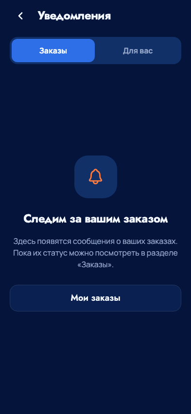

# Колокольчик в главном меню - 23 сентября 2026

По решению владельца верхняя кнопка профиля заменена уведомлениями.
Профиль остаётся в нижней навигации. Размер и положение круглой кнопки сохранены,
новая иконка имеет подпись доступности «Уведомления».

Маршрут `/notifications` открывает экран с вкладками «Заказы» и «Для вас».
Есть возврат назад с переходом в меню при прямом открытии, а также действия
«Мои заказы» и «Открыть события». Используются общие шрифты, цвета и анимации;
содержание прокручивается на коротких экранах, сенсорные цели не меньше 48.

Это готовая навигация и пустое состояние. Источник сообщений, прочтение,
счётчик непрочитанных и APNs/FCM пока не подключены; фиктивных сообщений нет.
Следующий этап - лента с серверной авторизацией и состоянием прочтения,
затем доставка push с согласиями. До этого колокольчик не показывает точку.

Проверки: TypeScript, ESLint, web-экспорт и iOS Dev bundle; обновлённый сценарий
соответствия макету и навигации прошли. Проверены три размера 320×568, 393×852,
768×1024, обе вкладки, семантика выбранной вкладки, переходы в заказы/события,
профиль снизу, возврат и прямое открытие гостем. Все API-ответы синтетические,
реальных заказов и отправки уведомлений нет. Приёмка на физическом телефоне
и новый TestFlight в этот этап не входят.

