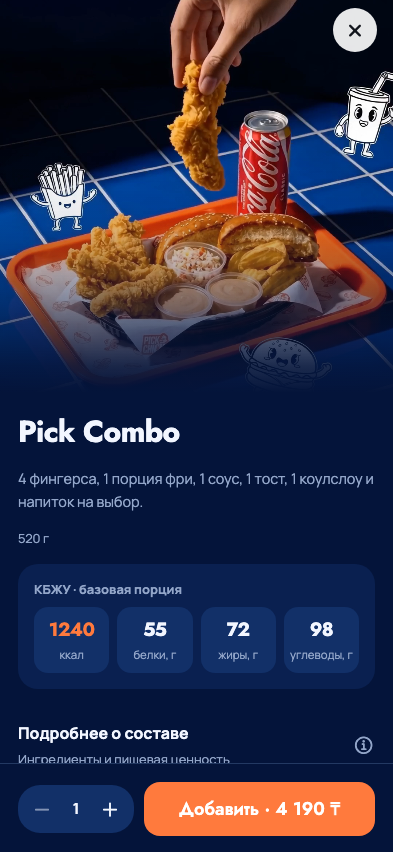

# Mobile: плавность и удобство - 23 сентября 2026

Владелец поручил улучшить анимации, переходы, скорость восприятия, размеры и
шрифты приложения, отдельно смягчить стык видео Пик Комбо с содержимым.
Визуальный источник остаётся `design/reference-source/mobile-v2.html.txt`.
Сохранены фирменные цвета, Jost/Manrope, исходная композиция витрины, карточек,
событий и закреплённых действий. Это доработка существующего интерфейса.

## Исследование и решения

Использованы навыки Mobile App Design Standards, design:design-critique и
webapp-testing. Основания проверены по официальным источникам:

- [Apple Motion](https://developer.apple.com/design/human-interface-guidelines/motion):
  движение объясняет действие и переход, поддерживает системное сокращение движения.
- [Apple Typography](https://developer.apple.com/design/human-interface-guidelines/typography):
  читаемость и адаптация при увеличении текста, гибкая компоновка.
- [Apple UI Design Tips](https://developer.apple.com/design/tips/):
  ориентир для сенсорных целей iOS - 44 × 44 пункта.
- [React Native Performance](https://reactnative.dev/docs/performance) и
  [Animated](https://reactnative.dev/docs/animated): нативное выполнение подходящих
  анимаций, разделение UI/JS работы; оценивать фактическую производительность
  в release-сборке на устройстве, а не по скорости отладчика.

Длительности ниже - наш выбор для PickChick, а не норматив Apple:

| Действие | Длительность | Результат |
|---|---:|---|
| Нажатие | 80 мс | Мягкий отклик прозрачностью |
| Отпускание | 150 мс | Возврат кнопки в исходное состояние |
| Открытие экрана в web | 180 мс | Появление без перемонтирования формы |
| Обложка → готовый видеокадр | 240 мс | Исчезает резкая смена изображения |

Нативная навигация использует штатные переходы стека. Вкладки и модальные
окна получили согласованное появление. Основные кнопки слегка уменьшаются
до 98,5%; нажатие выполняется сразу, ожидание анимации не добавлено.
Отключённая кнопка остаётся отключённой; отпускание вне кнопки отменяет действие.

## Что исправлено

1. Пик Комбо: видео постепенно затемняется до точного цвета страницы `#04143A`.
   Градиент лежит поверх обложки и видео; изображение сохраняется до готового кадра.
   Высота медиа учитывает короткий экран и планшет, сохраняя место для содержания.
2. Меню: исчезновение «Заберу сам / В зале» больше не меняет высоту шапки скачком.
   Прозрачность, смещение и фон зависят от прокрутки через Reanimated; React не
   обновляется на каждом кадре. Скрытый переключатель исключается из касаний.
3. Общие элементы: единый `MotionProvider` отслеживает сокращение движения во
   время работы. В этом режиме нет масштабирования, пространственных переходов
   и фонового видео. Возврат из фона, ошибка видео и статичная обложка сохранены.
4. Каталог: карточки мемоизированы, изображения используют memory/disk cache.
   Это уменьшает лишнюю работу при изменениях шапки/категории; процент ускорения
   без профилирования не заявляется.
5. Типографика: увеличены межстрочные интервалы заголовков, мелкие названия и
   описания меню. Переключатель получения имеет высоту 44. При большом системном
   шрифте карточки/модификаторы получают дополнительное место и переносы.
   На широком экране обычное содержимое ограничено 760 пунктами.
6. Проверка обнаружила обрезанный номер `083` на экране выдачи шириной 320.
   Теперь размер номера зависит от ширины и масштаба шрифта.

Общие элементы применены к входу, каталогу, корзине, оформлению, заказам,
профилю, событиям, лояльности и оболочке игр. Игровая физика и денежные правила
в этом этапе не изменялись. Банковские и фискальные операции не выполнялись.

## Проверки

- 35 экранов M01-M35 на 320×568, 393×852 и 768×1024: 105 состояний, скриншоты
  просмотрены; нет горизонтального выхода страницы и ошибок JavaScript.
  На коротких экранах длинные страницы прокручиваются.
- Дополнительно: неизменная высота шапки на шести положениях прокрутки,
  стык видео/содержимого, размер закрытия, отмена нажатия, смена Reduce Motion
  во время работы и добавление в корзину.
- Каталог: 24 блюда, категории, модификаторы, сохранение двух вариантов в корзине,
  повтор расчёта после ошибки, закреплённые действия на 320/390/430.
- Существующие проверки композиции исходного макета, прерванного воспроизведения,
  обложки и профиля прошли. В fixture каталога добавлен ранее отсутствовавший
  GET опубликованного контента; перед проверкой баннера тест ждёт загрузку каталога.
- Обычный checkout на 320/393/430: выбор Kaspi/карты, восстановление выбора,
  закреплённая кнопка и сохранение корзины прошли; платёж остаётся недоступным,
  симулятор отсутствует, записывающих запросов нет.
- Проверка лояльности на 320/393 прошла: награды остаются неактивированными,
  названия и условия помещаются, реальные запросы заблокированы.
- 162 существующих mobile unit-теста, TypeScript и ESLint прошли; 7 тестов roadmap прошли.
- Expo production-экспорт iOS/Android/web собран. Это JS/Hermes bundles и ресурсы,
  не новая IPA/APK или публикация в TestFlight. Dev-сервер выдаёт iOS/Android bundle.
- Все browser-проверки используют loopback и синтетические ответы; реальные
  заказы, платежи, сообщения и начисления не создавались.

Для обычного экспорта явно задавать `EXPO_PUBLIC_ORDER_SIMULATOR=0` и очищать
кэш после QA-экспорта с флагом `1`: проверка обнаружила сохранённый Metro-кэш
предыдущего режима. QA-экспорт хранится отдельно от обычного приложения.

### Следующая приёмка

Подключённый ранее iPhone сейчас недоступен. Физические 60/120 FPS, потребление
памяти, VoiceOver/TalkBack и системный увеличенный шрифт должны быть проверены
на iPhone и Android в release-сборке. Browser-матрица этого не доказывает.
Предложенная адаптация к fontScale реализована, но её нативная приёмка открыта.
Новый TestFlight не выпускался; обновление доступно через текущий PickChick Dev
при подключении к работающему серверу разработки.

## Примеры после изменения

Пик Комбо, телефон:

Меню и номер готового заказа на маленьком экране:

