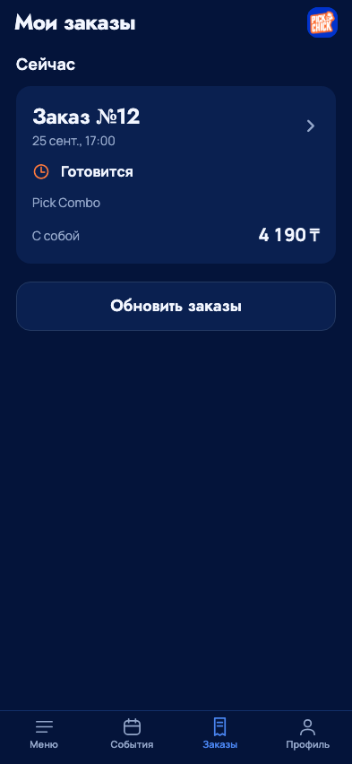
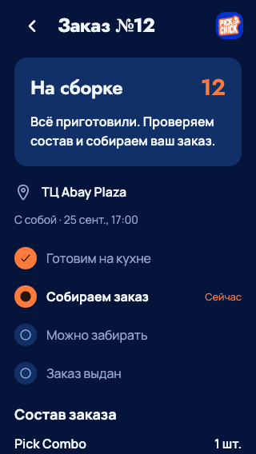
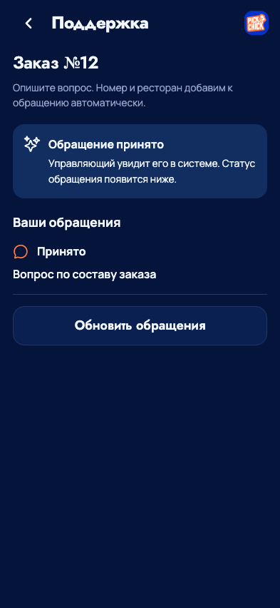

# Мои заказы и обратная связь - 25 сентября 2026

## Реализовано

UI/UX Pro Max (progress/submit feedback) и Impeccable (Operate/polish), бренд
PickChick, Jost/Manrope. Активные заказы отдельно от истории; номер, время Алматы,
состав, сумма и способ получения. В деталях кухня, сборка, готовность и выдача
имеют явный текстовый этап. Надпись «Статус проверен» удалена. Существующий
событийный watch, восстановление и защита неизвестного результата сохранены.
История имеет отдельную постраничную загрузку завершённых заказов, не расширяя
20 элементов живого watch. Добавление блюда закрывает редактор и возвращает
на предыдущую страницу; корзину открывает пользователь. Редактирование строки
из корзины по-прежнему возвращает в корзину.

После выдачи доступен отзыв: 1-5 звёзд и необязательный комментарий. Поддержка
открывается из конкретного заказа. По решению владельца обращения принимаются
внутри системы для управляющего, без внешнего мессенджера.

## Данные и границы

В текущем connected Dev используется синтетический клиентский сеанс `/v1/test`.
Это история данного сохранённого сеанса, не подтверждение production SMS/WhatsApp
идентификации и межустройственной истории реального аккаунта.

`GET /v1/test/history?before=<owned order UUID>` возвращает до20 завершённых заказов
и `has_more`. `GET/POST /v1/test/orders/:id/feedback` проверяет владельца заказа;
отзыв разрешён только для fulfilled и только один. Обращений не больше5 на заказ.
Payload строгий, комментарий до2000 символов. Idempotency-Key хранится на устройстве
до проверенного ответа; повтор сохраняет исходное содержимое и ключ.

Отзывы и обращения атомарно с `test_command_results` сохраняются в `bo_records`
той же точки с `source=mobile_test`. В бэк-офисе видны в «Отзывы» и «Обращения».
Оператор может менять рабочий статус/внутренние заметки, но не исходную оценку,
сообщение или принадлежность. Его изменения проходят прежний RBAC, ревизии и
bo_audit. Клиент получает только собственный текст, оценку и статус обращения;
внутренние заметки/резолюции и данные сотрудников не раскрываются. Это обращение,
не чат с ответами оператора. Клиент обновляет статус обращения кнопкой.

Фискальный документ не генерируется: `fiscal_state=not_applicable`, банк и ККМ
не подключены. «Официальный чек» честно сообщает об отсутствии документа;
состав заказа не выдаётся за чек. Реальная ссылка/QR появятся только вместе с
доверенным фискальным адаптером. Производственная лояльность не затрагивается.

## Проверено

- TypeScript mobile/API/test-order-flow/backoffice; адресные ESLint/Prettier;
  генерация и сверка OpenAPI.
- 25 PostgreSQL integration tests: прежний заказ/кухня/events/смены, чужой заказ,
  один отзыв после выдачи, повтор без дубликата, лимит обращений, история26 заказов,
  чтение и изменение статуса управляющим через настоящий Backoffice core.
- 29 Node mobile tests: recovery/cart edit, потерянный ответ отзыва/обращения и
  повтор после создания нового экземпляра клиента с тем же ключом.
- `browser_orders.py`:320×568,393×852,768×1024,852×393; живые события приготовления,
  сборки, ready и fulfilled, отзыв, потерянный ответ обращения, чек без подмены.
  HTTP полностью изолирован; реальные заказы/сообщения не отправляются.
- `browser_cart_sheet.py`: четыре размера, ручное открытие, редактор, количество,
  промокод, оформление и возврат; `browser_catalog_recovery.py`: недоступное меню,
  unknown, восстановление, fallback старого watch404.
- `browser_complete_catalog.py`: три размера,24 блюда,13 категорий, две конфигурации комбо, ручная корзина и сохранение исходного запроса после ошибки. Старый тест обновлён под текущий экран акций/оплаты.
- iOS/Android Dev manifest + bundle HTTP200. Нативная приёмка на телефоне,
  VoiceOver, системный Dynamic Type и клавиатура ещё отдельно.

В браузерном тесте долгого ожидания Playwright может вывести предупреждение
об отмене незавершённого перехваченного запроса при закрытии context; проверки
состояний завершены, ошибок приложения нет.

## Публикация

Исходники/Dev интерфейс обновлены. **Новый API обратной связи, бэк-офис и gateway
этим этапом на VPS ещё не установлены.** На старом сервере приложение показывает
недоступность приёма, не подтверждает фиктивную отправку. Онлайн-roadmap и TestFlight
также не опубликованы.

Для выпуска нужны зелёная CI точного коммита и отдельный проверенный release
из фактического baseline: VPS на020, общая разработка содержит021 смен.
Не применять исторический daily-number release повторно и не подменять весь
публичный gateway. Добавить только history/feedback GET/POST/OPTIONS;
сохранить таймауты и область watch. Runtime API требуется INSERT в bo_records
(нынешний mobile release гарантирует лишь SELECT для recipe trigger), и SELECT
в test_order_numbers. Не обходить ACL/restore rehearsal/release lock. После
выпуска проверить запись и статус через реальный бэк-офис с синтетическим заказом.

Старый preflight guard order-events исправлен адресно: добавление watch теперь
распознаёт `quotes|orders|` и сохраняет новые shift маршруты. Его два unit-теста
проходят. Это не заменяет выпуск021 или проверку остальных заданий CI.

## Снимки

