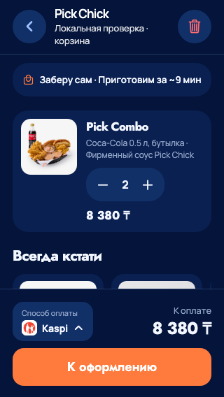
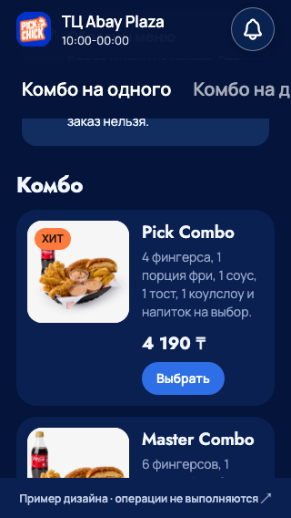

# Корзина и бейдж «ХИТ» - 23 сентября 2026

Первое исправление по [аудиту UI/UX Pro Max и Impeccable](../design/mobile-skills-review-2026-09-23.md),
подтверждённое владельцем. Изменён `apps/mobile/src/screens/CatalogScreens.tsx`.

## Изменения

- Убраны переопределения 44×44 у кнопок количества, возврата и очистки корзины.
  Они используют общий IconButton 48×48. Размер иконок сохранён, выросла
  именно область нажатия. Раскладка цены по-прежнему переносится при нехватке места.
- «ХИТ» использует существующий `colors.orangeInk` вместо белого текста:
  контраст на оранжевом #FF7A3D вырос с 2,59:1 до 6,77:1.
  Размер текста увеличен с 10/13 до 12/16 (размер/межстрочный интервал).
  Цвет фона, шрифт и положение бейджа сохранены.
- Новых библиотек и изменений расчёта цен, количества, оплаты или каталога нет.

## Проверки

- TypeScript, ESLint и web-экспорт прошли.
- Нативные Dev manifest и bundles iOS/Android возвращают HTTP 200.
- В web на 320×568, 393×852, 768×1024 и 852×393 проверены четыре области
  нажатия 48×48, увеличение количества от 1 до 20, блокировка плюса на лимите,
  уменьшение до 1, удаление последней позиции и очистка корзины.
- Проверены суммы 8 380 ₸ для двух и 83 800 ₸ для двадцати тестовых Pick Combo;
  отсутствие горизонтального переполнения, читаемость бейджа и JS-ошибок.
- Существующая проверка checkout на 320/393/430 прошла: переход из корзины,
  фиксированный footer, выбор способа оплаты и сохранение данных. Обращений
  к банку/создания заказов нет; использованы локальные синтетические данные.
- Снимки корзины и каталога просмотрены. Native Dynamic Type, VoiceOver,
  TalkBack и аппаратные FPS этим этапом не подтверждены. Новый TestFlight
  не создавался; изменения доступны через текущий PickChick Dev на Mac.

## Визуальное подтверждение

Web-превью React Native, ширина 320. Настоящие заказы не создавались.

Следующий этап по аудиту - компактный вариант «7 + 1» для профиля и улучшение
доступа к играм/блюдам. В этот этап изменение композиции этих страниц не входило.
