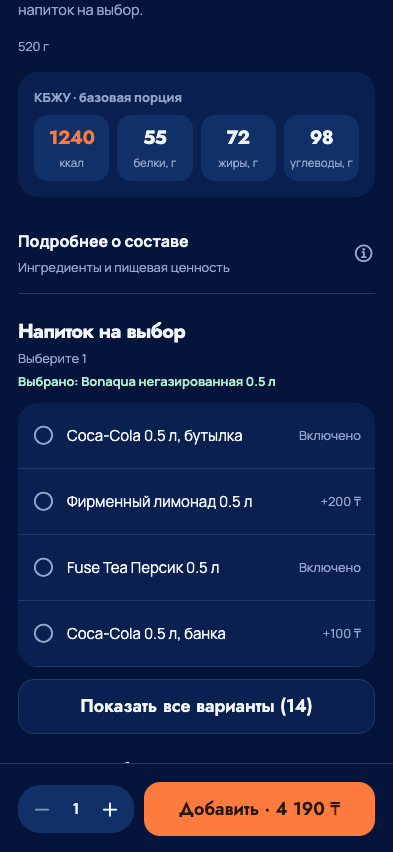
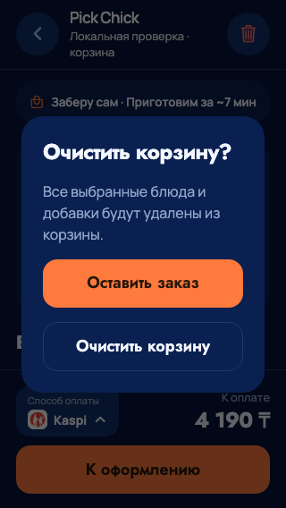
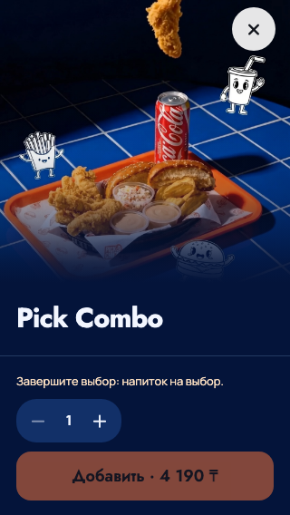

# Адресное применение UX-рекомендаций к выбору блюда

23 сентября 2026. По поручению владельца применены UI/UX Pro Max и Impeccable.
Сохранены композиция mobile-v2, фирменные фотографии, видео, цвета и шрифты.
Проверены текущие меню, карточки и профиль; изменения сосредоточены на конкретных
затруднениях в выборе добавок и корзине. Полного редизайна в этом этапе нет.

## Что улучшено

- Очистка всей корзины требует подтверждения. Первое действие - «Оставить заказ»;
  пустую корзину очистить нельзя. Отмена и перезагрузка сохраняют состав.
  Подтверждение передаёт снимок строк в существующий clearMatchingCart: если
  корзина успела измениться, новая версия не удаляется старым подтверждением.
- Под названием группы виден выбранный напиток/соус, даже если вариант находится
  за кнопкой «Показать все». Выбранная строка дополнительно выделяется поверхностью.
- Вместо «+0 ₸» у включённых вариантов написано «Включено»; доплаты и итоговая
  сумма продолжают вычисляться из каталога, в целых минимальных единицах.
- В необязательной группе с одним вариантом появился выбор «Не добавлять».
  Он доступен только если min=0 и max=1 в каталоге; обязательные группы сохраняют
  обязательность. Экранные дикторы получают название и checked-состояние выбора.
- Причина недоступного добавления теперь рядом с нижней кнопкой: обязательный
  выбор, лимит одинаковых наборов или разных позиций, недоступные добавки.
- Закрытие блюда увеличено до 48×48. Переход между категориями меню учитывает
  системное сокращение движения. Профиль уже использует крупные области действий;
  его оформление в этом этапе не заменялось.

## Основания

UI/UX Pro Max: адресный поиск destructive action confirmation дал правило
подтверждения разрушительных действий; react-native accessibility labels дал
рекомендации по названиям, ролям и проверке дикторов. Поиск selected state visibility
не дал подходящего правила для модификаторов даже после уточнения: состояние
выбора улучшено по Impeccable polish и фактическому поведению приложения,
а не по нерелевантным результатам поиска.

Impeccable: загружены контекст, polish, craft floor и native guidance. Общий
CSS-детектор не нашёл замечаний, но это не доказательство нативного качества.
Семантика опирается на [React Native accessibility](https://reactnative.dev/docs/0.86/accessibility)
и [Modal](https://reactnative.dev/docs/0.86/modal); платформенные свойства не подменяют
ручную проверку VoiceOver/TalkBack.

## Проверки и ограничения

- 162 JS и 30 Python mobile-проверок; отдельно существующие 6 проверок домена,
  включая защиту изменившейся корзины от запоздалой очистки. 7 roadmap-тестов.
- TypeScript, адресный ESLint/Prettier, web export без платёжного симулятора.
- Новый browser_ux_guidance.py: 320×568, 393×852, 768×1024 и 852×393;
  сворачивание выбранного напитка, итоговая цена и сохранение выбора, отмена/
  подтверждение очистки, перезагрузка, обязательная группа без значения по
  умолчанию, необязательная одиночная группа и checked-семантика.
- В проверках только локальные синтетические ответы; заказов, SMS и платежей
  не создавалось. Ошибок JS и горизонтального выхода страницы не обнаружено.
- Dev manifest и bundles iOS/Android отвечают HTTP 200. Это доступность исходников
  для Dev-клиента, не установка новой сборки. TestFlight не выпускался.
- Скриншоты ниже - React Native Web. На запущенном iOS Simulator не обнаружено
  установленного PickChick, Android emulator недоступен; нативная проверка
  крупного системного шрифта, дикторов, жестов и FPS остаётся для устройств.
- Известные ошибки общей CI из предыдущего этапа не исправлялись этим изменением.

## Визуальные доказательства

