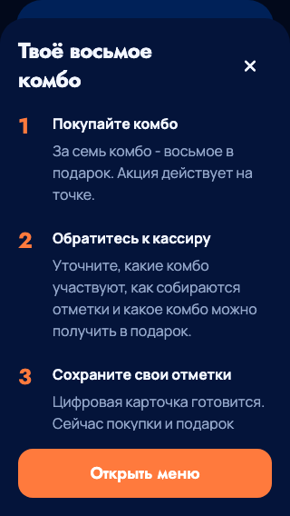

# Профиль и карточка «7 + 1» - 23 сентября 2026

Владелец поручил обновить профиль в цветах PickChick и заменить стрик заказов
в событиях и профиле акцией «Купи 7 комбо - получи 8-е в подарок».
Это уточнение имеет приоритет над старым макетом со стриком Алматы.

## Интерфейс

- В событиях полностью удалены недели, заморозка и награды стрика.
  Сохранён порядок: заголовок/описание, карточка акции, игры, миссии, «Скоро».
- Общий `ComboRewardCard` используется в обоих разделах. Фирменный синий
  `#0047BB` и оранжевый `#FF671F` берутся из существующих дизайн-токенов.
  Светлый талон содержит семь номеров и выделенный подарок, крупный заголовок
  и кнопку «Как получить подарок». Это схема акции, а не личный счётчик.
- Окно условий объясняет механику, предлагает уточнить участвующие комбо
  и подарок у кассира. Есть закрытие, прокрутка и переход в меню.
- Профиль получил оранжевый аватар, более читаемое имя, контрастное редактирование,
  быстрые заказы/помощь перед акцией и компактный вход «Мои Чики и уровни».
  Прежнего стрика в текущем компоненте профиля уже не было; крупную карточку
  Чиков заменяет новая акция, доступ к программе сохраняется.
- Все действия аккаунта, день рождения, QR, документы, управление данными,
  восстановление профиля и выход сохранены. Уведомления открывают новую ленту,
  настройки уведомлений доступны через настройки профиля. Неактивные промокоды
  и приглашения друзей остаются явно недоступными.
- Содержание ограничено 680 пунктами на широких экранах, длинные имена
  переносятся. При крупном системном шрифте быстрые действия встают вертикально.
  Фирменные Jost/Manrope и общие плавные нажатия сохранены.

## Границы акции

Владелец ранее подтвердил действие «7 + 1» на точке. Точные составы, сроки,
совместимость и перенос отметок ещё требуется согласовать по
[предложению программы](../proposals/loyalty-approval-2026-09-23.md).
Текст карточки говорит об участии на кассе и будущем цифровом учёте.
Дизайн не начисляет отметки, не выдаёт купоны и не сбрасывает существующие права.
Покупки, возвраты, миграция и серверное погашение остаются отдельным этапом.

## Проверка

Локально проверены 320×568, 393×852, 768×1024: оба размещения акции,
окно условий, закрытие/переход в меню, отсутствие старого стрика и выхода
за ширину экрана. Проверка профиля охватывает гостя, длинное имя, редактирование,
заказы/помощь/Чики/QR, выход и восстановление после ошибки чтения.
Проверки профиля, композиции макета и сценарий событий/PICK MAN прошли,
включая вход в игру, свайпы, паузу и сохранение. TypeScript, ESLint, web-экспорт,
Dev bundles iOS/Android и 7 тестов roadmap прошли.
Все сценарии изолированы от реальных API-записей.
Физический крупный шрифт и приёмка владельцем остаются открытыми;
новый TestFlight не выпускался.

## Высокая корзина и шкала «7 + 1» - 27 сентября 2026

По новому поручению владельца корзина поднята ближе к высоте страницы товара:
верхний отступ max(20, safe-area top +8). Сохраняются плавное открытие,
закрытие X/ручкой/Android Back, прокрутка и закреплённое действие. Статус заказа
и оформление оплаты сохраняют прежнюю высоту.

Общий ComboRewardCard получил новый фон Burger Combo на спокойном серо-синем
столе. [Файл и промпт встроенного image_gen](../../apps/mobile/assets/campaigns/README.md).
Высота блока остаётся174pt, в корзине136pt при обычном размере текста;
крупный системный шрифт может расширить содержимое для доступности.
Вместо прежней подписи расположена шкала: семь номеров, отметки-галочки за
купленные комбо и восьмая ячейка-подарок. Цвет продублирован символом и счётчиком.
Все размещения используют один компонент; нажатие открывает условия.

**Граница реализации:** это визуальный этап. У текущего API нет персонального
счётчика акции. Компонент принимает только целый purchasedCombos от0 до7;
без него показывает «Отметки пока у кассира», а не нулевой баланс. Только
явный preview показывает подписанный пример3из7. Локальные тестовые заказы
не превращаются в реальные покупки, цифровые награды не начисляются.
Серверный журнал покупок/возвратов, импорт кассовых отметок и погашение подарка
остаются открытым этапом; ни одна точка вызова пока не передаёт реальный счётчик.

Проверено:195 существующих Node mobile tests, typecheck/ESLint/Prettier,
Impeccable detect, Expo export iOS/Android/web, iOS Dev manifest/bundle HTTP200.
CUA web320/393/768: фон, шкала3из7, высота174 в событиях, компактный вариант
в корзине с бургером, поднятая пустая/заполненная корзина. Это не физическая
проверка safe-area/жестов iPhone. TestFlight/VPS/онлайн-пульт не обновлены;
для выпуска по-прежнему нужна полная зелёная CI точного SHA и release guards.

## Восстановление Dev после отсутствующего фона

27 сентября восстановлен Dev после ошибки отсутствующего combo-seven-plus-one.png. На скриншоте 19:51, файл сохранён в 19:52: ссылка появилась раньше нового изображения. Файл уже отслеживается Git. Metro перезапущен с очисткой кэша; текущая iOS-сборка HTTP 200 (11202866 байт), PNG HTTP 200 (1906307 байт), содержимое совпадает с файлом в проекте. Повторное открытие на физическом iPhone ещё должен подтвердить владелец. VPS/TestFlight/онлайн-пульт не обновлены.

Порядок последующих обновлений: сначала сохранить готовый asset в конечный путь,
затем менять require в компоненте. После этого проверять живую iOS-сборку
через `pnpm --filter @pickchick/mobile dev:check` и HTTP-загрузку нового asset.
Свежий export не заменяет проверку работающего Metro. Если iPhone удерживает
красный экран от промежуточного обновления, закрыть и снова открыть PickChick Dev;
переустановка и удаление данных для этой ошибки не требуются.

## Серверные пробные отметки - 27 сентября 2026

По просьбе владельца подключён серверный учёт. Для нынешних заказов без оплаты
выбран отдельный пробный режим; вопрос о режиме отправлен владельцу, ответа
на момент реализации нет. Он не создаёт коммерческих прав и не меняет условия
действующей бумажной акции. Выбор допустимых одиночных комбо служит только
проверке механики, а не утверждению коммерческого перечня.

- Миграция025: `test_combo_stamps`, отдельный PostgreSQL-журнал с customer_id,
  branch_id, уникальным order_id, количеством и версией `practice-single-combo-v1`.
- Новая выдача verified mobile-заказа записывает отметки в одной транзакции со
  статусом, command result и outbox. Ошибка записи откатывает выдачу целиком.
  Сервер читает количество и SKU из неизменяемого снимка, а не из клиентского
  счётчика. Повтор команды не удваивает результат; runtime не может менять журнал.
- Solo Combo, Burger Combo, Pick Combo, Master Combo: одна отметка за единицу.
  Напитки, допы, дуо и наборы исключены. Нет начисления на стадии готовности
  или после отмены. Старые заказы не пересчитываются, анонимные акторы не
  присваиваются аккаунту. Журнал сохраняется при очистке синтетических заказов.
- `GET /v1/test/combo-progress`: только собственный аутентифицированный customer,
  synthetic/practice, всего отметок, остаток0-6, завершённые круги, порог7,
  `redeemable:false`. Нельзя передать другой customer_id или записать число по HTTP.
- При7 и14 карточка показывает заполненные семь ячеек; при8 - одну следующего
  круга. В условиях видно число завершённых пробных кругов. Купоны не выдаются,
  срок действия и погашение не имитируются.
- Один общий запрос на модель приложения. Обновление после событий заказа,
  возвращения приложения на экран, восстановление после ошибки с backoff.
  Данные другого аккаунта скрываются сразу, неизвестное состояние не рисуется
  как нулевое. Локальный demo не выдаётся за серверный аккаунт.

Коммерческие покупки, частичные возвраты после выдачи, купоны/погашение,
истечение, перенос бумажных прав и отметки POS остаются отдельным этапом.
У пробного потока выданный заказ терминален: финансового возврата здесь нет.
При запуске коммерческой программы пробный журнал не переносится в реальные
права; нужны доверенные события оплаты и утверждённая версия правил.

Проверки: общий build/typecheck/lint/format,112 unit tests, contracts/design;
193 PostgreSQL integration passed +1 existing skip;198 mobile Node +30 Python.
Отдельный restricted-role сценарий проверяет откат выдачи без INSERT-права,
повторную конкурентную команду,7→8, чужой аккаунт, отмену/напиток и новый вход.
CUA393/320 на отдельной схеме PostgreSQL: вход с имитатором OTP,0из7 в профиле
и корзине, оформление Pick Combo, кухня→сборка→выдача, автоматическая1из7
в профиле/событиях, выход скрывает отметки. Настоящие сообщения и заказы
не создавались. Web export и живой iOS Dev bundle HTTP200 прошли.44 release-guard tests и7 roadmap tests прошли.

В общей проверке исправлены два прежних несоответствия фото-этапа: формат
README ретушей и устаревший unit-test, который требовал старый JPEG в mobile.
Проверка оригинальных JPEG/хешей сохранена, отдельно проверяется PNG-ретушь.

**Установка:** пока только код/локальный стенд. Read-only проверка VPS27.09:
API4ee0b801a8ceefa5aad339bdeecc1d4974f40538, publicbcf4fe624ba587208afb37e212bc8a49df6f6dea,
capabilities `data_mode=synthetic`, `phone_auth=false`. Guarded server-pilot
расширен до025, прав SELECT/INSERT и маршрута чтения; требует полную зелёную
CI точного SHA, готовые terms/privacy HTML и остальные штатные guards.
Готовых публикационных HTML пока нет; в legal draft остаётся матрица хранения.
Не обходить эти проверки ради счётчика. VPS/TestFlight/онлайн-пульт не обновлены.
