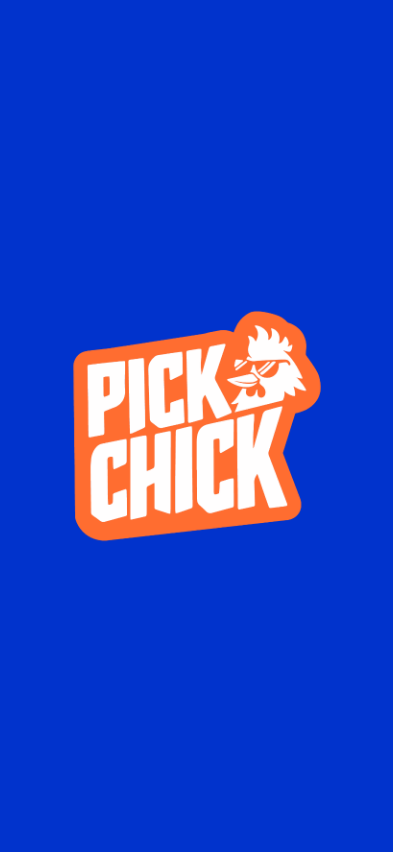
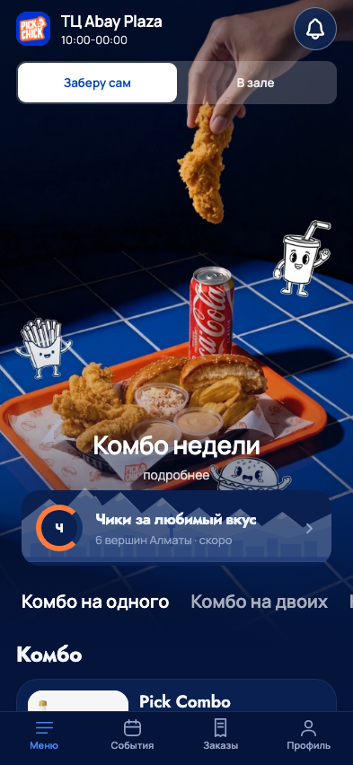

# Приближение логотипа и порядок блоков меню

24 сентября 2026. Прямое изменение исходной композиции по поручению владельца:
сначала «Чики за любимый вкус», затем категории меню; немного поднять эти блоки,
чтобы начало блюд было видно сразу. Заставка с логотипом и «Твой пик вкуса»
должна приближаться на весь экран и открывать главное меню.

## Реализация

- Один LaunchReveal на уровне корневой оболочки. При холодном входе логотип
  увеличивается за 860 мс до размера больше экрана; фон и логотип в конце
  растворяются поверх уже смонтированной страницы. Слоган исчезает раньше,
  чтобы увеличивающийся знак не перекрывал текст. Вкладки и возврат из блюда
  заставку не повторяют. Прямые ссылки сохраняют свою страницу назначения.
- Подготовка зависит от локального изображения, шрифтов, layout и системной
  настройки движения, не от ответа API меню. Во время заставки скрытые действия
  недоступны для нажатия и экранного диктора. Ошибка изображения имеет ограниченный
  запасной выход; ошибка шрифтов по-прежнему показывает сообщение приложения.
- Reduce Motion заменяет приближение затуханием 160 мс; изменение настройки
  прерывает текущий zoom. Уход приложения в фон завершает заставку, возвращение
  не запускает её заново. Таймер завершения и анимация очищаются при unmount.
- Системная заставка удерживается до layout React-слоя. Фон #0133CC взят из
  поставленного logo.png, поэтому вокруг картинки нет другого оттенка синего.
  В expo-splash-screen обновлены backgroundColor и imageWidth=320. Для совпадения
  самого первого системного кадра нужна новая нативная сборка.
- Чики перенесены перед якорем категорий; категории по-прежнему закрепляются под
  шапкой и переводят к правильному разделу. На обычном телефоне высота hero меньше
  на 48 пунктов, нижний отступ перед каталогом меньше на 16. На низких экранах hero
  дополнительно ограничен, чтобы первая карточка попадала в видимую область.
  Видео, его плавный стык, фирменные материалы и фон корзины сохранены.

## Навыки и источники

UI/UX Pro Max: адресные правила reduced motion, осмысленной длительности и
ограничения числа движущихся элементов. Impeccable: animate, craft floor,
сохранение визуального контекста. Новых зависимостей нет; transform/opacity
используют существующий Animated с native driver на iOS/Android.

[Expo SplashScreen](https://docs.expo.dev/versions/latest/sdk/splash-screen/)
предупреждает, что Dev/Expo Go не полностью воспроизводят системную заставку;
конечный переход от ОС нужно принять в release-сборке.

## Проверки

- TypeScript, адресный ESLint/Prettier, обычный web export.
- 162 JS + 30 Python mobile-проверок.
- Новый browser_splash_menu: приближение больше экрана, завершение, сокращение
  движения и его смена, отсутствие повтора, сохранение прямой ссылки, четыре
  размера 320×568 / 393×852 / 768×1024 / 852×393, правильный порядок блоков,
  выход при скрытии вкладки и недоступном логотипе, первое блюдо в области просмотра на портретных размерах, переключение категорий.
- Существующий browser_mockup_fidelity прошёл с обновлёнными по решению владельца
  ожиданиями высоты hero и порядка Чики/категории. Навигация, видео без кнопки
  паузы, прерывание воспроизведения и запасная обложка сохранены.
- Только локальные синтетические GET-ответы; заказов/платежей нет.
- Dev manifest и bundles iOS/Android вернули HTTP 200. TestFlight не выпускался.
  Web-измерения и снимки не заменяют проверку плавности/FPS и первого кадра
  на физических iPhone/Android. Это следующий этап приёмки.

## Снимки web-превью

