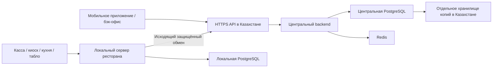

# VPS PickChick — вариант и порядок запуска

Подготовлено 06.09.2026. Пользователь подтвердил: VPS пока нет, требуется вариант.
Сервер не заказан, расходы не оформлены, deployment не выполнялся.

## Предлагаемый первый сервер

Для staging с синтетическими данными: **PS Cloud Basic-4**, площадка в Казахстане.
При оформлении явно выбрать/подтвердить Казахстан: у провайдера есть площадки
также вне РК. Выбор города и местонахождения копий фиксируется в реестре окружения.

| Параметр                   | Проверенное предложение                                                     |
| -------------------------- | --------------------------------------------------------------------------- |
| CPU                        | 4 разделяемых vCPU                                                          |
| RAM                        | 8 192 MB                                                                    |
| Диск                       | 160 GB SSD                                                                  |
| IPv4                       | 1                                                                           |
| Публичная цена             | 28 750 ₸/месяц                                                              |
| Четыре месяца по этой цене | 115 000 ₸ только за базовый VPS                                             |
| Назначение                 | Тестовый центральный API, PostgreSQL, Redis, проверка связи с тестовым edge |

Цена и ресурсы прочитаны в загруженном публичном калькуляторе
[PS Cloud — тарифы](https://www.ps.kz/ru/hosting/vps/tab-order) 06.09.2026.
Это отображённая цена, не оплаченный счёт. Итоговое налоговое оформление,
backup, объектное хранилище, домен, платное администрирование и дополнительные
услуги в 115 000 ₸ не посчитаны; проверить итог корзины до заказа.
Резервное копирование VPS у PS Cloud приобретается отдельно, см.
[описание услуги](https://www.ps.kz/ru/hosting/vps).

Более экономный staging-кандидат — Basic-3: 4 shared vCPU / 4 096 MB / 80 GB SSD,
14 450 ₸/месяц (57 800 ₸ за четыре месяца), по той же странице тарифов.
Basic-4 предпочтительнее по запасу памяти для API, БД и наблюдаемости; это
инженерная оценка, а не измеренный предел производительности PickChick.

**CPU разделяемый:** PS указывает минимум 12,5% каждого ядра при высокой
нагрузке платформы; для четырёх ядер это суммарно 0,5 ядра гарантированного
процессорного времени. [Официальное описание CPU](https://docs.ps.kz/ru/hosting/vps/faq/configuration/vps-cpu-allocation).
Поэтому Basic-4 предлагается как staging. Этот тариф не подтверждает
production SLO из ТЗ. Для рабочего контура запросить гарантированные CPU,
IOPS, отдельные failure domains и предложение по резервированию БД.

ОС для будущего стенда — Ubuntu 24.04 LTS x86_64 при наличии поддерживаемого
образа у провайдера. Публичное описание VPS перечисляет старые версии Ubuntu;
24.04 пока не подтверждена в заказе. Не подменять выбранный образ молча.
Панели Plesk/ispmanager и AI runtime серверу PickChick не требуются.

## Что где будет работать

Это целевая схема, клиентские приложения и публичный TLS ещё не развёрнуты.
VPS не заменяет локальный сервер ресторана. При обрыве интернета будущая касса
обращается к edge по LAN. Сейчас проверено сохранённое меню; автономные заказы,
терминал, ККМ и 8-часовое испытание ещё впереди.

Для production сохраняется конфигурация ТЗ, раздел 7.4: два API-узла,
worker, PostgreSQL primary 4 vCPU/16 GB/150–250 GB и сопоставимый standby,
раздельные cache/queue и отдельные копии. Один staging VPS не является
сокращённой сметой всего production и не обеспечивает такую отказоустойчивость.

## Порядок моей работы с VPS

1. Подготовить deploy-артефакт из проверенного GitHub commit: воспроизводимый
   образ API, конфигурацию staging, отдельные миграционные/runtime роли БД,
   секреты из защищённого хранилища. Не переносить `.env.example` как реальные пароли.
2. Согласовать конкретный заказ с городом, CPU, ОС, backup и итогом счёта.
   Аккаунт и платёжные документы оформить на владельца проекта. До этого
   разработка и локальные испытания продолжаются.
3. После создания получить адрес и SSH-доступ по ключу через локальный
   SSH agent/защищённое хранилище. В репозитории — только имена окружений,
   публичные параметры и инструкции. Проверить host key по консоли провайдера.
4. Настроить отдельного deploy-пользователя, обновления, firewall, журналирование,
   синхронизацию времени и автозапуск. SSH ограничить доверенными адресами/VPN;
   наружу выпускать HTTPS, а PostgreSQL/Redis оставить в закрытой сети.
   Проверить фактические правила Docker, а не только вывод firewall.
5. Настроить доменное имя, TLS и ротацию сертификатов, авторизацию устройств
   и отдельный защищённый доступ к staging-бэк-офису. В текущем коде разрешён
   только localhost: открытие порта не превращает стенд в готовый staging.
6. Настроить шифрованные копии БД в отдельном хранилище в РК, контроль давности
   копии и восстановление в отдельную БД. Для production — WAL/PITR, RPO ≤ 5 мин
   и RTO ≤ 60 мин из ТЗ с измеренным протоколом, не обещанием по настройкам.
7. Выполнить deploy фиксированного SHA, миграции отдельным шагом, smoke checks,
   подключение тестового edge, обрыв связи/повторы, рестарт и restore drill.
   Проверить, что rollback приложения совместим с уже применённой схемой.
8. В GitHub записать релиз, адрес окружения, результат проверок, порядок отката
   и эксплуатационный runbook. Первые deploy выполнять контролируемым запуском;
   не развёртывать произвольный push прямо в рабочий ресторан.

## Что потребуется для запуска

Провайдерский аккаунт владельца, подтверждённый счёт/площадка/ОС, домен или
тестовый поддомен, SSH public key, адреса доступа, место хранения копий и
контакт ответственного за эксплуатацию. Пароли, банковские ключи, device tokens
и production-данные не передавать через GitHub или сообщения чата.

Текущий результат этой задачи — проверенное предложение и порядок внедрения.
Docker release image, TLS/VPN, удалённые секреты, backup automation и сам VPS
ещё не созданы; они составят отдельный проверяемый этап инфраструктуры.
