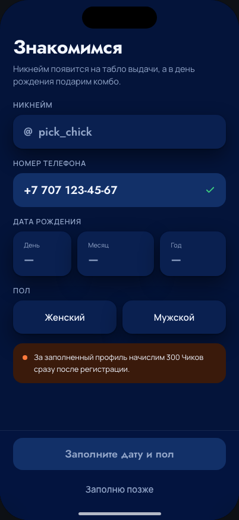
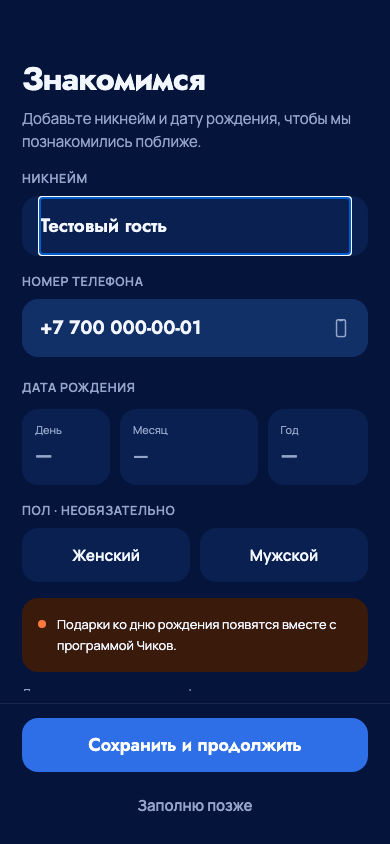
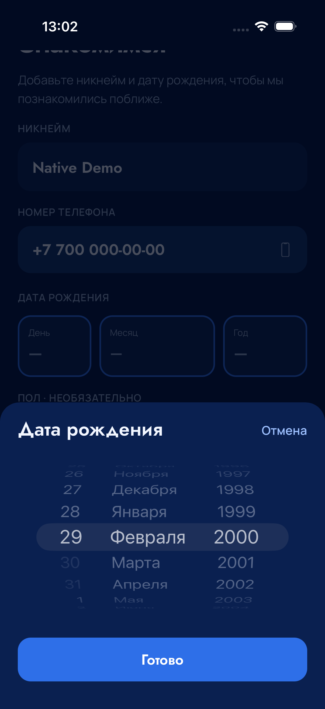
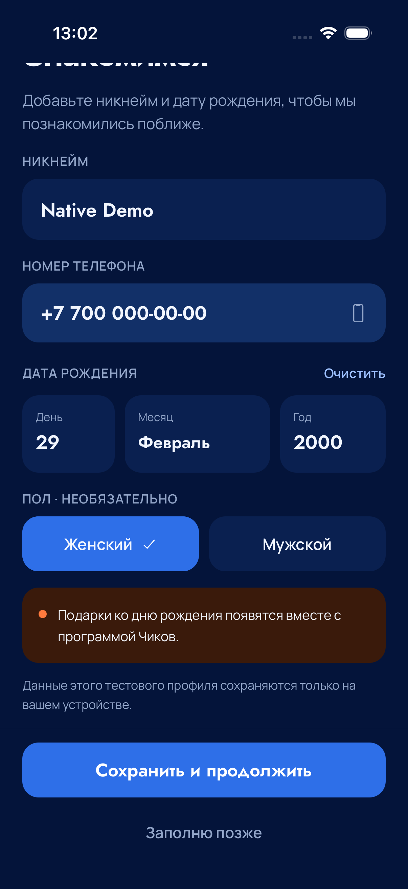

# Проверка входа и даты рождения — 7 сентября 2026

## Состав

M02/M03/M04 по `design/reference-source/mobile-v2.html.txt`;
никнейм без `@`, подтверждаемый системный пикер даты, редактирование в профиле,
локальная миграция v1 → v2. Оригинальные снимки сохранены приватно в
`.local/auth-design/original-{phone,otp,registration}.png`.

## Фактические проверки

`pnpm check` прошёл: сборка, TypeScript, lint/format, 29 unit-тестов,
контракты и 130 экранов каталога дизайна. `pnpm test:mobile` — 67 Node-тестов
и 21 Python-проверка (включая 4 проверки прозрачного Clang launcher). После защиты позднего восстановления старого никнейма
повторены mobile TypeScript/ESLint.

Браузерный `browser_demo_account.py` прошёл на 320×568, 390×844, 430×932:
неверный/верный код, отсутствие `@`, 29 февраля 2000, отмена черновика,
запрет будущей даты, сохранение/перезапуск/очистка/выход, необязательный пол,
«Заполню позже», закреплённые кнопки, отсутствие горизонтального переполнения,
изоляция preview и сохранение независимого TEST-сеанса заказа. HTTP полностью
перехвачен фикстурой; SMS и новых заказов — 0.

В тесте устранены два ложных сбоя: измерение Modal до окончания slide-анимации
и неоднозначный locator скрытого retained screen React Navigation. Ожидание
стабильности и строгое выделение видимого экрана сохраняют проверки геометрии.

| Исходный макет                                                   | Приложение, браузер 390×844                                         |
| ---------------------------------------------------------------- | ------------------------------------------------------------------- |
|  |  |

## Нативный iPhone

Release, iPhone 17 Pro Simulator / iOS 26.5 / 402×874. В Run-auth-dob-04
клавиатурный сценарий прошёл за 36,642 с: точный быстрый ввод, оба действия
над клавиатурой и сохранение имени. Второй сценарий выявил сброс колеса на
20-е число вместо 29-го при быстром выборе. Обратная запись промежуточных
JS-значений в UIDatePicker убрана: колесо владеет движением, «Готово» берёт
последнее нативное значение. Сам тест и требование 29 февраля не ослаблялись.

Повтор Run-auth-dob-06 — **PASS, 102,259 с**: неверный/верный OTP, три колеса,
29.02.2000, сохранение, relaunch, редактирование, отмена черновика и выход.
После проверки длинных названий месяцев поле месяца расширено, шрифт 17 px;
«Сентябрь» и «Декабрь» помещаются в одну строку на 320 px. Финальное визуальное
центрирование системного колеса проверено в Run-auth-dob-07: **PASS, 121,299 с**.

Первый и второй запуск остановлены до компиляции из-за I/O deadlock SwiftBuild.
Воспроизведённое поведение соответствует [upstream #1315](https://github.com/swiftlang/swift-build/pull/1315).
Применён [явный локальный обход](../../docs/operations/ios-clang-probe-workaround.md)
с исходными stdout/stderr/exit code и настоящим `features.json`. Третий запуск
подтвердил устранение зависания, но остановлен до тестов для сохранения поиска
compiler metadata. Run04/06 используют исправленный зеркальный `usr`. Run05
прерван до проверки после локальной ошибки подготовки патча; не засчитывается.

В GitHub опубликован [PR #17](https://github.com/xaaknazar/pickchick/pull/17).
[CI исходного UI d1b1234](https://github.com/xaaknazar/pickchick/actions/runs/34096561762)
завершён успешно во всех трёх jobs. Финальные SHA и Apple-выпуск будут
зафиксированы после завершения их проверок.

| Пикер на iPhone                                                      | Сохранённая дата                                                     |
| -------------------------------------------------------------------- | -------------------------------------------------------------------- |
|  |  |

## Границы

Проверяется локальный demo-профиль. Реальные SMS не отправляются,
DOB не сохраняется в серверной БД, customer/session API ещё не реализован.
Физическая установка владельцем и Android-проверка пока не подтверждены.
VPS, API и ресторанные устройства на этом этапе не обновляются.
