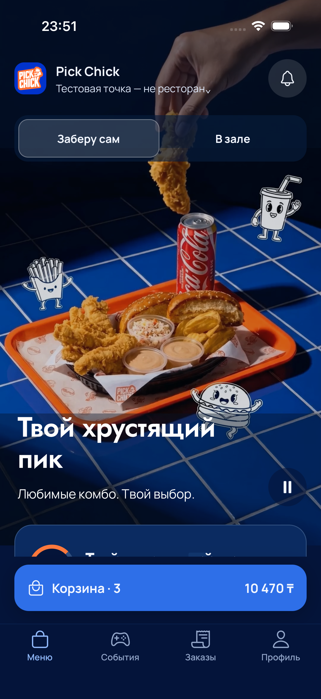
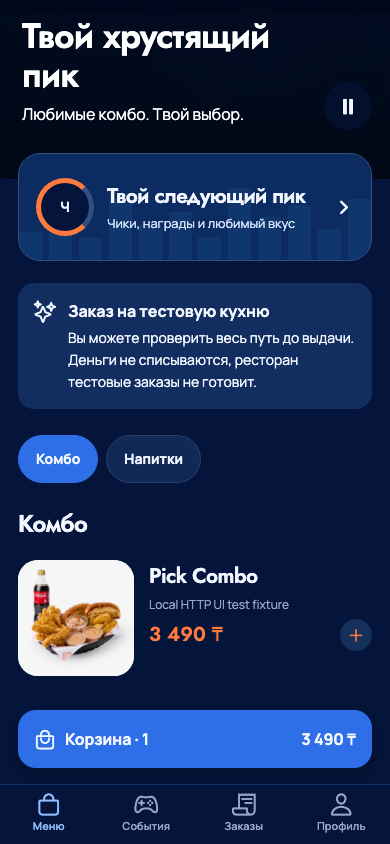
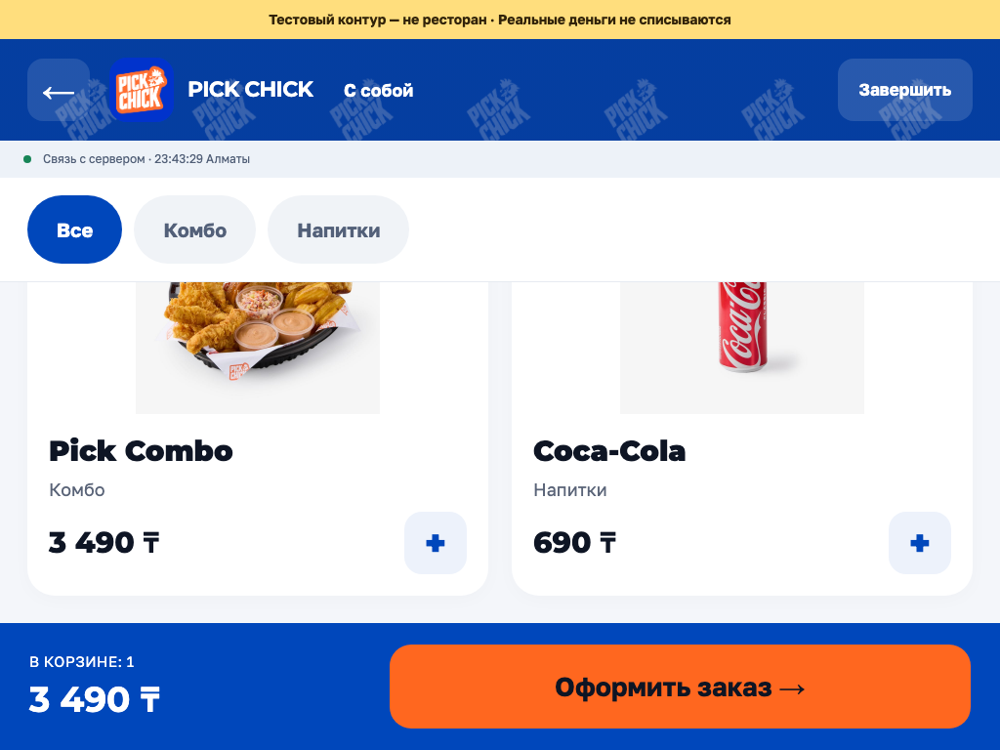
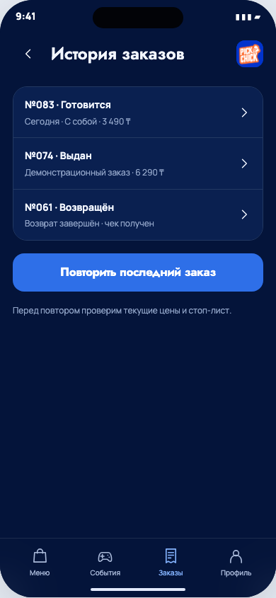

# Проверка закреплённых действий и ёмкости — 6 сентября 2026

Исходники: `d644822c3085348b66ea63d75bb753869d2d3829`.
[PR #9](https://github.com/xaaknazar/pickchick/pull/9).

## Найденные и исправленные дефекты

- В макете M19 на короткой истории низ навбара находился на 288 px выше нижней
  границы mobile frame. Навигация теперь привязана к frame независимо от контента.
- В Expo web служебная полоса 44 px отделяла корзину от tabs; суммарный зазор был
  около 59 px. Ссылка на каталог дизайна перенесена в профиль, зазор стал 16 px.
- Подписи нижних вкладок подрезались из-за метрик шрифта. Заданы lineHeight и
  высота панели с учётом fontScale и safe area; подписи полностью видны.
- Product/cart actions теперь занимают измеряемую область вне ScrollView.
  Резерв содержимого не зависит от жёстко заданного размера абсолютного overlay.
- В киоске min-height 700 px вытеснял нижние действия за короткий viewport.
  Фиксированная высота окна и отдельные scroll/footer исправляют это; cart,
  loyalty и quote имеют постоянно доступные основные действия.
- На iOS при клавиатуре нельзя было добраться до сохранения никнейма.
  Действия перенесены в footer с KeyboardAvoidingView; результат повторного
  нативного прогона указан ниже.

## Проверки

- 130 экранов / 749 состояний каталога: нет JS ошибок, отсутствующих ресурсов,
  горизонтального overflow. Положение навбара проверено для каждого mobile state,
  в котором он присутствует, до и после прокрутки.
- Expo web: 320×568, 390×667, 390×844, 430×932, 844×390. Проверены вкладки,
  положение корзины, кнопки добавления и checkout, высота touch target и подписей.
- Kiosk: 768×1024, 820×1180, 1024×768, 1180×820, 1024×600; закрепление menu/cart/
  loyalty/quote, отдельная прокрутка, touch targets. Все запросы в локальные fixtures.
- Восемь kiosk recovery, mobile cold-start с неизвестным результатом и недоступным
  каталогом, отсутствие частого polling после fulfilled — прошли на HTTP fixtures.
- `pnpm check`, 64 PG/HTTP integration, 34 mobile unit, 17 release-script unit,
  экспорт iOS/Android/web. Audit: нет high/critical, два moderate известны.
- Admission: реальный LOCK PostgreSQL, 20 отказов вместо растущей очереди, client
  abort не освобождает слот SQL, liveness доступен, после unlock работа продолжается.
- [Локальный read baseline](../load/results/2026-09-06-local-read.json): 2 000 GET,
  concurrency 16, p95 4,91 мс, p99 6,77 мс, ошибок 0; Apple M5, Node 24.16.0.
  Это small-fixture localhost измерение, оно не доказывает production ёмкость.

## Границы

Все банковские исходы TEST — симуляция, реальная кухня ресторана ничего не готовит.
Рабочие SMS/Kaspi/ККМ/Yandex/лояльность ещё не подключены. Неизвестные результаты
не подменяются успешной оплатой. Полная матрица находится в connected-screen-status.
Физические iPhone/Android и iPad с системной клавиатурой/Guided Access ещё требуют
аппаратной приёмки. Нагрузочный Gate миллиона профилей/1 000 заказов/нескольких
точек/HA определён в ADR 0007, но на текущем TEST VPS не выполнен.

## Нативный iOS и опубликованный сервер

Xcode 26.6, iOS Simulator 26.5, iPhone 17 Pro, Release с встроенным JS:
в Run-9 прошли все 35 экранов, изменение количества/запрет реальной оплаты и
недоступный SMS-вход. Новый keyboard-тест нашёл дефект M04; после исправления
финальный Run-10 прошёл 2/2: фиксированные контролы и сохранение при клавиатуре,
без пропусков. Метрики рамок проверялись непосредственно в XCUITest. Сценарий
увеличенного системного текста отдельно не прогонялся; fontScale учтён в layout.

Опубликованный на VPS API/web SHA совпадает с исходниками этого отчёта.
[Протокол deployment](../../docs/operations/deployments/2026-09-06-fixed-controls.md):
зашифрованный backup восстановлен, 38 ingress и 103 static files проверены,
T-000018/19/20 прошли общий TEST journey, соседний сервис не изменился.

Сборка **0.1.0 (2)** из того же SHA подписана, strict codesign пройден,
Apple processing завершён, `PickChick Internal` показывает «Тестируется».
[Подтверждение выпуска](../../docs/operations/mobile-testflight.md#выпуск-010-2--фиксированные-действия).

