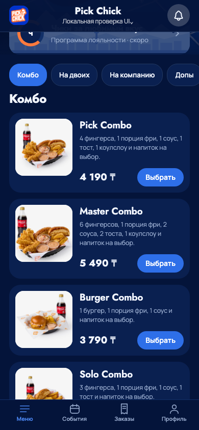
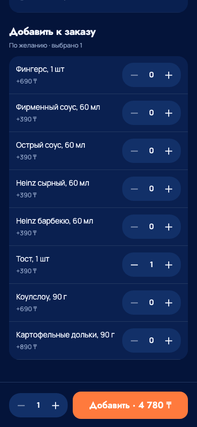
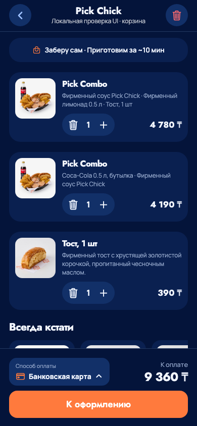
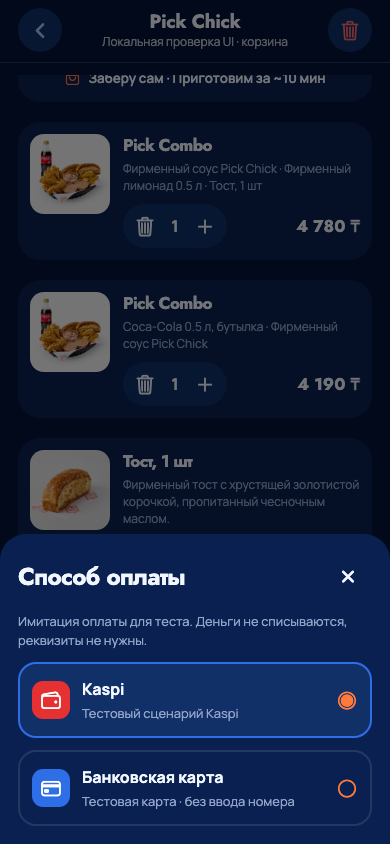

# Полный мобильный каталог: проверка 7 сентября 2026

Визуальный источник — предоставленный заказчиком mobile-v2, сохранённый в
`design/reference-source/mobile-v2.html.txt`. Скриншоты ниже сняты с Expo web,
а не с HTML-макета. Фикстура выдаёт тот же каталог v0.3, который использует API.

## Проверенное в браузере

`tests/mobile/browser_complete_catalog.py` прошёл на 320×568, 390×844 и 430×932:
24 блюда, 13 переходов между категориями, заголовок ниже закреплённых фильтров,
необрезанная вершина, КБЖУ, изменение цены и два независимых варианта комбо,
«Всегда кстати», выбор карты, восстановление корзины и повтор quote после 503
с тем же телом и ключом. Заказы/платежи в этом тесте не создаются.

`tests/mobile/browser_demo_account.py` проверяет неверный и верный код, локальное
сохранение имени/номера, перезагрузку и выход на трёх ширинах. HTTP-операций
регистрации и отправки SMS нет. Отдельно прошли прежняя проверка композиции
мокапа и геометрия закреплённых элементов mobile/kiosk.

| Каталог                                                 | Выбранный состав                                    |
| ------------------------------------------------------- | --------------------------------------------------- |
|  |  |

| Корзина                                              | Способ оплаты                                                 |
| ---------------------------------------------------- | ------------------------------------------------------------- |
|  |  |

## API и кухня

Локальные проверки: `pnpm check`, 42 mobile unit, 17 Python и 68 интеграционных
PostgreSQL/HTTP тестов; экспорт web/iOS/Android. Новый снимок хранит только
выбранные опции. Проверка максимальных вариантов и 20 заказов получила
568 898 UTF-8 байт, ниже лимита клиента; это не production нагрузочный тест.

На VPS подтверждён T-000028 с лимонадом и тостом: серверная сумма 4 780 ₸,
читаемый состав на кухне, обе станции, табло и выдача. Сценарии киоска,
потерянного ответа и неизвестного результата оплаты также прошли.
[Точные версии и deployment evidence](../../docs/operations/deployments/2026-09-07-mobile-complete.md).

## Нативная проверка и пределы

Нативные проверки и TestFlight 4 завершаются; актуальный результат фиксируется
в [состоянии проекта](../../docs/project-status.md). Браузерные размеры не заменяют
проверку iPhone, а устранение покадровых React-обновлений не является замером FPS.
SMS, банк и фискальный сервис не подключены. Профиль локальный, КБЖУ из мокапа;
редактор каталога бэк-офиса и production-приёмка остаются отдельными этапами.
