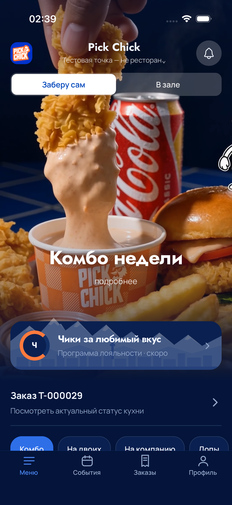
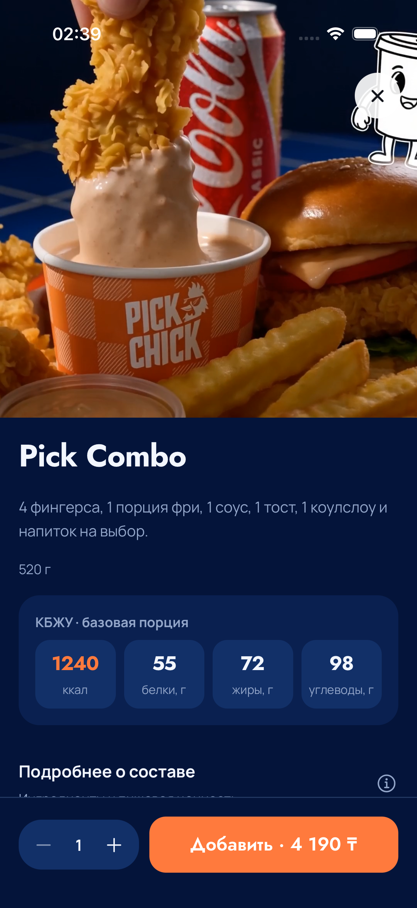
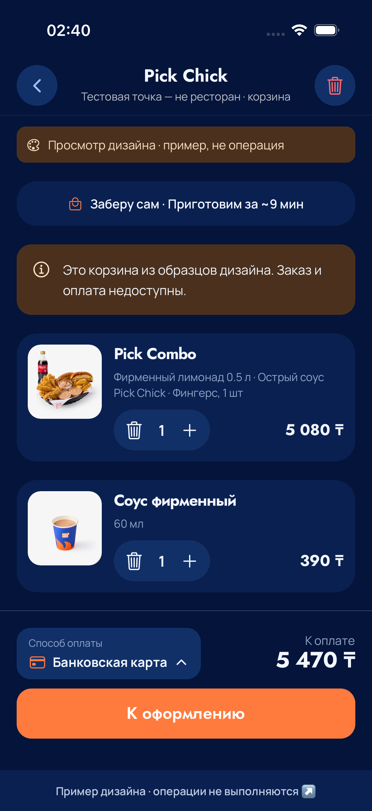
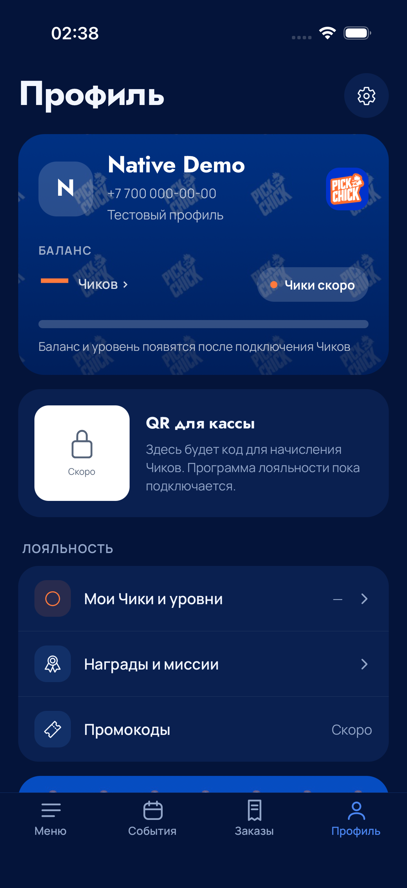
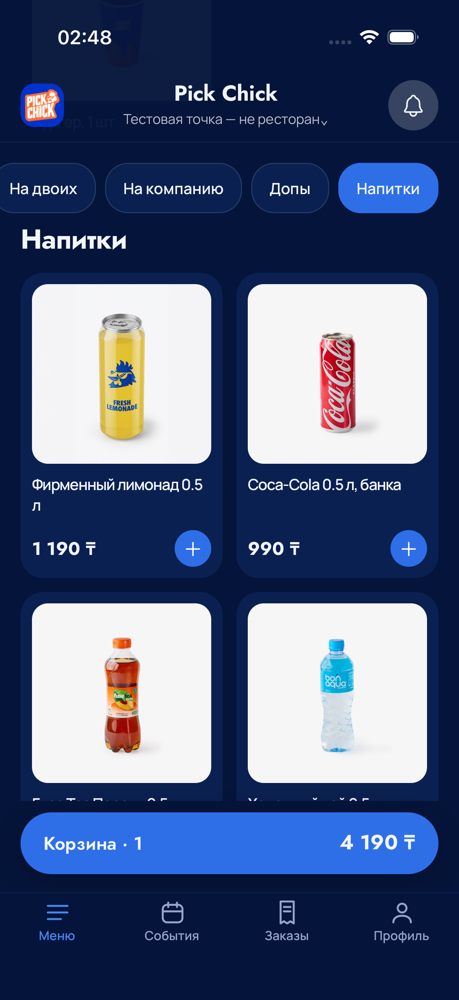
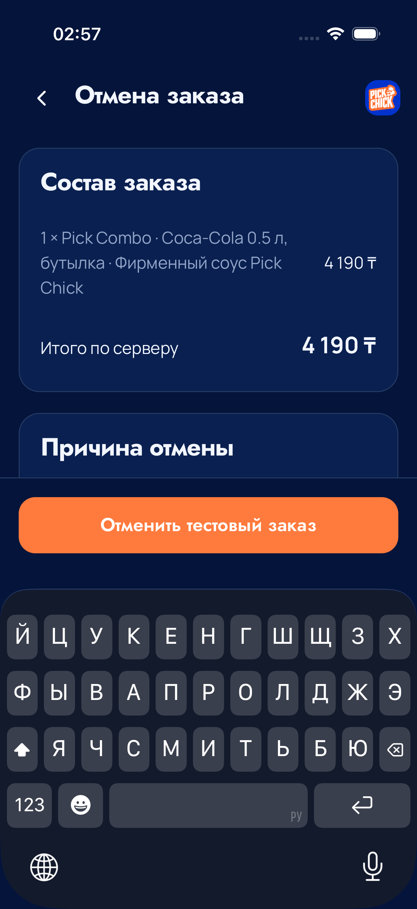

# Полный мобильный каталог: проверка 7 сентября 2026

Визуальный источник — предоставленный заказчиком mobile-v2, сохранённый в
`design/reference-source/mobile-v2.html.txt`. В браузерном разделе показан Expo web,
а не HTML-макет; фикстура выдаёт тот же каталог v0.3, который использует API.
В нативном разделе — отдельные, неизменённые PNG из XCTest attachments.

## Проверенное в браузере

`tests/mobile/browser_complete_catalog.py` прошёл на 320×568, 390×844 и 430×932:
24 блюда, 13 переходов между категориями, заголовок ниже закреплённых фильтров,
необрезанная вершина, КБЖУ, изменение цены и два независимых варианта комбо,
«Всегда кстати», выбор карты, восстановление корзины и повтор quote после 503
с тем же телом и ключом. Заказы/платежи в этом тесте не создаются.

`tests/mobile/browser_demo_account.py` проверяет неверный и верный код, локальное
сохранение имени/номера, перезагрузку и выход на трёх ширинах. HTTP-операций
регистрации и отправки SMS нет. Отдельно прошли прежняя проверка композиции
мокапа и геометрия закреплённых элементов mobile/kiosk.

| Каталог                                                 | Выбранный состав                                    |
| ------------------------------------------------------- | --------------------------------------------------- |
|  |  |

| Корзина                                              | Способ оплаты                                                 |
| ---------------------------------------------------- | ------------------------------------------------------------- |
|  |  |

## API и кухня

Локальные проверки: `pnpm check`, 42 mobile unit, 17 Python и 68 интеграционных
PostgreSQL/HTTP тестов; экспорт web/iOS/Android. Новый снимок хранит только
выбранные опции. Проверка максимальных вариантов и 20 заказов получила
568 898 UTF-8 байт, ниже лимита клиента; это не production нагрузочный тест.

На VPS подтверждён T-000028 с лимонадом и тостом: серверная сумма 4 780 ₸,
читаемый состав на кухне, обе станции, табло и выдача. Сценарии киоска,
потерянного ответа и неизвестного результата оплаты также прошли.
[Точные версии и deployment evidence](../../docs/operations/deployments/2026-09-07-mobile-complete.md).

## Нативная проверка

Среда: Release, iPhone 17 Pro Simulator, iOS 26.5, логический размер 402×874,
PNG 1206×2622. Тесты — `tests/mobile/ios/SmokeTests.swift`.
Run20 проверил мобильный код с исправлениями ввода через `7287600`:
**8 из 9 сценариев прошли**, переход к категории выявил отдельный дефект.

| Сценарий Run20                                              | Результат | Время, с |
| ----------------------------------------------------------- | --------- | -------: |
| Корзина и нижняя навигация закреплены при прокрутке         | PASS      |   25,485 |
| Переходы по категориям                                      | FAIL      |   21,124 |
| TEST-заказ: создание, восстановление после relaunch, отмена | PASS      |   40,842 |
| Клавиатура не скрывает действие профиля                     | PASS      |   22,359 |
| Demo-вход: неверный/верный OTP, ник, relaunch, выход        | PASS      |   53,118 |
| Исходная композиция и отсутствие кнопки паузы видео         | PASS      |   23,277 |
| Количество в preview-корзине и отключённая оплата           | PASS      |   29,231 |
| Модификаторы, КБЖУ, upsell и выбор способа оплаты           | PASS      |   57,017 |
| Запуск и переходы по всем 35 экранам                        | PASS      |  376,156 |

Run21 на `fe5774a` повторил затронутые сценарии: **1 из 2 прошёл**.
Переходы «Напитки → На компанию → Комбо» прошли за 16,240 с: выбранная категория
согласована с разделом, заголовок ниже полоски, положение и доступность корзины
и нижней навигации сохранены. Повтор TEST-заказа после изменения поля причины
отмены завершился FAIL за 67,292 с; успешная проверка прежнего варианта в Run20
не подтверждала этот изменённый путь.

Run22 на `41d206e15c961a389e1aef50e57fb7b5d15b219f` завершился **2 из 2 PASS**:

| Сценарий Run22                                                  | Результат | Время, с |
| --------------------------------------------------------------- | --------- | -------: |
| TEST-заказ: создание, relaunch и отмена при открытой клавиатуре | PASS      |   47,838 |
| Demo-вход: неверный/верный OTP, ник, relaunch, выход            | PASS      |   51,710 |

T-000031 создан, восстановлен после relaunch и отменён через приложение.
Тест проверил полное значение причины до отправки, доступность кнопки над
открытой клавиатурой, отмену первым нажатием и точный текст причины в ответе
сервера: `Native TEST cancellation after relaunch: complete reason`.
Отмена T-000030 после неудачного Run21 выполнена отдельно управляющим для уборки
собственного синтетического заказа; она не засчитывается как успешный UI-сценарий.
Повтор Run22 закрыл обнаруженный в Run21 дефект отмены.

Локальные первичные свидетельства:

- `.local/mobile-complete-native20.log` и
  `.local/mobile-ios/Run-20-complete-regression.xcresult`;
- `.local/mobile-complete-native21.log` и
  `.local/mobile-ios/Run-21-native-category-and-reason.xcresult`;
- `.local/mobile-complete-native22.log` и
  `.local/mobile-ios/Run-22-native-cancel-footer.xcresult`.

### Исправления, найденные нативными тестами

При быстром вводе управляющие `value` в Phone, OTP и нике перезаписывали текст
на каждом JS-обновлении. Поля используют `defaultValue`: редактированием владеет
нативное поле, JS получает текст для валидации/сохранения. Новый challenge и выход
явно очищают нужные поля; изменение сохранённого ника обновляет prefill.
Нормализация телефона, trim, лимиты и локальное хранение сохранены.
Swift проверяет точное `field.value` после прежнего `typeText`, без замедления ввода.
Имя теста и activity `native-input-v2` фиксируют проверяемую ревизию и путь
загруженного test bundle. В Run20 весь сценарий ввода/восстановления прошёл.

Переход к категории читал `requestedY.value` сразу после записи в shared value
Reanimated. На native запись откладывается до UI runtime, поэтому команда получала
предыдущее значение. В Run20 нажатие «Напитки» вернуло прокрутку в начало:
вновь раскрылись hero и выбор способа получения, а AX показывал заголовок
«Напитки» на y=4044 при content frame y=0. Это не ошибка selected trait.
Исправление `fe5774a` вычисляет локальный `targetY`, записывает его в shared value
и передаёт тот же локальный `targetY` в `scrollTo`. Строгий category-тест Run21 прошёл.
На случай повторного сбоя тест сохраняет координаты и accessibility-состояния
всех связанных элементов до исходного assert.

В `41d206e` действие отмены вынесено в footer страницы: клавиатура больше
не перекрывает кнопку. Нативное поле причины сохраняет введённый текст без
перезаписи через `value`. В тесте замена многострочного prefill выделяет весь
текст перед удалением: положение каретки после касания не гарантирует удаление
всех символов обычными backspace. До ввода проверяется полная очистка, после
прежнего `typeText` — точное значение поля. Run22 подтвердил геометрию кнопки,
первое нажатие при открытой клавиатуре и сохранение всей причины сервером;
проверки точного ввода не ослаблялись.

### Нативные снимки

Четыре снимка Run20 показывают витрину без кнопки паузы, базовую карточку комбо
с КБЖУ, выбранный состав в preview-корзине и локальный профиль после relaunch.
В корзине явно обозначен режим просмотра; телефон профиля — синтетический
тестовый ввод. Изображения не ретушировались и не собирались из разных состояний.

| Витрина · Run20                                                        | Комбо и КБЖУ · Run20                                                                     |
| ---------------------------------------------------------------------- | ---------------------------------------------------------------------------------------- |
|  |  |

| Состав, upsell и карта · Run20                                                                    | Профиль после relaunch · Run20                                                                       |
| ------------------------------------------------------------------------------------------------- | ---------------------------------------------------------------------------------------------------- |
|  |  |

Пятый снимок — успешный переход к «Напиткам» в Run21 после исправления команды
прокрутки. Полоска категорий, заголовок и закреплённые действия видны одновременно.

Шестой снимок — Run22 непосредственно перед первым нажатием отмены. Кнопка
целиком расположена над открытой клавиатурой. Сам текст причины в этом кадре
ниже видимой части прокручиваемой формы; его полнота подтверждена assert поля
и серверного результата, а также attachment `Connected-cancelled` в xcresult.

## Пределы проверки

Все сбои, выявленные Run20/Run21, закрыты успешными повторами затронутых сценариев.
Обход всех 35 экранов прошёл в Run20; полный набор из девяти сценариев на финальном
`41d206e` заново не запускался — Run22 проверял два сценария, а категории прошли
в Run21. Это совокупность регрессии и целевых повторов, а не один полный прогон
финального SHA. TestFlight 4 этим документом не объявляется опубликованным.
Актуальный результат —
в [состоянии проекта](../../docs/project-status.md). Simulator не заменяет установку
на физический iPhone; обход 35 экранов не доказывает визуальную приёмку каждого
экрана и работу всех бизнес-функций. Устранение покадровых React-обновлений
не является замером FPS.

SMS, банк и фискальный сервис не подключены. Профиль локальный, КБЖУ из мокапа;
редактор каталога бэк-офиса и production-приёмка остаются отдельными этапами.
